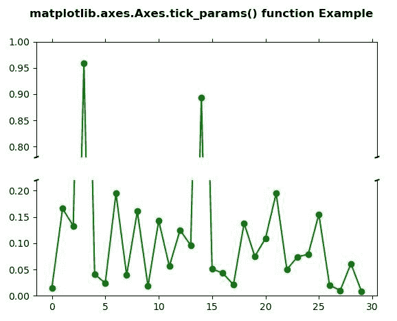
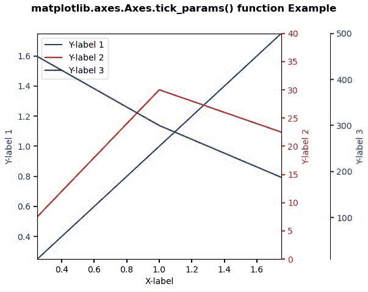

# Python 中的 matplotlib . axes . axes . tick _ params()

> 原文:[https://www . geeksforgeeks . org/matplotlib-axes-axes-tick _ params-in-python/](https://www.geeksforgeeks.org/matplotlib-axes-axes-tick_params-in-python/)

**[Matplotlib](https://www.geeksforgeeks.org/python-introduction-matplotlib/)** 是 Python 中的一个库，是 NumPy 库的数值-数学扩展。**轴类**包含了大部分的图形元素:轴、刻度、线二维、文本、多边形等。，并设置坐标系。Axes 的实例通过回调属性支持回调。

## matplotlib . axes . axes . tick _ params()函数

matplotlib 库的 Axes 模块中的 **Axes.tick_params()函数**用于控制主要刻度定位器的行为。

> **语法:** Axes.tick_params(self，axis='both '，**kwargs)
> 
> **参数:**该方法接受以下参数。
> 
> *   **轴:**此参数用于将参数应用到哪个轴。
> 
> **返回值:**此方法不返回值。

下面的例子说明了 matplotlib.axes . axes . tick _ params()函数在 matplotlib . axes 中的作用:

**例 1:**

```py
# Implementation of matplotlib function
import matplotlib.pyplot as plt
import numpy as np

values = np.array([
    0.015, 0.166, 0.133, 0.159, 0.041,
    0.024, 0.195, 0.039, 0.161, 0.018,
    0.143, 0.056, 0.125, 0.096, 0.094,
    0.051, 0.043, 0.021, 0.138, 0.075,
    0.109, 0.195, 0.050, 0.074, 0.079,
    0.155, 0.020, 0.010, 0.061, 0.008])

values[[3, 14]] += .8

fig, (ax, ax2) = plt.subplots(2, 1, sharex = True)

ax.plot(values, "o-", color ="green")
ax2.plot(values, "o-", color ="green")

ax.set_ylim(.78, 1.) 
ax2.set_ylim(0, .22)

ax.spines['bottom'].set_visible(False)
ax2.spines['top'].set_visible(False)
ax.xaxis.tick_top()
ax.tick_params(labeltop = False)
ax2.xaxis.tick_bottom()

d = .005
kwargs = dict(transform = ax.transAxes,
              color ='k', clip_on = False)

ax.plot((-d, +d), (-d, +d), **kwargs)       
ax.plot((1 - d, 1 + d), (-d, +d), **kwargs) 

kwargs.update(transform = ax2.transAxes)  
ax2.plot((-d, +d), (1 - d, 1 + d), **kwargs)
ax2.plot((1 - d, 1 + d), (1 - d, 1 + d), **kwargs) 

fig.suptitle('matplotlib.axes.Axes.tick_params()\
function Example\n\n', fontweight ="bold")

plt.show()
```

**输出:**


**例 2:**

```py
# Implementation of matplotlib function
import matplotlib.pyplot as plt

def make_patch_spines_invisible(ax):
    ax.set_frame_on(True)
    ax.patch.set_visible(False)
    for sp in ax.spines.values():
        sp.set_visible(False)

fig, host = plt.subplots()
fig.subplots_adjust(right = 0.75)

par1 = host.twinx()
par2 = host.twinx()

# Offset the right spine of par2.
# The ticks and label have already been
# placed on the right by twinx above.
par2.spines["right"].set_position(("axes", 
                                   1.2))

# Having been created by twinx, par2 
# has its frame off, so the line of its
# detached spine is invisible.  First,
# activate the frame but make the patch
# and spines invisible.
make_patch_spines_invisible(par2)

# Second, show the right spine.
par2.spines["right"].set_visible(True)

p1, = host.plot([0, 1, 2], [0, 1, 2], "b-",
                label ="Y-label 1")

p2, = par1.plot([0, 1, 2], [0, 30, 20], 
                "r-", label ="Y-label 2")

p3, = par2.plot([0, 1, 2], [500, 300, 150], 
                "g-", label ="Y-label 3")

host.set_xlim(0.25, 1.75)
host.set_ylim(0.25, 1.75)
par1.set_ylim(0, 40)
par2.set_ylim(10, 500)

host.set_xlabel("X-label")
host.set_ylabel("Y-label 1")
par1.set_ylabel("Y-label 2")
par2.set_ylabel("Y-label 3")

host.yaxis.label.set_color(p1.get_color())
par1.yaxis.label.set_color(p2.get_color())
par2.yaxis.label.set_color(p3.get_color())

tkw = dict(size = 4, width = 1.5)
host.tick_params(axis ='y',
                 colors = p1.get_color(),
                 **tkw)

par1.tick_params(axis ='y',
                 colors = p2.get_color(),
                 **tkw)

par2.tick_params(axis ='y',
                 colors = p3.get_color(),
                 **tkw)

host.tick_params(axis ='x', **tkw)

lines = [p1, p2, p3]

host.legend(lines, [l.get_label() for l in lines])

fig.suptitle('matplotlib.axes.Axes.tick_params()\
function Example\n\n', fontweight ="bold")

plt.show()
```

**输出:**
