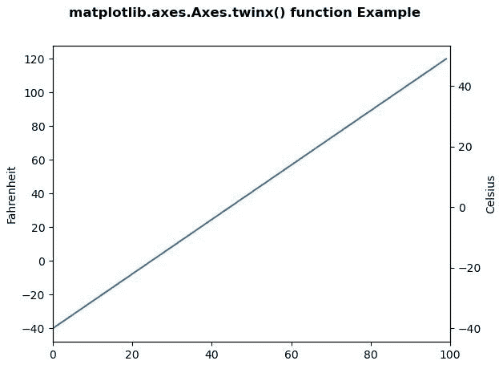
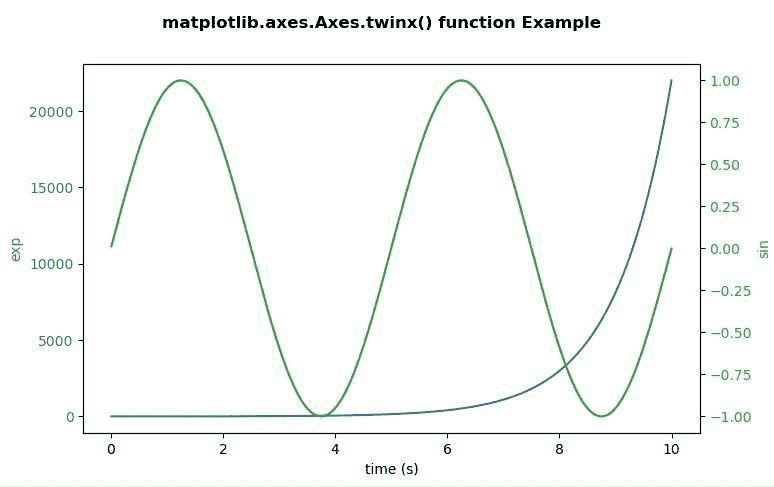

# Matplotlib.axes.Axes.twinx()在 Python

中

> 哎哎哎:# t0]https://www . geeksforgeeks . org/matplot lib-axes-twinx-in-python/

**[Matplotlib](https://www.geeksforgeeks.org/python-introduction-matplotlib/)** 是 Python 中的一个库，是 NumPy 库的数值-数学扩展。**轴类**包含了大部分的图形元素:轴、刻度、线二维、文本、多边形等。，并设置坐标系。Axes 的实例通过回调属性支持回调。

## matplotlib.axes.Axes.twinx()函数

matplotlib 库的 Axes 模块中的 **Axes.twinx()函数**用于创建共享 xaxis 的双轴。

> **语法:** Axes.twinx(self)
> 
> **参数:**该方法不接受任何参数。
> 
> **返回值:**该方法用于返回以下内容。
> 
> *   **ax_twin :** 这将返回新创建的 Axes 实例。

下面的例子说明了 matplotlib.axes.Axes.twinx()函数在 matplotlib.axes 中的作用:

**例 1:**

```
# Implementation of matplotlib function
import matplotlib.pyplot as plt
import numpy as np

def GFG1(temp):
    return (5\. / 9.) * (temp - 32)

def GFG2(ax1):
    y1, y2 = ax1.get_ylim()
    ax_twin .set_ylim(GFG1(y1), GFG1(y2))
    ax_twin .figure.canvas.draw()

fig, ax1 = plt.subplots()
ax_twin = ax1.twinx()

ax1.callbacks.connect("ylim_changed", GFG2)
ax1.plot(np.linspace(-40, 120, 100))
ax1.set_xlim(0, 100)

ax1.set_ylabel('Fahrenheit')
ax_twin .set_ylabel('Celsius')

fig.suptitle('matplotlib.axes.Axes.twinx()\
 function Example\n\n', fontweight ="bold")

plt.show()
```

**输出:**


**例 2:**

```
# Implementation of matplotlib function
import numpy as np
import matplotlib.pyplot as plt

# Create some mock data
t = np.arange(0.01, 10.0, 0.001)
data1 = np.exp(t)
data2 = np.sin(0.4 * np.pi * t)

fig, ax1 = plt.subplots()

color = 'tab:blue'
ax1.set_xlabel('time (s)')
ax1.set_ylabel('exp', color = color)
ax1.plot(t, data1, color = color)
ax1.tick_params(axis ='y', labelcolor = color)

ax2 = ax1.twinx()

color = 'tab:green'
ax2.set_ylabel('sin', color = color)
ax2.plot(t, data2, color = color)
ax2.tick_params(axis ='y', labelcolor = color)

fig.suptitle('matplotlib.axes.Axes.twinx() \
function Example\n\n', fontweight ="bold")

plt.show()
```

**输出:**
