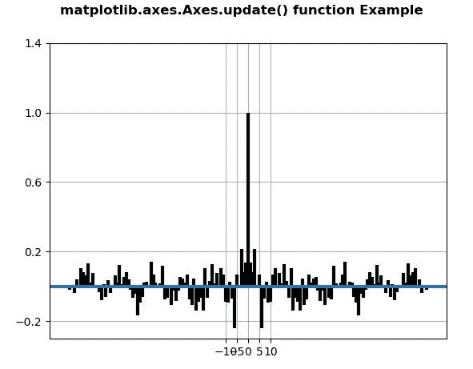
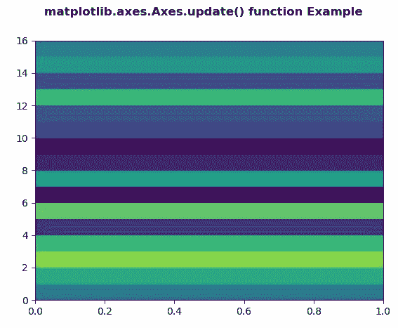

# Python 中的 Matplotlib.axes.Axes.update()

> 原文:[https://www . geeksforgeeks . org/matplotlib-axes-axes-update-in-python/](https://www.geeksforgeeks.org/matplotlib-axes-axes-update-in-python/)

**[Matplotlib](https://www.geeksforgeeks.org/python-introduction-matplotlib/)** 是 Python 中的一个库，是 NumPy 库的数值-数学扩展。**轴类**包含了大部分的图形元素:轴、刻度、线二维、文本、多边形等。，并设置坐标系。Axes 的实例通过回调属性支持回调。

## matplotlib.axes.Axes.update()函数

matplotlib 库的 Axes 模块中的 **Axes.update()函数**用于从字典道具中更新该艺术家的属性。

> **语法:** Axes.update(自我，道具)
> 
> **参数:**该方法接受以下参数。
> 
> *   **道具:**这个参数是属性的字典。
> 
> **返回:**该方法不返回值。

下面的例子说明了 matplotlib.axes.Axes.update()函数在 matplotlib.axes 中的作用:

**例 1:**

```
# Implementation of matplotlib function
import matplotlib.pyplot as plt
import numpy as np

np.random.seed(10**7)
geeks = np.random.randn(100)

fig, ax = plt.subplots()
ax.acorr(geeks, usevlines = True,
         normed = True,
         maxlags = 80, lw = 3)

ax.grid(True)

prop = {'xticks': np.array([-10., -5.,  0.,   5., 10\. ]),
        'yticks': np.array([-0.2,  0.2,  0.6,  1.,  1.4]),
        'ylabel': None, 'xlabel': None}

ax.update(prop)

fig.suptitle('matplotlib.axes.Axes.update()\
 function Example', fontweight ="bold") 

plt.show() 
```

**输出:**


**例 2:**

```
# Implementation of matplotlib function 
import numpy as np 
import matplotlib.pyplot as plt 

xx = np.random.rand(16, 30) 

fig, ax = plt.subplots() 

m = ax.pcolor(xx) 
m.set_zorder(-20)
prop = {'autoscalex_on': False}
w = ax.update(prop)

fig.suptitle('matplotlib.axes.Axes.update()\
function Example', fontweight ="bold") 

plt.show() 
```

**输出:**
