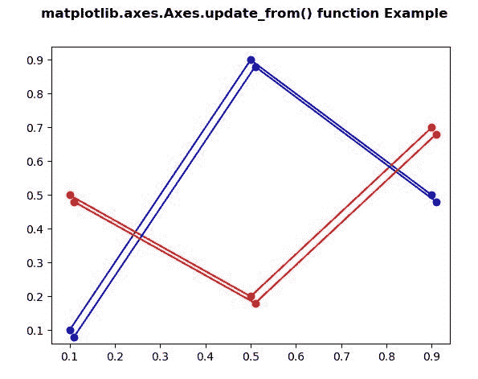

# Python 中的 matplotlib . axes . axes . update _ from()

> 原文:[https://www . geeksforgeeks . org/matplotlib-axes-axes-update _ from-in-python/](https://www.geeksforgeeks.org/matplotlib-axes-axes-update_from-in-python/)

**[Matplotlib](https://www.geeksforgeeks.org/python-introduction-matplotlib/)** 是 Python 中的一个库，是 NumPy 库的数值-数学扩展。**轴类**包含了大部分的图形元素:轴、刻度、线二维、文本、多边形等。，并设置坐标系。Axes 的实例通过回调属性支持回调。

## matplotlib . axes . axes . update _ from()函数

matplotlib 库的 Axes 模块中的 **Axes.update_from()函数**用于将属性从他人复制到自己。

> **语法:** Axes.update_from(self，other)
> 
> **参数:**此方法接受任何参数。
> 
> *   **其他:**该参数是需要更新的属性。
> 
> **返回:**此方法返回艺术家所有属性的字典。

下面的例子说明了 matplotlib.axes . axes . update _ from()函数在 matplotlib . axes 中的作用:

**例 1:**

```py
# Implementation of matplotlib function 
import numpy as np
import matplotlib.pyplot as plt
from matplotlib.legend_handler import HandlerLine2D

x = np.linspace(0, 3 * np.pi)
y1 = np.sin(x)
y2 = np.cos(x)

fig = plt.figure()

ax = fig.add_subplot(111)
ax.plot(x, y1, c ='b', label ='y1', linewidth = 1.0)
ax.plot(x, y2, c ='g', label ='y2')

linewidth = 7

def update(prop1, prop2):
    prop1.update_from(prop2)
    prop1.set_linewidth(7)

plt.legend(handler_map ={plt.Line2D : HandlerLine2D(update_func = update)})

fig.suptitle('matplotlib.axes.Axes.update_from()\
 function Example', fontweight ="bold") 

plt.show() 
```

**输出:**


**例 2:**

```py
# Implementation of matplotlib function 
import numpy as np 
import matplotlib.pyplot as plt
import matplotlib.transforms as mtransforms

fig, ax = plt.subplots() 
l1, = ax.plot([0.1, 0.5, 0.9], 
              [0.1, 0.9, 0.5], 
              "bo-")
l2, = ax.plot([0.1, 0.5, 0.9],
              [0.5, 0.2, 0.7], 
              "ro-")

for l in [l1, l2]:

    xx = l.get_xdata()
    yy = l.get_ydata()

    shadow, = ax.plot(xx, yy)
    shadow.update_from(l)

    ot = mtransforms.offset_copy(l.get_transform(),
                                 ax.figure,
                                 x = 4.0, 
                                 y =-6.0, 
                                 units ='points')

    shadow.set_transform(ot)

fig.suptitle('matplotlib.axes.Axes.update_from() \
function Example', fontweight ="bold") 

plt.show() 
```

**输出:**
