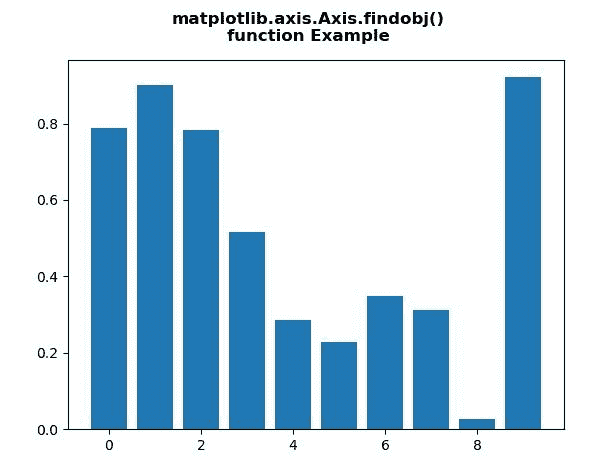
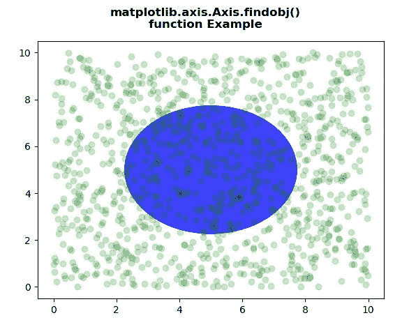

# Python 中的 Matplotlib.axis.Axis.findobj()函数

> 原文:[https://www . geesforgeks . org/matplotlib-axis-axis-find obj-function-in-python/](https://www.geeksforgeeks.org/matplotlib-axis-axis-findobj-function-in-python/)

[**Matplotlib**](https://www.geeksforgeeks.org/python-introduction-matplotlib/) 是 Python 中的一个库，是 NumPy 库的数值-数学扩展。这是一个神奇的 Python 可视化库，用于 2D 数组图，并用于处理更广泛的 SciPy 堆栈。

## Matplotlib.axis.Axis.findobj()函数

matplotlib 库的 Axis 模块中的 **Axis.findobj()函数**用于查找艺术家对象。

> **语法:** Axis.findobj(self，match=None，include_self=True)
> 
> **参数:**该方法接受以下参数。
> 
> *   **匹配:**该参数是匹配的过滤标准。默认值为无。
> *   **include_self :** 此参数将 self 包含在要检查匹配的列表中。
> 
> **返回值:**此方法返回艺术家(艺术家列表)。

下面的例子说明了 matplotlib.axis.Axis.findobj()函数在 matplotlib.axis 中的作用:

**例 1:**

## 蟒蛇 3

```
# Implementation of matplotlib function
from matplotlib.axis import Axis
import matplotlib.pyplot as plt  
from matplotlib.lines import Line2D  
import numpy as np  
from numpy.random import rand  

fig, ax2 = plt.subplots()  

ax2.bar(range(10), rand(10), picker = True)  

print("Value return : \n",  
      *list(Axis.findobj(ax2)), sep ="\n")

fig.suptitle("""matplotlib.axis.Axis.findobj()
function Example\n""", fontweight ="bold")  

plt.show()
```

**输出:**



```
Value return : 

Rectangle(xy=(-0.4, 0), width=0.8, height=0.787316, angle=0)
Rectangle(xy=(0.6, 0), width=0.8, height=0.901399, angle=0)
Rectangle(xy=(1.6, 0), width=0.8, height=0.783699, angle=0)
Rectangle(xy=(2.6, 0), width=0.8, height=0.516764, angle=0)
Rectangle(xy=(3.6, 0), width=0.8, height=0.284635, angle=0)
Rectangle(xy=(4.6, 0), width=0.8, height=0.228809, angle=0)
Rectangle(xy=(5.6, 0), width=0.8, height=0.347976, angle=0)
Rectangle(xy=(6.6, 0), width=0.8, height=0.311647, angle=0)
Rectangle(xy=(7.6, 0), width=0.8, height=0.0261189, angle=0)
Rectangle(xy=(8.6, 0), width=0.8, height=0.921416, angle=0)
Spine
Spine
Spine
Spine
Text(0.5, 0, '')
Text(1, 0, '')
Line2D()
Line2D()
Line2D((0,0),(0,1))
Text(0, 0, '')
Text(0, 1, '')
<matplotlib.axis.XTick object at 0x08917330>
Line2D()
Line2D()
Line2D((0,0),(0,1))
Text(0, 0, '')
Text(0, 1, '')
<matplotlib.axis.XTick object at 0x08917310>
Line2D()
Line2D()
Line2D((0,0),(0,1))
Text(0, 0, '')
Text(0, 1, '')
<matplotlib.axis.XTick object at 0x0A92A890>
Line2D()
Line2D()
Line2D((0,0),(0,1))
Text(0, 0, '')
Text(0, 1, '')
<matplotlib.axis.XTick object at 0x0A940D90>
Line2D()
Line2D()
Line2D((0,0),(0,1))
Text(0, 0, '')
Text(0, 1, '')
<matplotlib.axis.XTick object at 0x0A9540B0>
Line2D()
Line2D()
Line2D((0,0),(0,1))
Text(0, 0, '')
Text(0, 1, '')
<matplotlib.axis.XTick object at 0x0A9542B0>
Line2D()
Line2D()
Line2D((0,0),(0,1))
Text(0, 0, '')
Text(0, 1, '')
<matplotlib.axis.XTick object at 0x0A954570>
XAxis(80.0,52.8)
Text(0, 0.5, '')
Text(0, 0.5, '')
Line2D()
Line2D()
Line2D((0,0),(1,0))
Text(0, 0, '')
Text(1, 0, '')
<matplotlib.axis.YTick object at 0x08917A30>
Line2D()
Line2D()
Line2D((0,0),(1,0))
Text(0, 0, '')
Text(1, 0, '')
<matplotlib.axis.YTick object at 0x089176B0>
Line2D()
Line2D()
Line2D((0,0),(1,0))
Text(0, 0, '')
Text(1, 0, '')
<matplotlib.axis.YTick object at 0x0A9547B0>
Line2D()
Line2D()
Line2D((0,0),(1,0))
Text(0, 0, '')
Text(1, 0, '')
<matplotlib.axis.YTick object at 0x0A954BF0>
Line2D()
Line2D()
Line2D((0,0),(1,0))
Text(0, 0, '')
Text(1, 0, '')
<matplotlib.axis.YTick object at 0x0A954ED0>
Line2D()
Line2D()
Line2D((0,0),(1,0))
Text(0, 0, '')
Text(1, 0, '')
<matplotlib.axis.YTick object at 0x0A95E190>
YAxis(80.0,52.8)
Text(0.5, 1.0, '')
Text(0.0, 1.0, '')
Text(1.0, 1.0, '')
Rectangle(xy=(0, 0), width=1, height=1, angle=0)
AxesSubplot(0.125,0.11;0.775x0.77)

```

**例 2:**

## 蟒蛇 3

```
# Implementation of matplotlib function
from matplotlib.axis import Axis
import numpy as np  
import matplotlib.pyplot as plt  
import matplotlib.patches as mpatches  

fig, ax = plt.subplots()  
x, y = 10 * np.random.rand(2, 1000)  
ax.plot(x, y, 'go', alpha = 0.2)  

circ = mpatches.Circle((0.5, 0.5), 0.25,  
                       transform = ax.transAxes,  
                       facecolor ='blue',   
                       alpha = 0.75)  
ax.add_patch(circ)  

print("Value return : \n",  
      *list(Axis.findobj(ax)), sep ="\n")

fig.suptitle("""matplotlib.axis.Axis.findobj()
function Example\n""", fontweight ="bold")  

plt.show()
```

**输出:**



```
Value return : 

Circle(xy=(0.5, 0.5), radius=0.25)
Line2D(_line0)
Spine
Spine
Spine
Spine
Text(0.5, 0, '')
Text(1, 0, '')
Line2D()
Line2D()
Line2D((0,0),(0,1))
Text(0, 0, '')
Text(0, 1, '')
<matplotlib.axis.XTick object at 0x080C82F0>
Line2D()
Line2D()
Line2D((0,0),(0,1))
Text(0, 0, '')
Text(0, 1, '')
<matplotlib.axis.XTick object at 0x080C82D0>
Line2D()
Line2D()
Line2D((0,0),(0,1))
Text(0, 0, '')
Text(0, 1, '')
<matplotlib.axis.XTick object at 0x0A10BCF0>
Line2D()
Line2D()
Line2D((0,0),(0,1))
Text(0, 0, '')
Text(0, 1, '')
<matplotlib.axis.XTick object at 0x0A10BE10>
Line2D()
Line2D()
Line2D((0,0),(0,1))
Text(0, 0, '')
Text(0, 1, '')
<matplotlib.axis.XTick object at 0x0A1261F0>
Line2D()
Line2D()
Line2D((0,0),(0,1))
Text(0, 0, '')
Text(0, 1, '')
<matplotlib.axis.XTick object at 0x0A126490>
Line2D()
Line2D()
Line2D((0,0),(0,1))
Text(0, 0, '')
Text(0, 1, '')
<matplotlib.axis.XTick object at 0x0A126750>
Line2D()
Line2D()
Line2D((0,0),(0,1))
Text(0, 0, '')
Text(0, 1, '')
<matplotlib.axis.XTick object at 0x0A1269F0>
XAxis(80.0,52.8)
Text(0, 0.5, '')
Text(0, 0.5, '')
Line2D()
Line2D()
Line2D((0,0),(1,0))
Text(0, 0, '')
Text(1, 0, '')
<matplotlib.axis.YTick object at 0x080C8A10>
Line2D()
Line2D()
Line2D((0,0),(1,0))
Text(0, 0, '')
Text(1, 0, '')
<matplotlib.axis.YTick object at 0x080C8690>
Line2D()
Line2D()
Line2D((0,0),(1,0))
Text(0, 0, '')
Text(1, 0, '')
<matplotlib.axis.YTick object at 0x0A126B90>
Line2D()
Line2D()
Line2D((0,0),(1,0))
Text(0, 0, '')
Text(1, 0, '')
<matplotlib.axis.YTick object at 0x0A12F0D0>
Line2D()
Line2D()
Line2D((0,0),(1,0))
Text(0, 0, '')
Text(1, 0, '')
<matplotlib.axis.YTick object at 0x0A126E70>
Line2D()
Line2D()
Line2D((0,0),(1,0))
Text(0, 0, '')
Text(1, 0, '')
<matplotlib.axis.YTick object at 0x0A126970>
Line2D()
Line2D()
Line2D((0,0),(1,0))
Text(0, 0, '')
Text(1, 0, '')
<matplotlib.axis.YTick object at 0x0A10BDB0>
Line2D()
Line2D()
Line2D((0,0),(1,0))
Text(0, 0, '')
Text(1, 0, '')
<matplotlib.axis.YTick object at 0x0A12F4D0>
YAxis(80.0,52.8)
Text(0.5, 1.0, '')
Text(0.0, 1.0, '')
Text(1.0, 1.0, '')
Rectangle(xy=(0, 0), width=1, height=1, angle=0)
AxesSubplot(0.125,0.11;0.775x0.77)

```