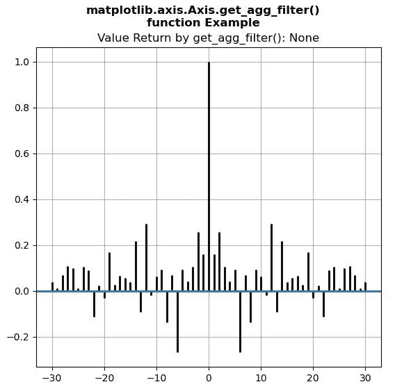

# Python 中的 matplotlib . axis . axis . get _ agg _ filter()函数

> 原文:[https://www . geeksforgeeks . org/matplotlib-axis-axis-get _ agg _ filter-in-function-python/](https://www.geeksforgeeks.org/matplotlib-axis-axis-get_agg_filter-function-in-python/)

[**Matplotlib**](https://www.geeksforgeeks.org/python-introduction-matplotlib/) 是 Python 中的一个库，是 NumPy 库的数值-数学扩展。这是一个神奇的 Python 可视化库，用于 2D 数组图，并用于处理更广泛的 SciPy 堆栈。

## matplotlib . axis . axis . get _ agg _ filter()函数

matplotlib 库的 Axis 模块中的 **Axis.get_agg_filter()函数**用于获取用于 agg 过滤的过滤函数。

> **语法:**axis . get _ agg _ filter(self)
> 
> **参数:**该方法不接受任何参数。
> 
> **返回值:**该方法返回用于 agg 过滤的过滤函数。

下面的例子说明了 matplotlib . axis . get _ agg _ filter()函数在 matplotlib.axis:

**例 1:**

## 蟒蛇 3

```py
# Implementation of matplotlib function
from matplotlib.axis import Axis
import numpy as np 
import matplotlib.pyplot as plt 
from matplotlib.artist import Artist  

xx = np.random.rand(6, 5) 

fig, axs = plt.subplots() 

m = axs.pcolor(xx) 
m.set_zorder(-2) 

# use of get_agg_filter() method 
val = Axis.get_agg_filter(axs) 
axs.set_title("Value Return by get_agg_filter(): "
              + str(val))

fig.suptitle("""matplotlib.axis.Axis.get_agg_filter()
function Example\n""", fontweight ="bold")  

plt.show()
```

**输出:**


**例 2:**

## 蟒蛇 3

```py
# Implementation of matplotlib function
from matplotlib.axis import Axis
import numpy as np 
import matplotlib.pyplot as plt 

np.random.seed(10**7) 
geeks = np.random.randn(40) 

fig, axs = plt.subplots() 
axs.acorr(geeks, usevlines=True, normed=True, 
          maxlags=30, lw=2) 

axs.grid(True) 

# use of get_agg_filter() method 
val = Axis.get_agg_filter(axs) 
axs.set_title("Value Return by get_agg_filter(): " 
              + str(val)) 

fig.suptitle("""matplotlib.axis.Axis.get_agg_filter()
function Example\n""", fontweight ="bold")  

plt.show()
```

**输出:**

