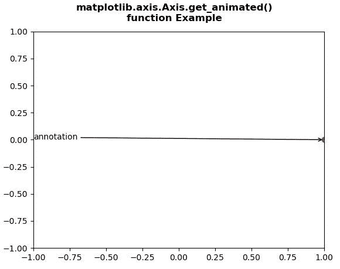

# Python 中的 matplotlib . axis . axis . get _ animated()函数

> 原文:[https://www . geesforgeks . org/matplotlib-axis-axis-get _ animated-function-in-python/](https://www.geeksforgeeks.org/matplotlib-axis-axis-get_animated-function-in-python/)

[**Matplotlib**](https://www.geeksforgeeks.org/python-introduction-matplotlib/) 是 Python 中的一个库，是 NumPy 库的数值-数学扩展。这是一个神奇的 Python 可视化库，用于 2D 数组图，并用于处理更广泛的 SciPy 堆栈。

## matplotlib . axis . axis . get _ animated()函数

matplotlib 库的 Axis 模块中的 **Axis.get_animated()函数**用于获取动画状态。

> **语法:** Axis.get_animated(self)
> 
> **参数:**该方法不接受任何参数。
> 
> **返回值:**此方法返回动画状态。

下面的例子说明了 matplotlib . axis . axis . get _ animated()函数在 matplotlib.axis:

**例 1:**

## 蟒蛇 3

```py
# Implementation of matplotlib function
from matplotlib.axis import Axis
import numpy as np  
import matplotlib.pyplot as plt  
import matplotlib.animation as animation  

data = np.array([[1, 2, 3, 4, 5],   
                [7, 4, 9, 2, 3]])  

fig = plt.figure()  
ax = plt.axes(xlim =(0, 20), ylim =(0, 20))  

line, = ax.plot([], [], 'r-')  
annotation = ax.annotate('', xy =(data[0][0],   
                         data[1][0]))  

Axis.set_animated(annotation, True)  
w = Axis.get_animated(annotation)  

print(str(w))  

fig.suptitle("""matplotlib.axis.Axis.get_animated()
function Example\n""", fontweight ="bold")  

plt.show()
```

**输出:**


```py
True

```

**例 2:**

## 蟒蛇 3

```py
# Implementation of matplotlib function
from matplotlib.axis import Axis
import numpy as np  
import matplotlib.pyplot as plt  
import matplotlib.animation as animation  

fig, ax = plt.subplots()  

ax.set_xlim([-1, 1])  
ax.set_ylim([-1, 1])  

L = 50
theta = np.linspace(0, 2 * np.pi, L)  
r = np.ones_like(theta)  

x = r * np.cos(theta)  
y = r * np.sin(theta)  

line, = ax.plot(1, 0, 'ro')  

annotation = ax.annotate(  
    'annotation', xy =(1, 0), xytext =(-1, 0),  
    arrowprops = {'arrowstyle': "->"}  
)  
Axis.set_animated(annotation, False)  
w = Axis.get_animated(annotation)  

print(str(w))    

fig.suptitle("""matplotlib.axis.Axis.get_animated()
function Example\n""", fontweight ="bold")  

plt.show()
```

**输出:**



```py
False

```