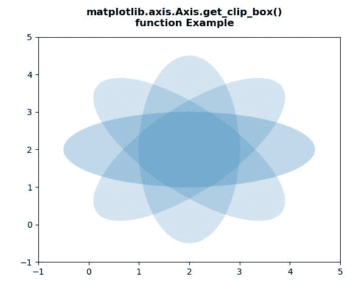
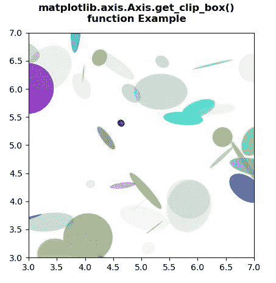

# Python 中的 matplotlib . axis . axis . get _ clip _ box()函数

> 原文:[https://www . geeksforgeeks . org/matplotlib-axis-axis-get _ clip _ box-python 中的函数/](https://www.geeksforgeeks.org/matplotlib-axis-axis-get_clip_box-function-in-python/)

[**Matplotlib**](https://www.geeksforgeeks.org/python-introduction-matplotlib/) 是 Python 中的一个库，是 NumPy 库的数值-数学扩展。这是一个神奇的 Python 可视化库，用于 2D 数组图，并用于处理更广泛的 SciPy 堆栈。

## matplotlib . axis . axis . get _ clip _ box()函数

matplotlib 库的 Axis 模块中的 **Axis.get_clip_box()函数**用于获取 clipbox..

> **语法:** Axis.get_clip_box(self)
> 
> **参数:**该方法不接受任何参数。
> 
> **返回值:**此方法返回剪贴簿。

下面的例子说明了 matplotlib . axis . axis . get _ clip _ box()函数在 matplotlib.axis:

**例 1:**

## 蟒蛇 3

```py
# Implementation of matplotlib function
from matplotlib.axis import Axis
import matplotlib.pyplot as plt  
import numpy as np  
from matplotlib.patches import Ellipse  

delta = 45.0

angles = np.arange(0, 360 + delta, delta)  
ells = [Ellipse((2, 2), 5, 2, a) for a in angles]  

fig, ax = plt.subplots()  

print("Value Return by get_clip_box()")  
for e in ells:  
    e.set_clip_box(ax.bbox)  
    print(Axis.get_clip_box(e))  
    e.set_alpha(0.1)  
    ax.add_artist(e)  

plt.xlim(-1, 5)  
plt.ylim(-1, 5)  

fig.suptitle("""matplotlib.axis.Axis.get_clip_box()
function Example\n""", fontweight ="bold")  

plt.show()
```

**输出:**



```py
Value Return by get_clip_box()
TransformedBbox(
    Bbox(x0=0.125, y0=0.10999999999999999, x1=0.9, y1=0.88),
    BboxTransformTo(
        TransformedBbox(
            Bbox(x0=0.0, y0=0.0, x1=6.4, y1=4.8),
            Affine2D(
                [[100\.   0\.   0.]
                 [  0\. 100\.   0.]
                 [  0\.   0\.   1.]]))))
TransformedBbox(
    Bbox(x0=0.125, y0=0.10999999999999999, x1=0.9, y1=0.88),
    BboxTransformTo(
        TransformedBbox(
            Bbox(x0=0.0, y0=0.0, x1=6.4, y1=4.8),
            Affine2D(
                [[100\.   0\.   0.]
                 [  0\. 100\.   0.]
                 [  0\.   0\.   1.]]))))
TransformedBbox(
    Bbox(x0=0.125, y0=0.10999999999999999, x1=0.9, y1=0.88),
    BboxTransformTo(
        TransformedBbox(
            Bbox(x0=0.0, y0=0.0, x1=6.4, y1=4.8),
            Affine2D(
                [[100\.   0\.   0.]
                 [  0\. 100\.   0.]
                 [  0\.   0\.   1.]]))))
TransformedBbox(
    Bbox(x0=0.125, y0=0.10999999999999999, x1=0.9, y1=0.88),
    BboxTransformTo(
        TransformedBbox(
            Bbox(x0=0.0, y0=0.0, x1=6.4, y1=4.8),
            Affine2D(
                [[100\.   0\.   0.]
                 [  0\. 100\.   0.]
                 [  0\.   0\.   1.]]))))
TransformedBbox(
    Bbox(x0=0.125, y0=0.10999999999999999, x1=0.9, y1=0.88),
    BboxTransformTo(
        TransformedBbox(
            Bbox(x0=0.0, y0=0.0, x1=6.4, y1=4.8),
            Affine2D(
                [[100\.   0\.   0.]
                 [  0\. 100\.   0.]
                 [  0\.   0\.   1.]]))))
TransformedBbox(
    Bbox(x0=0.125, y0=0.10999999999999999, x1=0.9, y1=0.88),
    BboxTransformTo(
        TransformedBbox(
            Bbox(x0=0.0, y0=0.0, x1=6.4, y1=4.8),
            Affine2D(
                [[100\.   0\.   0.]
                 [  0\. 100\.   0.]
                 [  0\.   0\.   1.]]))))
TransformedBbox(
    Bbox(x0=0.125, y0=0.10999999999999999, x1=0.9, y1=0.88),
    BboxTransformTo(
        TransformedBbox(
            Bbox(x0=0.0, y0=0.0, x1=6.4, y1=4.8),
            Affine2D(
                [[100\.   0\.   0.]
                 [  0\. 100\.   0.]
                 [  0\.   0\.   1.]]))))
TransformedBbox(
    Bbox(x0=0.125, y0=0.10999999999999999, x1=0.9, y1=0.88),
    BboxTransformTo(
        TransformedBbox(
            Bbox(x0=0.0, y0=0.0, x1=6.4, y1=4.8),
            Affine2D(
                [[100\.   0\.   0.]
                 [  0\. 100\.   0.]
                 [  0\.   0\.   1.]]))))
TransformedBbox(
    Bbox(x0=0.125, y0=0.10999999999999999, x1=0.9, y1=0.88),
    BboxTransformTo(
        TransformedBbox(
            Bbox(x0=0.0, y0=0.0, x1=6.4, y1=4.8),
            Affine2D(
                [[100\.   0\.   0.]
                 [  0\. 100\.   0.]
                 [  0\.   0\.   1.]]))))

```

**例 2:**

## 蟒蛇 3

```py
# Implementation of matplotlib function
from matplotlib.axis import Axis
import matplotlib.pyplot as plt  
import numpy as np  
from matplotlib.patches import Ellipse  

NUM = 200

ells = [Ellipse(xy = np.random.rand(2) * 10,  
                width = np.random.rand(),  
                height = np.random.rand(),  
                angle = np.random.rand() * 360)  
        for i in range(NUM)]  

fig, ax = plt.subplots(subplot_kw ={'aspect': 'equal'})  

print("Value Return by get_clip_box()")  
x = 0

for e in ells:  
    ax.add_artist(e)  
    e.set_clip_box(ax.bbox)  
    e.set_alpha(np.random.rand())  
    e.set_facecolor(np.random.rand(4))  

    if x<2:  
        print(Axis.get_clip_box(e))  
        x+= 1

ax.set_xlim(3, 7)  
ax.set_ylim(3, 7)  

fig.suptitle("""matplotlib.axis.Axis.get_clip_box()
function Example\n""", fontweight ="bold")  

plt.show()
```

**输出:**



```py
Value Return by get_clip_box()
TransformedBbox(
    Bbox(x0=0.125, y0=0.10999999999999999, x1=0.9, y1=0.88),
            Affine2D(
                [[100\.   0\.   0.]
                 [  0\. 100\.   0.]
                 [  0\.   0\.   1.]]))))
TransformedBbox(
    Bbox(x0=0.125, y0=0.10999999999999999, x1=0.9, y1=0.88),
    BboxTransformTo(
        TransformedBbox(
            Bbox(x0=0.0, y0=0.0, x1=6.4, y1=4.8),
            Affine2D(
                [[100\.   0\.   0.]
                 [  0\. 100\.   0.]
                 [  0\.   0\.   1.]]))))

```