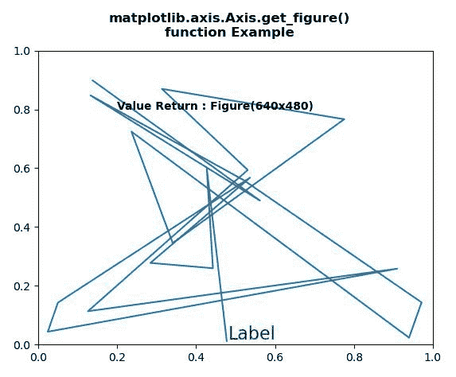
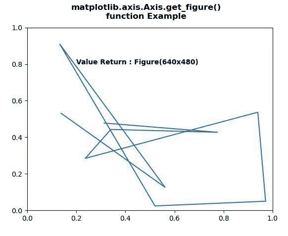

# Python 中的 matplotlib . axis . axis . get _ figure()函数

> 原文:[https://www . geeksforgeeks . org/matplotlib-axis-axis-get _ figure-function-in-python/](https://www.geeksforgeeks.org/matplotlib-axis-axis-get_figure-function-in-python/)

[**Matplotlib**](https://www.geeksforgeeks.org/python-introduction-matplotlib/) 是 Python 中的一个库，是 NumPy 库的数值-数学扩展。这是一个神奇的 Python 可视化库，用于 2D 数组图，并用于处理更广泛的 SciPy 堆栈。

## matplotlib . axis . axis . get _ figure()函数

matplotlib 库的 Axis 模块中的 **Axis.get_figure()函数**用于获取艺术家所属的 figure 实例。

> **语法:** Axis.get_figure(self)
> 
> **参数:**该方法不接受任何参数。
> 
> **返回值:**该方法返回艺术家所属的人物实例。

下面的例子说明了 matplotlib.axis . axis . get _ figure()函数在 matplotlib . axis 中的作用:

**例 1:**

## 蟒蛇 3

```py
# Implementation of matplotlib function
from matplotlib.axis import Axis
import numpy as np 
import matplotlib.pyplot as plt 
import matplotlib.lines as lines 
import matplotlib.transforms as mtransforms 
import matplotlib.text as mtext 

class GFGfun(lines.Line2D): 

    def __init__(self, *args, **kwargs): 
        self.text = mtext.Text(0, 0, '') 
        lines.Line2D.__init__(self, *args, **kwargs) 
        self.text.set_text(self.get_label()) 

    def set_figure(self, figure): 
        self.text.set_figure(figure) 
        lines.Line2D.set_figure(self, figure) 

    def set_axes(self, axes): 
        self.text.set_axes(axes) 
        lines.Line2D.set_axes(self, axes) 

    def set_transform(self, transform): 
        # 2 pixel offset 
        texttrans = transform + mtransforms.Affine2D().translate(2, 2) 
        self.text.set_transform(texttrans) 
        lines.Line2D.set_transform(self, transform) 

    def set_data(self, x, y): 
        if len(x): 
            self.text.set_position((x[-1], y[-1])) 

        lines.Line2D.set_data(self, x, y) 

    def draw(self, renderer): 
        lines.Line2D.draw(self, renderer) 
        self.text.draw(renderer) 

np.random.seed(10**7) 

fig, ax = plt.subplots() 
x, y = np.random.rand(2, 20) 
line = GFGfun(x, y, mfc ='green', 
              ms = 12, 
              label ='Label') 

line.text.set_color('green') 
line.text.set_fontsize(16) 

ax.add_line(line) 

ax.text(0.2, 0.8, "Value Return : "
        +str(Axis.get_figure(ax)),  
        fontweight ="bold")

fig.suptitle("""matplotlib.axis.Axis.get_figure()
function Example\n""", fontweight ="bold")  

plt.show()
```

**输出:**



**例 2:**

## 蟒蛇 3

```py
# Implementation of matplotlib function
from matplotlib.axis import Axis
import numpy as np 
import matplotlib.pyplot as plt 
import matplotlib.lines as lines 
import matplotlib.transforms as mtransforms 
import matplotlib.text as mtext 

class GFGfun(lines.Line2D): 

    def __init__(self, *args, **kwargs): 
        self.text = mtext.Text(0, 0, '') 
        lines.Line2D.__init__(self, *args, **kwargs) 
        self.text.set_text(self.get_label()) 

    def set_figure(self, figure): 
        self.text.set_figure(figure) 
        lines.Line2D.set_figure(self, figure) 

np.random.seed(10**7) 

fig, ax = plt.subplots() 
x, y = np.random.rand(2, 10) 
line = GFGfun(x, y, 
              mfc ='green', ms = 12, label ='Label') 

line.text.set_color('green') 
line.text.set_fontsize(16) 

ax.add_line(line) 

ax.text(0.2, 0.8, "Value Return : "
        +str(Axis.get_figure(ax)), 
        fontweight ="bold")

fig.suptitle("""matplotlib.axis.Axis.get_figure()
function Example\n""", fontweight ="bold")  

plt.show()
```

**输出:**

