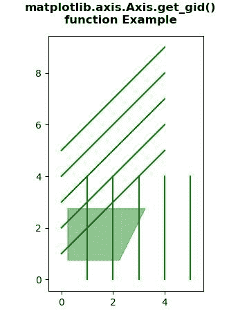
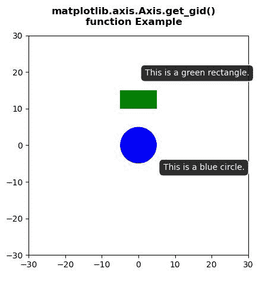

# Python 中的 Matplotlib.axis.Axis.get_gid()函数

> 原文:[https://www . geesforgeks . org/matplotlib-axis-axis-get _ GID-python 中的函数/](https://www.geeksforgeeks.org/matplotlib-axis-axis-get_gid-function-in-python/)

[**Matplotlib**](https://www.geeksforgeeks.org/python-introduction-matplotlib/) 是 Python 中的一个库，是 NumPy 库的数值-数学扩展。这是一个神奇的 Python 可视化库，用于 2D 数组图，并用于处理更广泛的 SciPy 堆栈。

## Matplotlib.axis.Axis.get_gid()函数

matplotlib 库的 Axis 模块中的 **Axis.get_gid()函数**用于获取组 id。

> **语法:** Axis.get_gid(self)
> 
> **参数:**该方法不接受任何参数。
> 
> **返回值:**此方法返回组 id。

下面的例子说明了 matplotlib.axis.Axis.get_gid()函数在 matplotlib.axis:
中的作用

**例 1:**

## 蟒蛇 3

```
# Implementation of matplotlib function
from matplotlib.axis import Axis
import numpy as np  
import matplotlib.pyplot as plt  

y, x = np.mgrid[:5, 1:6]  

poly_coords = [  
    (0.25, 2.75), (3.25, 2.75),  
    (2.25, 0.75), (0.25, 0.75)  
]  

fig, ax = plt.subplots()  

cells = ax.plot(x, y, x + y, color ='green')  

ax.add_patch(  
    plt.Polygon(poly_coords,   
                color ='forestgreen',   
                alpha = 0.5)  
    )  

ax.margins(x = 0.1, y = 0.05)  
ax.set_aspect('equal')  

for i, t in enumerate(ax.patches):  
    Axis.set_gid(t, 'patch_% d' % i) 
    print("Value Return :", Axis.get_gid(t))

fig.suptitle("""matplotlib.axis.Axis.get_gid()
function Example\n""", fontweight ="bold")  

plt.show()
```

**输出:**



```
Value Return : patch_ 0

```

**例 2:**

## 蟒蛇 3

```
# Implementation of matplotlib function
from matplotlib.axis import Axis
import numpy as np  
import matplotlib.pyplot as plt  

fig, ax = plt.subplots()  

circle = plt.Circle((0, 0), 5, fc ='blue')  
rect = plt.Rectangle((-5, 10), 10, 5, fc ='green')  

ax.add_patch(circle)  
ax.add_patch(rect)  

circle_tip = ax.annotate('This is a blue circle.',  
            xy =(0, 0),  
            xytext =(30, -30),  
            textcoords ='offset points',  
            color ='w',  
            ha ='left',  
            bbox = dict(boxstyle ='round, pad =.5',   
                        fc =(.1, .1, .1, .92),  
                        ec =(1., 1., 1.),   
                        lw = 1,  
                        zorder = 1),  
            )  

rect_tip = ax.annotate('This is a green rectangle.',  
            xy =(-5, 10),  
            xytext =(30, 40),  
            textcoords ='offset points',  
            color ='w',  
            ha ='left',  
            bbox = dict(boxstyle ='round, pad =.5',  
                        fc =(.1, .1, .1, .92),   
                        ec =(1., 1., 1.),   
                        lw = 1,  
                        zorder = 1),  
            )  

print("Value Return :")  
for i, t in enumerate(ax.patches):  
    Axis.set_gid(t, 'patch_% d'% i) 
    print(Axis.get_gid(t))  

for i, t in enumerate(ax.texts):  
    Axis.set_gid(t, 'tooltip_% d'% i) 
    print(Axis.get_gid(t))  

ax.set_xlim(-30, 30)  
ax.set_ylim(-30, 30)  
ax.set_aspect('equal') 

fig.suptitle("""matplotlib.axis.Axis.get_gid()
function Example\n""", fontweight ="bold")  

plt.show()
```

**输出:**



```
Value Return :
patch_ 0
patch_ 1
tooltip_ 0
tooltip_ 1

```