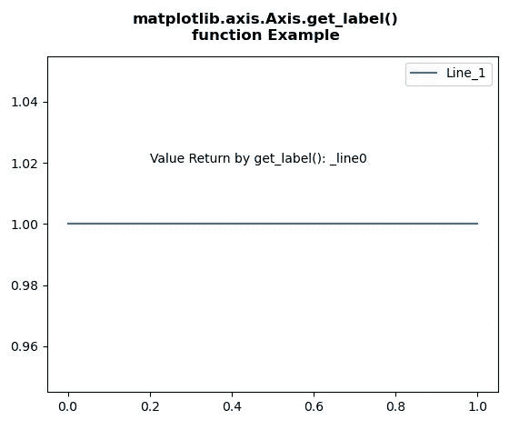
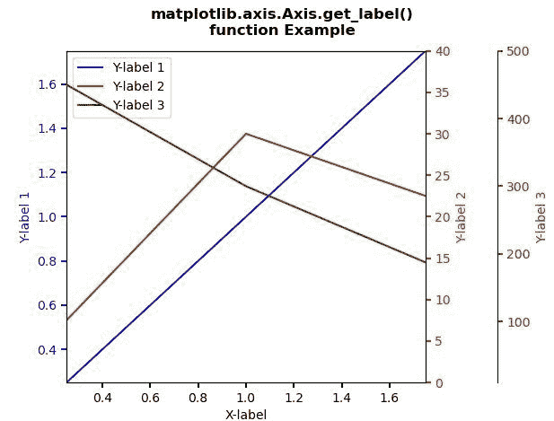

# Python 中的 Matplotlib.axis.Axis.get_label()函数

> 原文:[https://www . geesforgeks . org/matplotlib-axis-axis-get _ label-function-in-python/](https://www.geeksforgeeks.org/matplotlib-axis-axis-get_label-function-in-python/)

[**Matplotlib**](https://www.geeksforgeeks.org/python-introduction-matplotlib/) 是 Python 中的一个库，是 NumPy 库的数值-数学扩展。这是一个神奇的 Python 可视化库，用于 2D 数组图，并用于处理更广泛的 SciPy 堆栈。

## Matplotlib.axis.Axis.get_label()函数

matplotlib 库的 Axis 模块中的 **Axis.get_label()函数**用于获取图例中该艺术家使用的标签。

> **语法:** Axis.get_label(self)
> 
> **参数:**该方法不接受任何参数。
> 
> **返回值:**该方法返回图例中该艺术家使用的标签。

下面的例子说明了 matplotlib.axis.Axis.get_label()函数在 matplotlib.axis:

**例 1:**

## 蟒蛇 3

```
# Implementation of matplotlib function
from matplotlib.axis import Axis
import matplotlib.pyplot as plt  

fig, ax = plt.subplots()  

x = [0, 1]  
y = [1, 1]  
line, = ax.plot(x, y)  

ax.legend(("Line_1", ))  

ax.text(0.2, 1.02, "Value Return by get_label()\
: " + str(line.get_label()))

fig.suptitle("""matplotlib.axis.Axis.get_label()
function Example\n""", fontweight ="bold")  

plt.show()
```

**输出:**



**例 2:**

## 蟒蛇 3

```
# Implementation of matplotlib function
from matplotlib.axis import Axis
import matplotlib.pyplot as plt  

def make_patch_spines_invisible(ax):  
    ax.set_frame_on(True)  
    ax.patch.set_visible(False)  
    for sp in ax.spines.values():  
        sp.set_visible(False)  

fig, host = plt.subplots()  
fig.subplots_adjust(right = 0.75)  

par1 = host.twinx()  
par2 = host.twinx()  

par2.spines["right"].set_position(("axes", 1.2))  

make_patch_spines_invisible(par2)  

par2.spines["right"].set_visible(True)  

p1, = host.plot([0, 1, 2], [0, 1, 2],  
                "b-", label ="Y-label 1")  
p2, = par1.plot([0, 1, 2], [0, 30, 20],  
                "r-", label ="Y-label 2")  
p3, = par2.plot([0, 1, 2], [500, 300, 150],   
                "g-", label ="Y-label 3")  

host.set_xlim(0.25, 1.75)  
host.set_ylim(0.25, 1.75)  
par1.set_ylim(0, 40)  
par2.set_ylim(10, 500)  

host.set_xlabel("X-label")  
host.set_ylabel("Y-label 1")  
par1.set_ylabel("Y-label 2")  
par2.set_ylabel("Y-label 3")  

host.yaxis.label.set_color(p1.get_color())  
par1.yaxis.label.set_color(p2.get_color())  
par2.yaxis.label.set_color(p3.get_color())  

tkw = dict(size = 4, width = 1.5)  
host.tick_params(axis ='y',   
                 colors = p1.get_color(),   
                 **tkw)  
par1.tick_params(axis ='y',   
                 colors = p2.get_color(),  
                 **tkw)  
par2.tick_params(axis ='y',  
                 colors = p3.get_color(),  
                 **tkw)  
host.tick_params(axis ='x',  
                 **tkw)  

lines = [p1, p2, p3]  

host.legend(lines, [l.get_label() for l in lines])

fig.suptitle("""matplotlib.axis.Axis.get_label()
function Example\n""", fontweight ="bold")  

plt.show()
```

**输出:**

