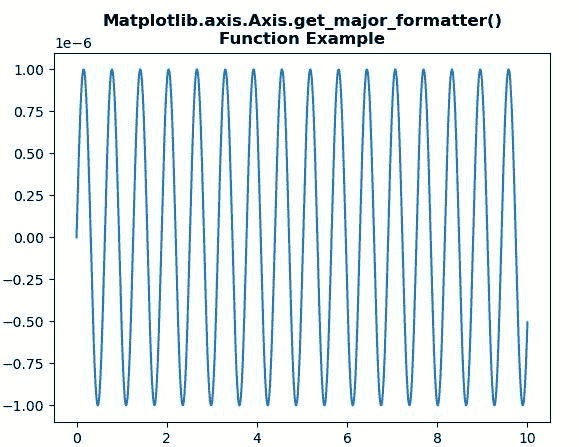
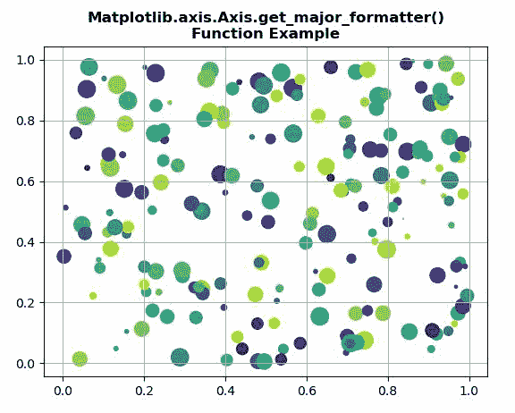

# Python 中的 matplotlib . axis . axis . get _ main _ formatter()函数

> 原文:[https://www . geeksforgeeks . org/matplotlib-axis-axis-get _ major _ formatter-python 中的函数/](https://www.geeksforgeeks.org/matplotlib-axis-axis-get_major_formatter-function-in-python/)

[**Matplotlib**](https://www.geeksforgeeks.org/python-introduction-matplotlib/) 是 Python 中的一个库，是 NumPy 库的数值-数学扩展。这是一个神奇的 Python 可视化库，用于 2D 数组图，并用于处理更广泛的 SciPy 堆栈。

## matplotlib . axis . axis . get _ main _ formatter()函数

matplotlib 库的 Axis 模块中的**axis . get _ main _ formatter()函数**用于获取主跑马灯的格式化程序。

> **语法:**axis . get _ major _ formatter(self)
> 
> **参数:**该方法不接受任何参数。
> 
> **返回值:**这个方法返回主跑马灯的格式化程序。

下面的例子说明了 matplotlib.axis . axis . get _ major _ formatter()函数在 matplotlib . axis 中的作用:

**例 1:**

## 蟒蛇 3

```
# Implementation of matplotlib function 
import numpy as np
from matplotlib.axis import Axis  
import matplotlib.pyplot as plt   

x = np.linspace(0, 10, 1000) 
y = 0.000001 * np.sin(10 * x) 

fig = plt.figure() 
ax = fig.add_subplot(111) 

ax.plot(x, y) 

print(Axis.get_major_formatter(ax.yaxis))

plt.title("Matplotlib.axis.Axis.get_major_formatter()\n\
Function Example", fontsize = 12, fontweight ='bold') 
plt.show()
```

**输出:**



```
<matplotlib.ticker.ScalarFormatter object at 0x08497E30>

```

**例 2:**

## 蟒蛇 3

```
# Implementation of matplotlib function 
import numpy as np
from matplotlib.axis import Axis  
import matplotlib.pyplot as plt   

np.random.seed(19680801)  

fig, ax = plt.subplots()  

x, y, s, c = np.random.rand(4, 200)  
s *= 200

ax.scatter(x, y, s, c)
ax.grid()  

print(Axis.get_major_formatter(ax.xaxis))

plt.title("Matplotlib.axis.Axis.get_major_formatter()\n\
Function Example", fontsize = 12, fontweight ='bold') 
plt.show()
```

**输出:**



```
<matplotlib.ticker.ScalarFormatter object at 0x084E9F10>

```