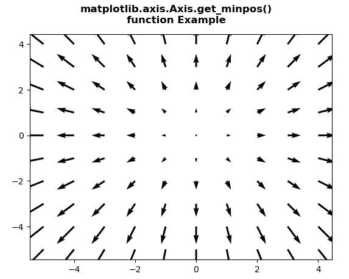

# Python 中的 matplotlib . axis . axis . get _ min pos()函数

> 原文:[https://www . geeksforgeeks . org/matplotlib-axis-axis-get _ min pos-python 中的函数/](https://www.geeksforgeeks.org/matplotlib-axis-axis-get_minpos-function-in-python/)

[**Matplotlib**](https://www.geeksforgeeks.org/python-introduction-matplotlib/) 是 Python 中的一个库，是 NumPy 库的数值-数学扩展。这是一个神奇的 Python 可视化库，用于 2D 数组图，并用于处理更广泛的 SciPy 堆栈。

## matplotlib . axis . axis . get _ min pos()函数

matplotlib 库的 Axis 模块中的 **Axis.get_minpos()函数**用于获取 minpos。

> **语法:** Axis.get_minpos(self)
> 
> **参数:**该方法不接受任何参数。
> 
> **返回值:**该方法返回最小值。

下面的例子说明了 matplotlib . axis . axis . get _ min pos()函数在 matplotlib.axis:
中的作用

**例 1:**

## 蟒蛇 3

```py
# Implementation of matplotlib function
from matplotlib.axis import Axis
import matplotlib.pyplot as plt 
import numpy as np 

X = np.arange(-5, 5, 1) 
Y = np.arange(-5, 5, 1) 
U, V = np.meshgrid(X, Y) 

fig, ax = plt.subplots() 
ax.quiver(X, Y, U, V)

w = ax.xaxis.get_minpos() 

print("Value Return :\n"+str(w)) 

fig.suptitle("""matplotlib.axis.Axis.get_minpos()
function Example\n""", fontweight ="bold")  

plt.show()
```

**输出:**



```py
Value Return :
4.0

```

**例 2:**

## 蟒蛇 3

```py
# Implementation of matplotlib function 
from matplotlib.axis import Axis
import numpy as np
import matplotlib.pyplot as plt

fig, ax2 = plt.subplots(sharex = True)
fig.subplots_adjust(left=0.2, wspace=0.6)
box = dict(facecolor='green', pad=5, alpha=0.2)

ax2.plot(20*np.random.rand(10))
ax2.set_xlabel('X - Label', bbox=box)
ax2.set_xlim(0, 10)
Axis.set_label_coords(ax2.xaxis, 0.5, 0.95)

w = ax2.xaxis.get_minpos() 

print("Value Return :\n"+str(w)) 

fig.suptitle("""matplotlib.axis.Axis.get_minpos()
function Example\n""", fontweight ="bold")  

plt.show()
```

**输出:**


```py
Value Return :
1.0
```