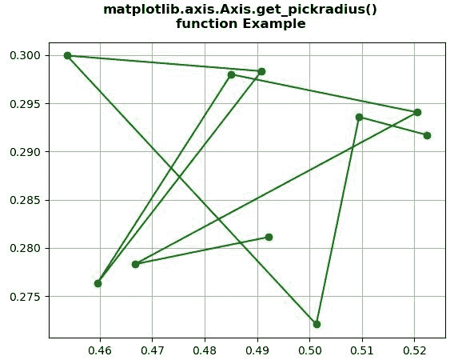
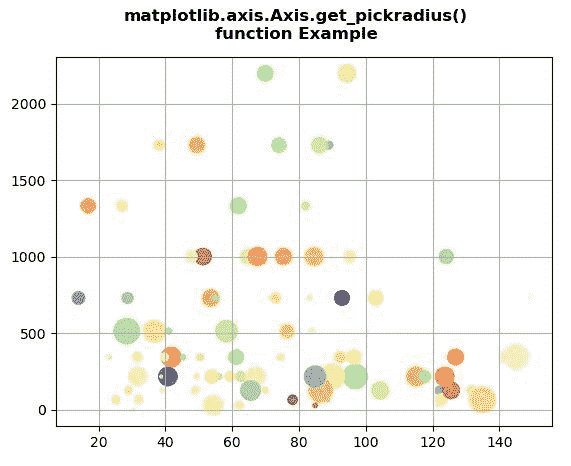

# Python 中的 matplotlib . axis . axis . get _ pick radius()函数

> 原文:[https://www . geeksforgeeks . org/matplotlib-axis-axis-get _ pick radius-python 中的函数/](https://www.geeksforgeeks.org/matplotlib-axis-axis-get_pickradius-function-in-python/)

[**Matplotlib**](https://www.geeksforgeeks.org/python-introduction-matplotlib/) 是 Python 中的一个库，是 NumPy 库的数值-数学扩展。这是一个神奇的 Python 可视化库，用于 2D 数组图，并用于处理更广泛的 SciPy 堆栈。

## matplotlib . axis . axis . get _ pick radius()函数

matplotlib 库的轴模块中的 **Axis.get_pickradius()函数**用于获取拾取器
使用的轴的深度

> **语法:**axis . get _ pick radius(self)
> 
> **参数:**该方法不接受任何参数。
> 
> **返回值:**此方法返回拾取器使用的轴的深度。

下面的例子说明了 matplotlib . axis . get _ pick radius()函数在 matplotlib.axis:
中的作用

**例 1:**

## 蟒蛇 3

```py
# Implementation of matplotlib function
from matplotlib.axis import Axis
import numpy as np 
import matplotlib.pyplot as plt 

X = np.random.rand(10, 200) 
xs = np.mean(X, axis = 1) 
ys = np.std(X, axis = 1) 

fig = plt.figure() 
ax = fig.add_subplot(111) 
line, = ax.plot(xs, ys, 'go-')

ax.grid()

print("Value return by get_pickradius() :",
      ax.yaxis.get_pickradius())

fig.suptitle("""matplotlib.axis.Axis.get_pickradius()
function Example\n""", fontweight ="bold")  

plt.show()
```

**输出:**



```py
Value return by get_pickradius() : 15

```

**例 2:**

## 蟒蛇 3

```py
# Implementation of matplotlib function
from matplotlib.axis import Axis
import numpy as np 
import matplotlib.pyplot as plt 

np.random.seed(19680801) 

volume = np.random.rayleigh(27, size = 100) 
amount = np.random.poisson(7, size = 100) 
ranking = np.random.normal(size = 100) 
price = np.random.uniform(1, 7, size = 100) 

fig, ax = plt.subplots() 

scatter = ax.scatter(volume * 2,  
                     amount**3, 
                     c = ranking, 
                     s = price**3, 
                     vmin = -3, 
                     vmax = 3, 
                     cmap ="Spectral")
ax.yaxis.set_pickradius(25)

ax.grid()

print("Value return by get_pickradius() :",
      ax.yaxis.get_pickradius())

fig.suptitle("""matplotlib.axis.Axis.get_pickradius()
function Example\n""", fontweight ="bold")  

plt.show()
```

**输出:**



```py
Value return by get_pickradius() : 25

```