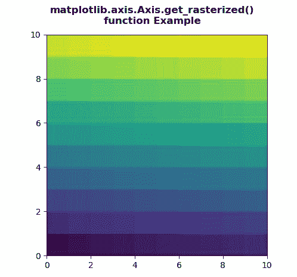
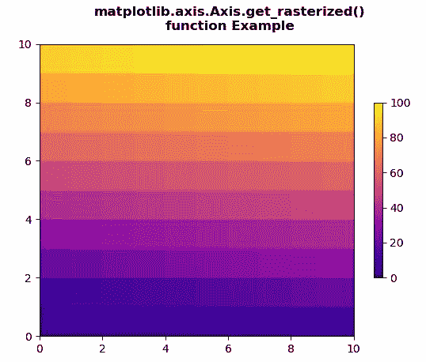

# Python 中的 matplotlib . axis . axis . get _ 栅格化()函数

> 原文:[https://www . geeksforgeeks . org/matplotlib-axis-axis-get _ 栅格化-python 中的函数/](https://www.geeksforgeeks.org/matplotlib-axis-axis-get_rasterized-function-in-python/)

[**Matplotlib**](https://www.geeksforgeeks.org/python-introduction-matplotlib/) 是 Python 中的一个库，是 NumPy 库的数值-数学扩展。这是一个神奇的 Python 可视化库，用于 2D 数组图，并用于处理更广泛的 SciPy 堆栈。

## matplotlib . axis . axis . get _ 光栅化()函数

matplotlib 库的 Axis 模块中的**axis . get _ 栅格化()函数**用于获取艺术家是否要栅格化..

> **语法:**axis . get _ 栅格化(自身)
> 
> **参数:**该方法不接受任何参数。
> 
> **返回值:**该方法返回艺术家是否要光栅化。

下面的例子说明了 matplotlib . axis . axis . get _ 栅格化()函数在 matplotlib.axis:

**例 1:**

## 蟒蛇 3

```
# Implementation of matplotlib function
from matplotlib.axis import Axis
import numpy as np  
import matplotlib.pyplot as plt  

d = np.arange(100).reshape(10, 10)  
xx, yy = np.meshgrid(np.arange(11), np.arange(11))  

fig, ax = plt.subplots()  

ax.set_aspect(1)  
m = ax.pcolormesh(xx, yy, d)  

if Axis.get_rasterized(m)== None:  
    Axis.set_rasterized(m, True) 

fig.suptitle("""matplotlib.axis.Axis.get_rasterized()
function Example\n""", fontweight ="bold")  

plt.show()
```

**输出:**



**例 2:**

## 蟒蛇 3

```
# Implementation of matplotlib function
from matplotlib.axis import Axis
import matplotlib.pyplot as plt  
import matplotlib.colors as mcolors  
import matplotlib.gridspec as gridspec  
import numpy as np  

arr = np.arange(100).reshape((10, 10))  
norm = mcolors.Normalize(vmin = 0., vmax = 100.)  

pc_kwargs = {'cmap': 'plasma', 'norm': norm}  

fig, ax = plt.subplots( )  

im = ax.pcolormesh(arr, **pc_kwargs)  
fig.colorbar(im, ax = ax, shrink = 0.6) 

if Axis.get_rasterized(im)== None:  
    Axis.set_rasterized(im, False) 

fig.suptitle("""matplotlib.axis.Axis.get_rasterized()
function Example\n""", fontweight ="bold")  

plt.show()
```

**输出:**

