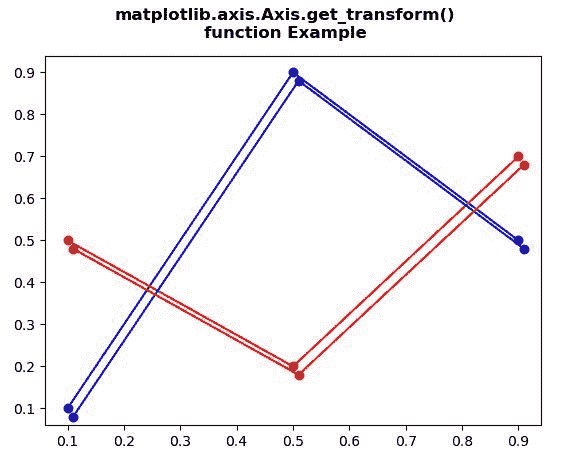
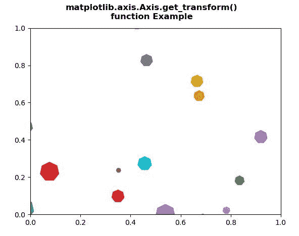

# Python 中的 matplotlib . axis . axis . get _ transform()函数

> 原文:[https://www . geeksforgeeks . org/matplotlib-axis-axis-get _ transform-python 中的函数/](https://www.geeksforgeeks.org/matplotlib-axis-axis-get_transform-function-in-python/)

[**Matplotlib**](https://www.geeksforgeeks.org/python-introduction-matplotlib/) 是 Python 中的一个库，是 NumPy 库的数值-数学扩展。这是一个神奇的 Python 可视化库，用于 2D 数组图，并用于处理更广泛的 SciPy 堆栈。

## matplotlib . axis . axis . get _ transform()函数

matplotlib 库的 Axis 模块中的 **Axis.get_transform()函数**用来获取该艺术家使用的 transform 实例。

> **语法:** Axis.get_transform(self)
> 
> **参数:**该方法不接受任何参数。
> 
> **返回值:**该方法返回该艺术家使用的 Transform 实例。

下面的例子说明了 matplotlib . axis . axis . get _ transform()函数在 matplotlib.axis:

**例 1:**

## 蟒蛇 3

```
# Implementation of matplotlib function
from matplotlib.axis import Axis
import numpy as np   
import matplotlib.pyplot as plt  
import matplotlib.transforms as mtransforms  

fig, ax = plt.subplots()   

l1, = ax.plot([0.1, 0.5, 0.9],  
              [0.1, 0.9, 0.5], 
              "bo-")  

l2, = ax.plot([0.1, 0.5, 0.9], 
              [0.5, 0.2, 0.7], 
              "ro-")  

for l in [l1, l2]:  
    xx = l.get_xdata()  
    yy = l.get_ydata()  
    shadow, = ax.plot(xx, yy)  
    shadow.update_from(l)  

    ot = mtransforms.offset_copy(l.get_transform(),  
                                 ax.figure,  
                                 x = 4.0, y =-6.0,  
                                 units ='points')  

    shadow.set_transform(ot) 

fig.suptitle("""matplotlib.axis.Axis.get_transform()
function Example\n""", fontweight ="bold")  

plt.show()
```

**输出:**



**例 2:**

## 蟒蛇 3

```
# Implementation of matplotlib function
from matplotlib.axis import Axis
import matplotlib.pyplot as plt  
from matplotlib import collections, colors, transforms  
import numpy as np  

nverts = 50
npts = 100

r = np.arange(nverts)  
theta = np.linspace(0, 2 * np.pi, nverts)  

xx = r * np.sin(theta)  
yy = r * np.cos(theta)  
spiral = np.column_stack([xx, yy])  

rs = np.random.RandomState(19680801)  

xyo = rs.randn(npts, 2)  

colors = [colors.to_rgba(c)  
          for c in plt.rcParams['axes.prop_cycle'].by_key()['color']]  

fig, ax1 = plt.subplots()  

col = collections.RegularPolyCollection(  
    7, sizes = np.abs(xx) * 10.0,   
    offsets = xyo,   
    transOffset = ax1.transData)  

trans = transforms.Affine2D().scale(fig.dpi / 72.0)  
Axis.set_transform(col, trans)   

ax1.add_collection(col, autolim = True)  
col.set_color(colors)
print("Value Return by get_transform() :\n", 
       col.get_transform())

fig.suptitle("""matplotlib.axis.Axis.get_transform()
function Example\n""", fontweight ="bold")  

plt.show()
```

**输出:**

