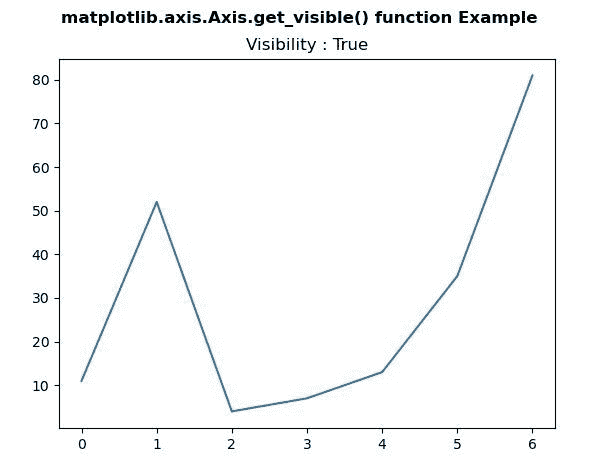
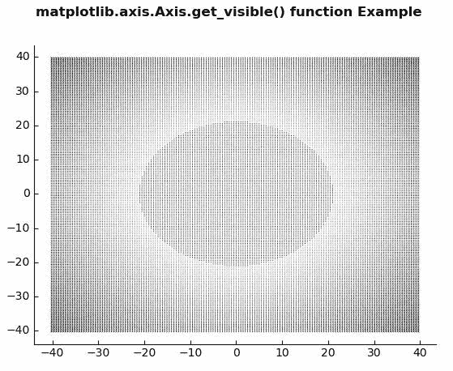

# Python 中的 matplotlib . axis . axis . get _ visible()函数

> 原文:[https://www . geesforgeks . org/matplotlib-axis-axis-get _ visible-python 中的函数/](https://www.geeksforgeeks.org/matplotlib-axis-axis-get_visible-function-in-python/)

[**Matplotlib**](https://www.geeksforgeeks.org/python-introduction-matplotlib/) 是 Python 中的一个库，是 NumPy 库的数值-数学扩展。这是一个神奇的 Python 可视化库，用于 2D 数组图，并用于处理更广泛的 SciPy 堆栈。

## matplotlib . axis . axis . get _ visible()函数

matplotlib 库的 Axis 模块中的 **Axis.get_visible()函数**用于获取可见性。

> **语法:** Axis.get_visible(self)
> 
> **参数:**该方法不接受任何参数。
> 
> **返回值:**此方法返回可见性。

以下示例说明 matplotlib . axis . axis . get _ visible()函数在 matplotlib.axis:
**示例 1:**

## 蟒蛇 3

```
# Implementation of matplotlib function
from matplotlib.axis import Axis
import matplotlib.pyplot as plt  
from mpl_toolkits.axisartist.axislines import Subplot  

fig, ax = plt.subplots()  

ax.plot([11, 52, 4, 7, 13, 35, 81])  

ax.set_title("Visibility : " +str(Axis.get_visible(ax)))

fig.suptitle('matplotlib.axis.Axis.get_visible() \
function Example\n', fontweight ="bold")  

plt.show() 
```

**输出:**



**例 2:**

## 蟒蛇 3

```
# Implementation of matplotlib function
from matplotlib.axis import Axis
import numpy as np  
import matplotlib.pyplot as plt  
from mpl_toolkits.axisartist.axislines import Subplot  

fig = plt.figure()  

ax = Subplot(fig, 111)  
fig.add_subplot(ax)  

X = np.arange(-40, 40, 0.5)  
Y = np.arange(-40, 40, 0.5)  
U, V = np.meshgrid(X, Y)  

ax.quiver(X, Y, U, V)  

ax.axis["right"].set_visible(False)  
ax.axis["top"].set_visible(False)  

print("Visibilities of Axis")  
print("Bottom :", Axis.get_visible(ax.axis["bottom"]),  
      "\nTop :", Axis.get_visible(ax.axis["top"]),  
      "\nLeft :", Axis.get_visible(ax.axis["left"]),  
      "\nRight :", Axis.get_visible(ax.axis["right"]))

fig.suptitle('matplotlib.axis.Axis.get_visible() \
function Example\n', fontweight ="bold")  

plt.show() 
```

**输出:**



```
Visibilities of Axis
Bottom : True 
Top : False 
Left : True 
Right : False

```