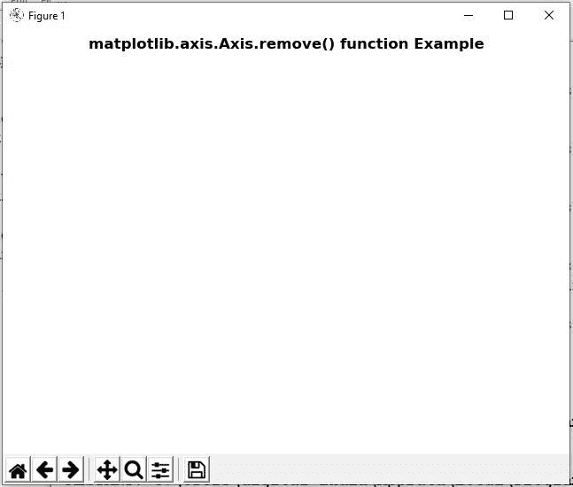

# Python 中的 Matplotlib.axis.Axis.remove()函数

> 原文:[https://www . geesforgeks . org/matplotlib-axis-axis-remove-python 中的函数/](https://www.geeksforgeeks.org/matplotlib-axis-axis-remove-function-in-python/)

[**Matplotlib**](https://www.geeksforgeeks.org/python-introduction-matplotlib/) 是 Python 中的一个库，是 NumPy 库的数值-数学扩展。这是一个神奇的 Python 可视化库，用于 2D 数组图，并用于处理更广泛的 SciPy 堆栈。

## Matplotlib.axis.Axis.remove()函数

matplotlib 库的 Axis 模块中的 **Axis.remove()函数**用于在可能的情况下从图形中移除艺术家。

> **语法:**轴.移除(自我)
> 
> **参数:**该方法不接受任何参数。
> 
> **返回值:**此方法返回移除艺术家后的图形。

以下示例说明 matplotlib.axis.Axis.remove()函数在 matplotlib.axis:
**示例 1:**

## 蟒蛇 3

```
# Implementation of matplotlib function
from matplotlib.axis import Axis
import matplotlib.pyplot as plt 

fig, axs = plt.subplots() 
axs.plot([1, 2, 3]) 

# use of remove() method 
Axis.remove(axs) 

fig.suptitle('matplotlib.axis.Axis.remove() \
function Example\n', fontweight ="bold")  

plt.show() 
```

**输出:**



**例 2:**

## 蟒蛇 3

```
# Implementation of matplotlib function
from matplotlib.axis import Axis
import matplotlib.pyplot as plt  

fig, (axs, axs2) = plt.subplots(2, 1)  
gs = axs2.get_gridspec()   

# use of remove() method 
Axis.remove(axs) 

axbig = fig.add_subplot(gs[1:, -1])  
axbig.annotate("Removed one Axes",  
               (0.4, 0.5),  
               xycoords ='axes fraction',  
               va ='center') 

fig.suptitle('matplotlib.axis.Axis.remove() \
function Example\n', fontweight ="bold")  

plt.show() 
```

**输出:**

