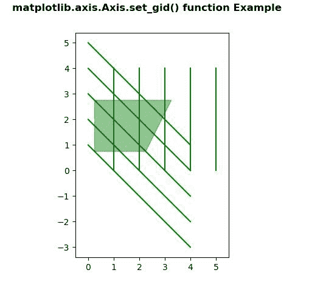
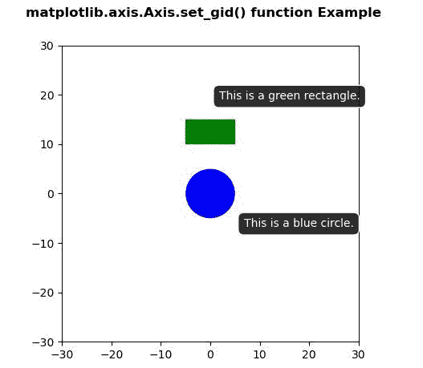

# Python 中的 Matplotlib.axis.Axis.set_gid()函数

> 原文:[https://www . geesforgeks . org/matplotlib-axis-axis-set _ GID-python 中的函数/](https://www.geeksforgeeks.org/matplotlib-axis-axis-set_gid-function-in-python/)

[**Matplotlib**](https://www.geeksforgeeks.org/python-introduction-matplotlib/) 是 Python 中的一个库，是 NumPy 库的数值-数学扩展。这是一个神奇的 Python 可视化库，用于 2D 数组图，并用于处理更广泛的 SciPy 堆栈。

## Matplotlib.axis.Axis.set_gid()函数

matplotlib 库的 Axis 模块中的 **Axis.set_gid()函数**用于设置艺术家的(组)id。

> **语法:** Axis.set_gid(self，gid)
> 
> **参数:**该方法接受以下参数。
> 
> *   **gid:** 这个参数是 gid 给出的字符串。
> 
> **返回值:**此方法不返回值。

以下示例说明 matplotlib.axis.Axis.set_gid()函数在 matplotlib.axis:
**示例 1:**

## 蟒蛇 3

```
# Implementation of matplotlib function
from matplotlib.axis import Axis
import numpy as np 
import matplotlib.pyplot as plt 

y, x = np.mgrid[:5, 1:6] 
poly_coords = [ 
    (0.25, 2.75), (3.25, 2.75), 
    (2.25, 0.75), (0.25, 0.75) 
] 

fig, ax = plt.subplots() 

cells = ax.plot(x, y, x - y, color='green') 
ax.add_patch( 
    plt.Polygon(poly_coords, 
                color='forestgreen', 
                alpha=0.5) 
) 

ax.margins(x=0.1, y=0.05) 
ax.set_aspect('equal') 

for i, t in enumerate(ax.patches): 
    Axis.set_gid(t, 'patch_% d' % i) 

fig.suptitle('matplotlib.axis.Axis.set_gid() \
function Example\n', fontweight ="bold")  

plt.show() 
```

**输出:**



**例 2:**

## 蟒蛇 3

```
# Implementation of matplotlib function
from matplotlib.axis import Axis
import numpy as np  
import matplotlib.pyplot as plt  

fig, ax = plt.subplots()  

circle = plt.Circle((0, 0), 5, fc ='blue')  
rect = plt.Rectangle((-5, 10), 10, 5, fc ='green')  

ax.add_patch(circle)  
ax.add_patch(rect)  

circle_tip = ax.annotate('This is a blue circle.',  
        xy =(0, 0),xytext =(30, -30), ha ='left',
        textcoords ='offset points',color ='w',
        bbox = dict(boxstyle ='round, pad =.5',   
            fc =(.1, .1, .1, .92), ec =(1., 1., 1.),
            lw = 1, zorder = 1))  

rect_tip = ax.annotate('This is a green rectangle.',  
        xy =(-5, 10), xytext =(30, 40),color ='w', 
        textcoords ='offset points', ha ='left',  
        bbox = dict(boxstyle ='round, pad =.5',  
            fc =(.1, .1, .1, .92), ec =(1., 1., 1.),
            lw = 1, zorder = 1))  

for i, t in enumerate(ax.patches):  
    Axis.set_gid(t, 'patch_% d'% i)  

for i, t in enumerate(ax.texts):  
    Axis.set_gid(t, 'tooltip_% d'% i)  

ax.set_xlim(-30, 30)  
ax.set_ylim(-30, 30)  
ax.set_aspect('equal')

fig.suptitle('matplotlib.axis.Axis.set_gid() \
function Example\n', fontweight ="bold")  

plt.show() 
```

**输出:**

