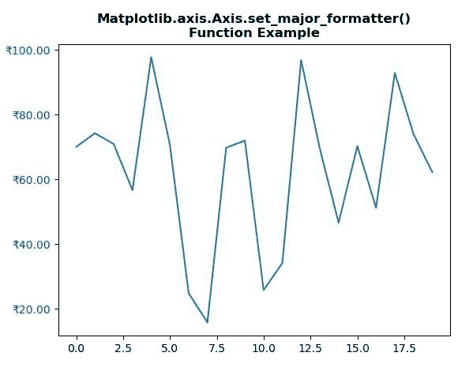

# Python 中的 matplotlib . axis . axis . set _ main _ formatter()函数

> 原文:[https://www . geeksforgeeks . org/matplotlib-axis-axis-set _ major _ formatter-python 中的函数/](https://www.geeksforgeeks.org/matplotlib-axis-axis-set_major_formatter-function-in-python/)

[**Matplotlib**](https://www.geeksforgeeks.org/python-introduction-matplotlib/) 是 Python 中的一个库，是 NumPy 库的数值-数学扩展。这是一个神奇的 Python 可视化库，用于 2D 数组图，并用于处理更广泛的 SciPy 堆栈。

## matplotlib . axis . axis . set _ main _ formatter()函数

matplotlib 库的 Axis 模块中的 **Axis.set_major_formatter()函数**用于设置主跑马灯的格式化程序。

> **语法:**axis . set _ main _ formatter(self，formatter)
> 
> **参数:**该方法接受以下参数。
> 
> *   **格式化程序:**该参数是*格式化程序*。
> 
> **返回值:**此方法不返回值。

以下示例说明 matplotlib . axis . axis . set _ main _ formatter()函数在 matplotlib.axis:
**示例 1:**

## 蟒蛇 3

```
# Implementation of matplotlib function 
import numpy as np
from matplotlib.axis import Axis  
import matplotlib.pyplot as plt
import matplotlib.ticker as ticker

np.random.seed(19680801)

fig, ax = plt.subplots()
ax.plot(100*np.random.rand(20))

formatter = ticker.FormatStrFormatter('?%1.2f')
Axis.set_major_formatter(ax.yaxis, formatter)

for tick in ax.yaxis.get_major_ticks():
    tick.label1.set_color('green')

plt.title("Matplotlib.axis.Axis.set_major_formatter()\n\
Function Example", fontsize = 12, fontweight ='bold') 

plt.show()
```

**输出:**



**例 2:**

## 蟒蛇 3

```
# Implementation of matplotlib function 
from matplotlib.axis import Axis
import datetime 
import matplotlib.pyplot as plt 
from matplotlib.dates import DayLocator, HourLocator, DateFormatter, drange 
import numpy as np 

date1 = datetime.datetime(2020, 4, 2) 
date2 = datetime.datetime(2020, 4, 6) 
delta = datetime.timedelta(hours = 6) 
dates = drange(date1, date2, delta) 

y = np.arange(len(dates)) 

fig, ax = plt.subplots() 
ax.plot_date(dates, y ** 2, 'g') 

ax.set_xlim(dates[0], dates[-1]) 

ax.xaxis.set_major_locator(DayLocator()) 
ax.xaxis.set_minor_locator(HourLocator(range(0, 25, 6))) 
ax.xaxis.set_major_formatter(plt.NullFormatter()) 

ax.fmt_xdata = DateFormatter('% Y-% m-% d % H:% M:% S') 
fig.autofmt_xdate() 

plt.title("Matplotlib.axis.Axis.set_major_formatter()\n\
Function Example", fontsize = 12, fontweight ='bold') 

plt.show()
```

**输出:**

