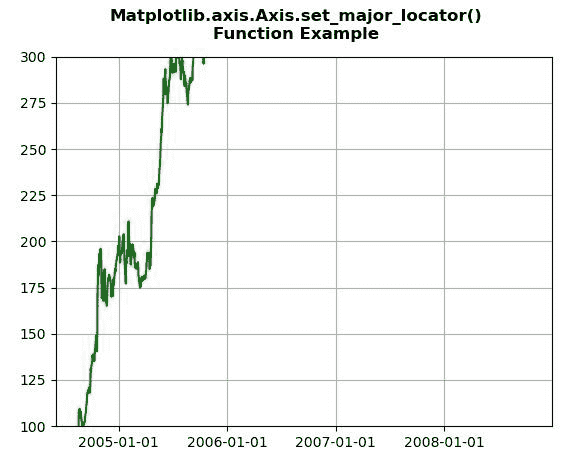
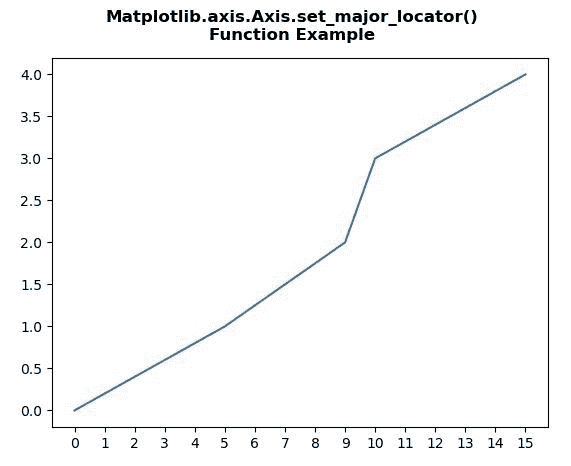

# Python 中的 matplotlib . axis . axis . set _ main _ locator()函数

> 原文:[https://www . geesforgeks . org/matplotlib-axis-axis-set _ major _ locator-python 中的函数/](https://www.geeksforgeeks.org/matplotlib-axis-axis-set_major_locator-function-in-python/)

[**Matplotlib**](https://www.geeksforgeeks.org/python-introduction-matplotlib/) 是 Python 中的一个库，是 NumPy 库的数值-数学扩展。这是一个神奇的 Python 可视化库，用于 2D 数组图，并用于处理更广泛的 SciPy 堆栈。

## matplotlib . axis . axis . set _ main _ locator()函数

matplotlib 库的 Axis 模块中的**axis . set _ main _ locator()函数**用于设置主跑马灯的定位器。

> **语法:**axis . set _ main _ locator(自身，定位器)
> 
> **参数:**该方法接受以下参数。
> 
> *   **定位器:**该参数为*定位器*。
> 
> **返回值:**此方法不返回值。

以下示例说明 matplotlib . axis . axis . set _ main _ locator()函数在 matplotlib.axis:
**示例 1:**

## 蟒蛇 3

```py
# Implementation of matplotlib function 
from matplotlib.axis import Axis
import numpy as np 
import matplotlib.pyplot as plt 
import matplotlib.dates as mdates 
import matplotlib.cbook as cbook 

years = mdates.YearLocator()    
months = mdates.MonthLocator()   
years_fmt = mdates.DateFormatter('% Y') 

with cbook.get_sample_data('goog.npz') as datafile: 
    data = np.load(datafile)['price_data'].view(np.recarray) 

fig, ax = plt.subplots() 
ax.plot('date', 'adj_close', data = data, color ="green") 

Axis.set_major_locator(ax.xaxis, years) 
ax.set_ylim((100, 300)) 

ax.format_xdata = mdates.DateFormatter('% m') 
ax.grid(True) 

fig.suptitle("Matplotlib.axis.Axis.set_major_locator()\n\
Function Example", fontsize = 12, fontweight ='bold') 

plt.show()
```

**输出:**



**例 2:**

## 蟒蛇 3

```py
# Implementation of matplotlib function 
from matplotlib.axis import Axis
import matplotlib.pyplot as plt 
import matplotlib.ticker as ticker 

x = [0, 5, 9, 10, 15] 
y = [0, 1, 2, 3, 4] 

tick_spacing = 1

fig, ax = plt.subplots(1, 1) 
ax.plot(x, y) 
ax.xaxis.set_major_locator(ticker.MultipleLocator(tick_spacing))

fig.suptitle("Matplotlib.axis.Axis.set_major_locator()\n\
Function Example", fontsize = 12, fontweight ='bold') 

plt.show()
```

**输出:**

