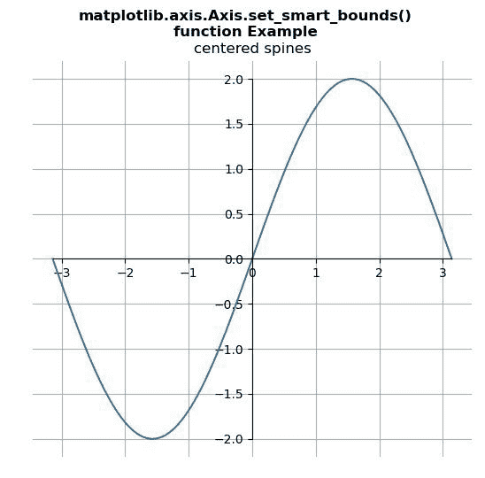
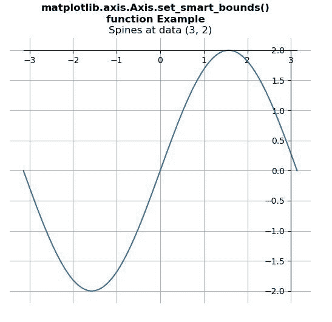

# Python 中的 matplotlib . axis . axis . set _ smart _ bounds()函数

> 原文:[https://www . geeksforgeeks . org/matplotlib-axis-axis-set _ smart _ bounds-python 中的函数/](https://www.geeksforgeeks.org/matplotlib-axis-axis-set_smart_bounds-function-in-python/)

[**Matplotlib**](https://www.geeksforgeeks.org/python-introduction-matplotlib/) 是 Python 中的一个库，是 NumPy 库的数值-数学扩展。这是一个神奇的 Python 可视化库，用于 2D 数组图，并用于处理更广泛的 SciPy 堆栈。

## matplotlib . axis . axis . set _ smart _ bounds()函数

matplotlib 库的 Axis 模块中的 **Axis.set_smart_bounds()函数**用于设置轴有智能边界。

> **语法:** Axis.set_smart_bounds(self，value)
> 
> **参数:**该方法接受以下参数。
> 
> *   **值:**该参数为布尔值。
> 
> **返回值:**此方法不返回值。

下面的例子说明了 matplotlib . axis . axis . set _ smart _ bounds()函数在 matplotlib.axis:

**例 1:**

## 蟒蛇 3

```py
# Implementation of matplotlib function
from matplotlib.axis import Axis
import numpy as np
import matplotlib.pyplot as plt

fig = plt.figure()
x = np.linspace(-np.pi, np.pi, 100)
y = 2*np.sin(x)

ax = fig.add_subplot()
ax.set_title('centered spines')
ax.plot(x, y)

ax.spines['left'].set_position('center')
ax.spines['right'].set_color('none')
ax.spines['bottom'].set_position('center')
ax.spines['top'].set_color('none')
ax.spines['left'].set_smart_bounds(True)
ax.spines['bottom'].set_smart_bounds(True)

ax.xaxis.set_ticks_position('bottom')
ax.yaxis.set_ticks_position('left')

ax.grid() 

fig.suptitle("""matplotlib.axis.Axis.set_smart_bounds()
function Example\n""", fontweight ="bold")  

plt.show()
```

**输出:**



**例 2:**

## 蟒蛇 3

```py
# Implementation of matplotlib function
from matplotlib.axis import Axis
import numpy as np
import matplotlib.pyplot as plt

fig = plt.figure()
x = np.linspace(-np.pi, np.pi, 100)
y = 2*np.sin(x)

ax = fig.add_subplot()
ax.set_title('Spines at data (3, 2)')
ax.plot(x, y)

ax.spines['left'].set_position(('data', 3))
ax.spines['right'].set_color('none')
ax.spines['bottom'].set_position(('data', 2))
ax.spines['top'].set_color('none')
ax.spines['left'].set_smart_bounds(True)
ax.spines['bottom'].set_smart_bounds(True)

ax.xaxis.set_ticks_position('bottom')
ax.yaxis.set_ticks_position('left')

ax.grid() 

fig.suptitle("""matplotlib.axis.Axis.set_smart_bounds()
function Example\n""", fontweight ="bold")  

plt.show()
```

**输出:**

