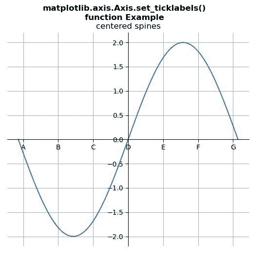

# Python 中的 matplotlib . axis . axis . set _ tick labels()函数

> 原文:[https://www . geeksforgeeks . org/matplotlib-axis-axis-set _ tick labels-python 中的函数/](https://www.geeksforgeeks.org/matplotlib-axis-axis-set_ticklabels-function-in-python/)

[**Matplotlib**](https://www.geeksforgeeks.org/python-introduction-matplotlib/) 是 Python 中的一个库，是 NumPy 库的数值-数学扩展。这是一个神奇的 Python 可视化库，用于 2D 数组图，并用于处理更广泛的 SciPy 堆栈。

## matplotlib . axis . axis . set _ tick labels()函数

matplotlib 库的 Axis 模块中的 **Axis.set_ticklabels()函数**用于设置刻度标签的文本值。

> **语法:** Axis.set_ticklabels(self，ticklabels，\*args，minor=False，*\*kwargs)
> 
> **参数:**该方法接受以下参数。
> 
> *   **ticklabels :** 此参数是 tick 标签的文本列表。
> *   **次要:**该参数包含布尔值。
> 
> **返回值:**该方法返回文本列表。

下面的例子说明了 matplotlib . axis . axis . set _ tick labels()函数在 matplotlib.axis:

**例 1:**

## 蟒蛇 3

```
# Implementation of matplotlib function
from matplotlib.axis import Axis
import matplotlib.pyplot as plt
import numpy as np 

fig = plt.figure()

x = np.linspace(0,2*np.pi,100)
y = 2*np.sin(x)

ax = fig.add_subplot()
ax.plot(x,y)

ax.yaxis.set_ticklabels(['','a','b','c','d',
                         'e','f','g','h','i',
                         ''])  
ax.xaxis.set_ticklabels(['','A','B','C','D',
                         'E','F','G',''])

ax.grid() 

fig.suptitle("""matplotlib.axis.Axis.set_ticklabels()
function Example\n""", fontweight ="bold")  

plt.show()
```

**输出:**


**例 2:**

## 蟒蛇 3

```
# Implementation of matplotlib function
from matplotlib.axis import Axis
import matplotlib.pyplot as plt
import numpy as np 

fig = plt.figure()
x = np.linspace(-np.pi, np.pi, 100)
y = 2 * np.sin(x)

ax = fig.add_subplot()
ax.set_title('centered spines')
ax.plot(x, y)

ax.spines['left'].set_position('center')
ax.spines['right'].set_color('none')
ax.spines['bottom'].set_position('center')
ax.spines['top'].set_color('none')

ax.xaxis.set_ticks_position('bottom')
ax.yaxis.set_ticks_position('left')
ax.xaxis.set_ticklabels(['','A','B','C','D',
                         'E','F','G',''])

ax.grid() 

fig.suptitle("""matplotlib.axis.Axis.set_ticklabels()
function Example\n""", fontweight ="bold")  

plt.show()
```

**输出:**

