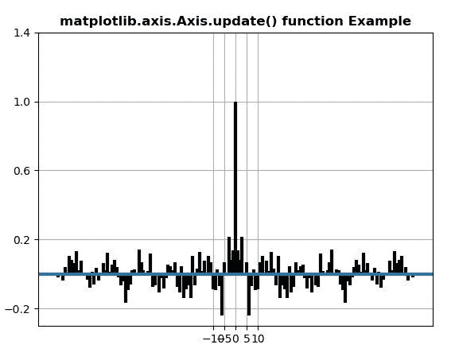
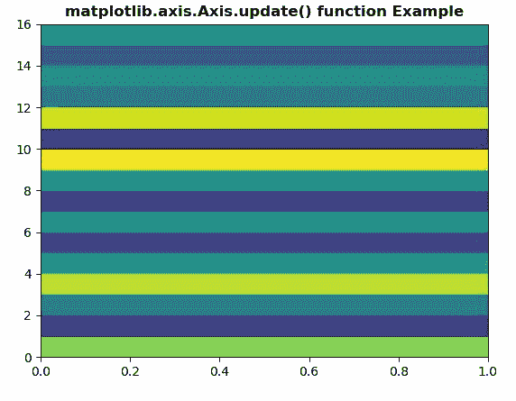

# Python 中的 Matplotlib.axis.Axis.update()函数

> 原文:[https://www . geeksforgeeks . org/matplotlib-axis-axis-update-function-in-python/](https://www.geeksforgeeks.org/matplotlib-axis-axis-update-function-in-python/)

[**Matplotlib**](https://www.geeksforgeeks.org/python-introduction-matplotlib/) 是 Python 中的一个库，是 NumPy 库的数值-数学扩展。这是一个神奇的 Python 可视化库，用于 2D 数组图，并用于处理更广泛的 SciPy 堆栈。

## Matplotlib.axis.Axis.update()函数

matplotlib 库的 Axis 模块中的 **Axis.update()函数**用于从字典道具中更新该艺术家的属性。

> **语法:** Axis.update(自我，道具)
> 
> **参数:**该方法接受以下参数。
> 
> *   **道具:**这个参数是属性的字典。
> 
> **返回值:**此方法不返回值。

下面的例子说明 matplotlib.axis.Axis.update()函数在 matplotlib.axis:

**例 1:**

## 蟒蛇 3

```py
# Implementation of matplotlib function
from matplotlib.axis import Axis
import matplotlib.pyplot as plt  
import numpy as np  

np.random.seed(10**7)  
geeks = np.random.randn(100)  

fig, ax = plt.subplots()  
ax.acorr(geeks, usevlines = True,  
         normed = True,  
         maxlags = 80, lw = 3)  

ax.grid(True)  

prop = {'xticks': np.array([-10., -5., 
                            0., 5., 10.]),  
        'yticks': np.array([-0.2,  0.2,  
                            0.6, 1., 1.4]),  
        'ylabel': None, 'xlabel': None}  

Axis.update(ax, prop)

plt.title('matplotlib.axis.Axis.update() \
function Example', fontweight ="bold")  

plt.show() 
```

**输出:**



**例 2:**

## 蟒蛇 3

```py
# Implementation of matplotlib function
from matplotlib.axis import Axis
import numpy as np   
import matplotlib.pyplot as plt   

xx = np.random.rand(16, 30)   

fig, ax = plt.subplots()   

m = ax.pcolor(xx)   
m.set_zorder(-20)  
prop = {'autoscalex_on': False} 

Axis.update(ax, prop)

plt.title('matplotlib.axis.Axis.update() \
function Example', fontweight ="bold")  

plt.show() 
```

**输出:**

