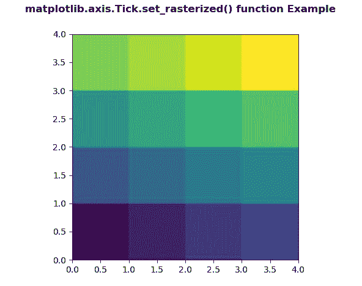

# Python 中的 matplotlib . axis . tick . set _ 栅格化()函数

> 原文:[https://www . geeksforgeeks . org/matplotlib-axis-tick-set _ 栅格化-python 中的函数/](https://www.geeksforgeeks.org/matplotlib-axis-tick-set_rasterized-function-in-python/)

[**Matplotlib**](https://www.geeksforgeeks.org/python-introduction-matplotlib/) 是 Python 中的一个库，是 NumPy 库的数值-数学扩展。这是一个神奇的 Python 可视化库，用于 2D 数组图，并用于处理更广泛的 SciPy 堆栈。

## matplotlib . axis . tick . set _ 栅格化()函数

matplotlib 库的轴模块中的**tick . set _ 栅格化()函数**用于在矢量后端输出中强制栅格化(位图)绘制。

> **语法:**tick . set _ 栅格化(自身，栅格化)
> 
> **参数:**该方法接受以下参数。
> 
> *   **栅格化:**该参数为布尔值。
> 
> **返回值:**此方法不返回值。

以下示例说明 matplotlib . axis . tick . set _ 栅格化()函数在 matplotlib.axis:
**示例 1:**

## 蟒蛇 3

```py
# Implementation of matplotlib function
from matplotlib.axis import Tick
import numpy as np  
import matplotlib.pyplot as plt  

d = np.arange(16).reshape(4,4)  
xx, yy = np.meshgrid(np.arange(5), np.arange(5))  

fig, ax = plt.subplots()  

ax.set_aspect(1)  
m = ax.pcolormesh(xx, yy, d)  
Tick.set_rasterized(m, True) 

fig.suptitle('matplotlib.axis.Tick.set_rasterized() \
function Example', fontweight ="bold")  

plt.show() 
```

**输出:**



**例 2:**

## 蟒蛇 3

```py
# Implementation of matplotlib function
from matplotlib.axis import Tick
import matplotlib.pyplot as plt  
import matplotlib.colors as mcolors  
import matplotlib.gridspec as gridspec  
import numpy as np  

arr = np.arange(20).reshape((4, 5))  
norm = mcolors.Normalize(vmin = 0., vmax = 20.)  

pc_kwargs = {'cmap': 'BuGn', 'norm': norm}  

fig, ax = plt.subplots( )  

im = ax.pcolormesh(arr, **pc_kwargs)  
fig.colorbar(im, ax = ax, shrink = 0.7)  
Tick.set_rasterized(im, False) 

fig.suptitle('matplotlib.axis.Tick.set_rasterized() \
function Example', fontweight ="bold")  

plt.show() 
```

**输出:**

