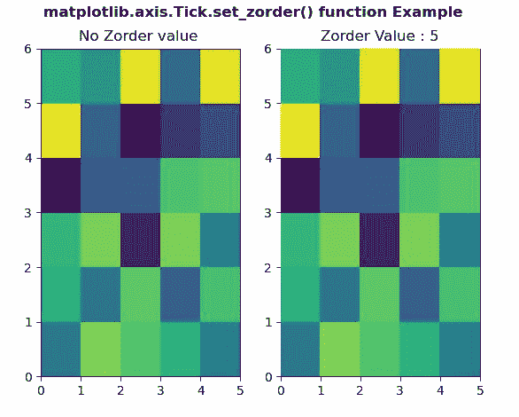

# Python 中的 matplotlib . axis . tick . set _ zorder()函数

> 原文:[https://www . geeksforgeeks . org/matplotlib-axis-tick-set _ zorder-python 中的函数/](https://www.geeksforgeeks.org/matplotlib-axis-tick-set_zorder-function-in-python/)

[**Matplotlib**](https://www.geeksforgeeks.org/python-introduction-matplotlib/) 是 Python 中的一个库，是 NumPy 库的数值-数学扩展。这是一个神奇的 Python 可视化库，用于 2D 数组图，并用于处理更广泛的 SciPy 堆栈。

## matplotlib . axis . tick . set _ zorder()函数

matplotlib 库的轴模块中的 **Tick.set_zorder()函数**用于为艺术家设置 zorder。具有较低 zorder 值的艺术家首先被绘制。

> **语法:** Tick.set_zorder(自我，等级)
> 
> **参数:**该方法接受以下参数。
> 
> *   **级别:**该参数包含浮点值。
> 
> **返回值:**此方法不返回值。

以下示例说明 matplotlib . axis . tick . set _ zorder()函数在 matplotlib.axis:
**示例 1:**

## 蟒蛇 3

```
# Implementation of matplotlib function
from matplotlib.axis import Tick
import numpy as np  
import matplotlib.pyplot as plt  

d = np.arange(49).reshape(7, 7)  
xx, yy = np.meshgrid(np.arange(8), np.arange(8))  

fig, ax = plt.subplots()  

ax.set_aspect(1)  
m = ax.pcolormesh(xx**2, yy**2, d**2) 

Tick.set_zorder(m, -5) 

ax.set_title('matplotlib.axis.Tick.set_zorder() \
function Example', fontweight ="bold")  

plt.show() 
```

**输出:**


**例 2:**

## 蟒蛇 3

```
# Implementation of matplotlib function
from matplotlib.axis import Tick
import numpy as np  
import matplotlib.pyplot as plt  

xx = np.random.rand(6, 5)  

fig, (ax3, ax4) = plt.subplots(1, 2)  

m = ax3.pcolor(xx)  

ax3.set_title("No Zorder value ")  

m = ax4.pcolor(xx)  
Tick.set_zorder(m, 5)  

ax4.set_title("Zorder Value : 5")

fig.suptitle('matplotlib.axis.Tick.set_zorder() \
function Example', fontweight ="bold")  

plt.show() 
```

**输出:**

