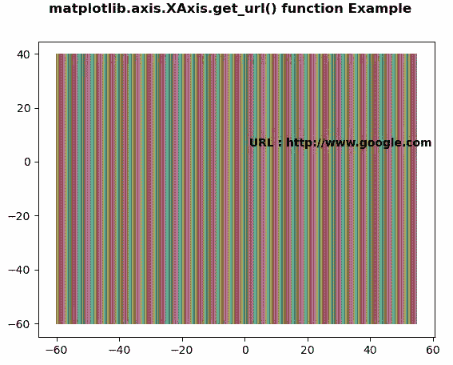

# Python 中的 Matplotlib.axis.XAxis.get_url()函数

> 原文:[https://www . geeksforgeeks . org/matplotlib-axis-xaxis-get _ URL-in-function-python/](https://www.geeksforgeeks.org/matplotlib-axis-xaxis-get_url-in-function-python/)

**[Matplotlib](https://www.geeksforgeeks.org/python-introduction-matplotlib/)** 是 Python 中的一个库，是 NumPy 库的数值-数学扩展。这是一个神奇的 Python 可视化库，用于 2D 数组图，并用于处理更广泛的 SciPy 堆栈。

## Matplotlib.axis.XAxis.get_url()函数

matplotlib 库的 Axis 模块中的 **XAxis.get_url()** 函数用于获取 url。

> **语法:** XAxis.get_url(self)
> 
> **参数:**该方法不接受任何参数。
> 
> **返回值:**该方法返回网址。

**例 1:**

```py
# Implementation of matplotlib function 
from matplotlib.axis import XAxis 
import numpy as np 
import matplotlib.pyplot as plt 

X = np.arange(-60, 55, 0.4) 
Y = np.arange(-60, 40, 0.4) 
U, V = np.meshgrid(X, Y) 

fig, ax = plt.subplots() 
ax.plot(U, V) 
ax.set_url('http://www.google.com') 
fig.canvas.print_figure('scatter.svg') 

ax.text(1.5, 5.5, "URL : "
        + str( XAxis.get_url(ax)), 
        fontweight ="bold") 

fig.suptitle('matplotlib.axis.XAxis.get_url() function\
Example\n', fontweight ="bold") 

plt.show()
```

**输出:**


**例 2:**

```py
# Implementation of matplotlib function 
from matplotlib.axis import XAxis 
import matplotlib.pyplot as plt 
import numpy as np 

fig, ax = plt.subplots() 
delta = 0.25

x = y = np.arange(-4.0, 5.0, delta) 
X, Y = np.meshgrid(x, y) 

Z1 = np.exp(-X**2 - Y**2) 
Z2 = np.exp(-(X - 1)**2 - (Y - 1)**2) 
Z = (Z1 - Z2) * 2

ax.imshow(Z, interpolation ='bilinear', 
        cmap = "BuGn", 
        origin ='lower', 
        extent =[-3, 3, -3, 3]) 

ax.set_url('https://www.geeksforgeeks.org/')     
ax.set_title("URL : "+str(XAxis.get_url(ax)), 
            fontweight ="bold") 

fig.suptitle('matplotlib.axis.XAxis.get_url() \
function Example\n', fontweight ="bold") 

plt.show()
```

**输出:**
