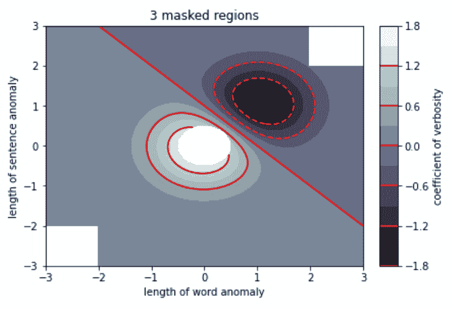
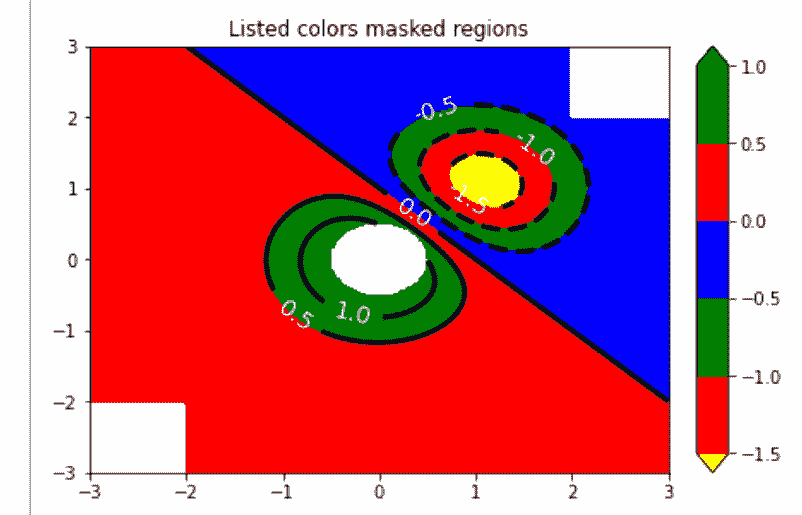
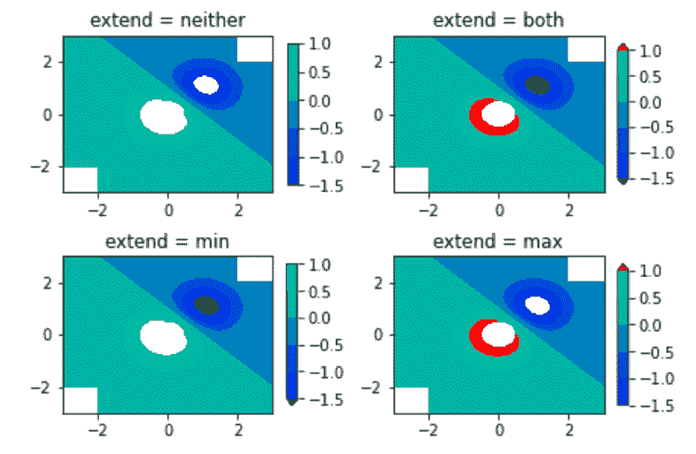

# Python 中的 Matplotlib.colors.Colormap 类

> 原文:[https://www . geesforgeks . org/matplotlib-colors-color map-python 中的类/](https://www.geeksforgeeks.org/matplotlib-colors-colormap-class-in-python/)

[**Matplotlib**](http://geeksforgeeks.org/python-matplotlib-an-overview/) 是 Python 中一个惊人的可视化库，用于数组的 2D 图。Matplotlib 是一个多平台数据可视化库，构建在 NumPy 数组上，旨在与更广泛的 SciPy 堆栈一起工作。

## matplotlib.colors.Colormap

**matplotlib . colors . color map**类属于 **matplotlib.colors** 模块。matplotlib.colors 模块用于将颜色或数字参数转换为 RGBA 或 RGB。该模块用于将数字映射到颜色，或者在一维颜色数组(也称为颜色映射)中进行颜色规格转换。

matplotlib.colors.Colormap 类是所有标量到 RGBA 映射的基类。通常，颜色映射实例用于将数据值(浮动)从间隔 0-1 转换为它们各自的 RGBA 颜色。这里 matplotlib.colors.Normalize 类用于缩放数据。matplotlib.cm.ScalarMappable 子类大量使用这个数据->规格化->映射到颜色处理链。

**语法:**

> 类 matplotlib.colors.Colormap(名称，N=256)
> 
> **参数:**
> 
> *   **名称:**它接受一个代表颜色名称的字符串。
> *   **N:** 表示 rgb 量化级数的整数值。

**类方法:**

1.  **colorbar_extend = None :** 如果 colormap 存在于可标量映射上，并且 colorbar_extend 设置为 false，则 colorbar 创建将 colorbar_extend 作为 matplotlib.colorbar.Colorbar 的构造函数中 extend 关键字的默认值。
2.  **为 _ 灰色(自身):**返回一个布尔值，检查 plt 是否为灰色。
3.  **反转(自身，名称=无)**:用于制作 Colormap 的反转实例。这个函数不是为基类实现的。它有一个参数，即可选的名称，并接受一个字符串名称的反向颜色映射。如果设置为“无”，将成为父色图+“r”的名称。
4.  set_bad(self，color='k '，alpha=None):它设置用于屏蔽值的颜色。
5.  **set_over(self，color='k '，，alpha=None):** 用于设置高超范围值使用的颜色。它要求 norm.clip 为 False。
6.  **set_under(self，color='k '，，alpha=None):** 用于设置低超范围值使用的颜色。它要求 norm.clip 为 False。

**例**:

```py
import numpy as np
import matplotlib.pyplot as plt

start_point = 'lower'

diff = 0.025

a = b = np.arange(-3.0, 3.01, diff)
A, B = np.meshgrid(a, b)
X1 = np.exp(-A**2 - B**2)
X2 = np.exp(-(A - 1)**2 - (B - 1)**2)
X = (X1 - X2) * 2

RR, RC = X.shape

# putting NaNs in one corner:
X[-RR // 6:, -RC // 6:] = np.nan

X = np.ma.array(X)
# masking the other corner:
X[:RR // 6, :RC // 6] = np.ma.masked

# masking a circle in the middle:
INNER = np.sqrt(A**2 + B**2) < 0.5
X[INNER] = np.ma.masked

# using automatic selection of
# contour levels;
figure1, axes2 = plt.subplots(constrained_layout = True)
C = axes2.contourf(A, B, X, 10, 
                   cmap = plt.cm.bone, 
                   origin = start_point)

C2 = axes2.contour(C, levels = C.levels[::2], 
                   colors ='r', origin = start_point)

axes2.set_title('3 masked regions')
axes2.set_xlabel('length of word anomaly')
axes2.set_ylabel('length of sentence anomaly')

# Make a colorbar for the ContourSet 
# returned by the contourf call.
cbar = figure1.colorbar(C)

cbar.ax.set_ylabel('coefficient of verbosity')

# Add the contour line levels
# to the colorbar
cbar.add_lines(C2)

figure2, axes2 = plt.subplots(constrained_layout = True)

# making a contour plot with the
# levels specified,
levels = [-1.5, -1, -0.5, 0, 0.5, 1]
C3 = axes2.contourf(A, B, X, levels,
                   colors =('r', 'g', 'b'),
                   origin = start_point,
                   extend ='both')

# data below the lowest contour 
# level yellow, data below the
# highest level green:
C3.cmap.set_under('yellow')
C3.cmap.set_over('green')

C4 = axes2.contour(A, B, X, levels,
                  colors =('k', ),
                  linewidths =(3, ),
                  origin = start_point)

axes2.set_title('Listed colors (3 masked regions)')

axes2.clabel(C4, fmt ='% 2.1f', 
             colors ='w',
             fontsize = 14)

figure2.colorbar(C3)

# Illustrating all 4 possible 
# "extend" settings:
extends = ["neither", "both", "min", "max"]
cmap = plt.cm.get_cmap("winter")
cmap.set_under("green")
cmap.set_over("red")

figure, axes = plt.subplots(2, 2,
                            constrained_layout = True)

for ax, extend in zip(axes.ravel(), extends):

    cs = ax.contourf(A, B, X, levels, 
                     cmap = cmap, 
                     extend = extend, 
                     origin = start_point)

    figure.colorbar(cs, ax = ax, shrink = 0.9)
    ax.set_title("extend = % s" % extend)
    ax.locator_params(nbins = 4)

plt.show()
```

**输出** :


