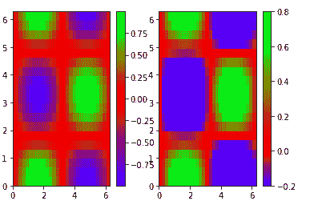

# Python 中的 matplotlib . colors . diverging norm 类

> 原文:[https://www . geeksforgeeks . org/matplotlib-colors-diverging norm-in-class-python/](https://www.geeksforgeeks.org/matplotlib-colors-divergingnorm-class-in-python/)

[**Matplotlib**](http://geeksforgeeks.org/python-matplotlib-an-overview/) 是 Python 中一个惊人的可视化库，用于数组的 2D 图。Matplotlib 是一个多平台数据可视化库，构建在 NumPy 数组上，旨在与更广泛的 SciPy 堆栈一起工作。

## matplotlib.colors.DivergingNorm

**matplotlib . colors . divergingnome**类属于 **matplotlib.colors** 模块。matplotlib.colors 模块用于将颜色或数字参数转换为 RGBA 或 RGB。该模块用于将数字映射到颜色，或者在一维颜色数组(也称为颜色映射)中进行颜色规格转换。
matplotlib . colors . diverging norm 类在围绕概念中心绘制变化率不均匀或不等的数据时非常有用。例如，数据范围在-2 到之间，以 0 为中心或中点。

> **语法:**matplotlib . colors . diverging norm(vcenter，vmin，vmax)
> **参数:**
> 
> 1.  **vcenter** :它接受一个浮点值，该值定义了归一化中的 0.5 数据值。
>     
> 2.  **vmin:** 可选参数，接受浮点值，归一化定义 0.0 数据值，默认为数据集最小值。
>     
> 3.  **vmax:** 为可选参数，接受浮点值，归一化定义 1.0 数据值，默认为数据集最大值。

**例 1:**

## 蟒蛇 3

```
import numpy
from matplotlib import pyplot as plt
from matplotlib import colors

# dummy data to plot
x = numpy.linspace(0, 2*numpy.pi, 30)
y = numpy.linspace(0, 2*numpy.pi, 20)
[A, B] = numpy.meshgrid(x, y)
Q = numpy.sin(A)*numpy.cos(B)

fig = plt.figure()
plt.ion()

#  yellow to green to red
# colormap
plt.set_cmap('brg')

ax = fig.add_subplot(1, 2, 1)
plt.pcolor(A, B, Q)
plt.colorbar()

ax = fig.add_subplot(1, 2, 2)

# defining the scale, with white
# at zero
vmin = -0.2
vmax = 0.8
norms = colors.DivergingNorm(vmin=vmin,
                             vcenter=0,
                             vmax=vmax)

plt.pcolor(A, B, Q,
           vmin=vmin,
           vmax=vmax,
           norm=norms) 

plt.colorbar()
```

**输出:**



**例 2:**

## 蟒蛇 3

```
import numpy as np
import matplotlib.pyplot as plt
import matplotlib.cbook as cbook
import matplotlib.colors as colors

file = cbook.get_sample_data('topobathy.npz',
                             asfileobj = False)

with np.load(file) as example:
    topo = example['topo']
    longi = example['longitude']
    latit = example['latitude']

figure, axes = plt.subplots(constrained_layout = True)

# creating a colormap that
# has land and ocean clearly
# delineated and of the
# same length (256 + 256)
undersea = plt.cm.terrain(np.linspace(0, 0.17, 256))
land = plt.cm.terrain(np.linspace(0.25, 1, 256))
every_colors = np.vstack((undersea, land))

terrain_map = colors.LinearSegmentedColormap.from_list('terrain_map',
                                                       every_colors)

# the center is offset so that
# the land has more dynamic range
# while making the norm
diversity_norm = colors.DivergingNorm(vmin =-500,
                                      vcenter = 0,
                                      vmax = 4000)

pcm = axes.pcolormesh(longi, latit, topo,
                      rasterized = True,
                      norm = diversity_norm,
                      cmap = terrain_map, )

axes.set_xlabel('Longitude $[^o E]{content}apos;)
axes.set_ylabel('Latitude $[^o N]{content}apos;)
axes.set_aspect(1 / np.cos(np.deg2rad(49)))

figure.colorbar(pcm, shrink = 0.6,
                extend ='both',
                label ='Elevation [m]')
plt.show()
```

**输出:**

