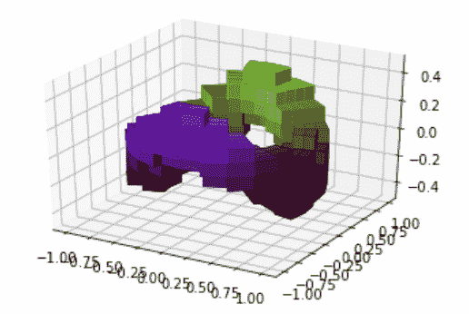
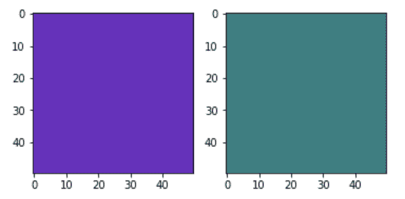

# Python 中的 Matplotlib.colors.hsv_to_rgb()

> 原文:[https://www . geesforgeks . org/matplotlib-colors-HSV _ to _ RGB-in-python/](https://www.geeksforgeeks.org/matplotlib-colors-hsv_to_rgb-in-python/)

**[Matplotlib](http://geeksforgeeks.org/python-matplotlib-an-overview/)** 是 Python 中一个惊人的可视化库，用于数组的 2D 图。Matplotlib 是一个多平台数据可视化库，构建在 NumPy 数组上，旨在与更广泛的 SciPy 堆栈一起工作。

## matplotlib.colors.hsv_to_rgb()

matplotlib.colors.hsv_to_rgb()函数用于将 hsv 值转换为 rgb。

> **语法:**matplotlib . colors . HSV _ to _ RGB(HSV)
> 
> **参数:**
> 
> *   **hsv:** 它是一个类似数组的参数，形式为(…，3)，其中所有的值都假设在 0 到 1 的范围内。
> 
> **返回:**
> 
> *   **rgb:** 它以(…，3)的形式返回一个数组，该数组由转换为 0 到 1 范围内的 rgb 值的颜色组成。

**例 1:**

```py
import matplotlib.pyplot as plt
import matplotlib.colors
import numpy as np

# helper function to find 
# mid-points
def helper(z):

    k = ()
    for i in range(z.ndim):
        z = (z[k + np.index_exp[:-1]] + z[k + np.index_exp[1:]]) / 2.0
        k += np.index_exp[:]

    return z

# dummy coordinates with  rgb 
# values attached with each
s, alpha, x = np.mgrid[0:1:11j,
                       0:np.pi*2:25j,
                       -0.5:0.5:11j]
a = s*np.cos(alpha)
b = s*np.sin(alpha)

sc, alphac, xc = helper(s), helper(alpha), helper(x)

# wobbly torus about [0.7, *, 0]
sphere = (sc - 0.7)**2 + (xc + 0.2*np.cos(alphac*2))**2 < 0.2**2

# combining the color components
hsv = np.zeros(sphere.shape + (3,))
hsv[..., 0] = alphac / (np.pi*2)
hsv[..., 1] = sc
hsv[..., 2] = xc + 0.5

#the hsv to rgb function
plot_colors = matplotlib.colors.hsv_to_rgb(hsv)

# and plot everything
figure = plt.figure()
axes = figure.gca(projection='3d')

axes.voxels(a, b, x, sphere,
          facecolors=plot_colors,
          edgecolors=np.clip(2*plot_colors - 0.5, 0, 1), 
          linewidth=0.5)

plt.show()
```

**输出:**


**例 2:**

```py
from matplotlib.colors import hsv_to_rgb

# sample squares for example
first_square = np.full((50, 50, 3),
                       fill_value ='698', 
                       dtype = np.uint8) / 255.0

second_square = np.full((50, 50, 3),
                        fill_value ='385',
                        dtype = np.uint8) / 255.0

plt.subplot(1, 2, 1)
plt.imshow(hsv_to_rgb(first_square))

plt.subplot(1, 2, 2)
plt.imshow(hsv_to_rgb(second_square))

plt.show()
```

**输出:**
