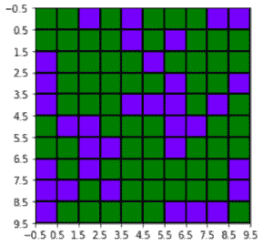

# Python 中的 Matplotlib.colors.to_hex()

> 原文:[https://www . geesforgeks . org/matplotlib-colors-to _ hex-in-python/](https://www.geeksforgeeks.org/matplotlib-colors-to_hex-in-python/)

**[Matplotlib](http://geeksforgeeks.org/python-matplotlib-an-overview/)** 是 Python 中一个惊人的可视化库，用于数组的 2D 图。Matplotlib 是一个多平台数据可视化库，构建在 NumPy 数组上，旨在与更广泛的 SciPy 堆栈一起工作。

## matplotlib.colors.to_hex()

`matplotlib.colors.to_hex()`功能用于将 0 到 1 之间的数字转换成十六进制色码。如果 keep_alpha 设置为 False(也是默认设置)，则使用`#rrggbb`格式，否则使用`#rrggbbaa`。

> **语法:** matplotlib.colors.to_hex(c，keep_alpha=False)
> 
> **参数:**
> 
> 1.  **c:** 这表示 0 到 1 之间的颜色序列数组。
> 2.  **keep_alpha:** 如果设置为 True，则使用#rrggbbaa 格式，否则使用#rrggbb 格式，并且只接受布尔值。

**例 1:**

```py
import matplotlib.pyplot as plt
from matplotlib import colors
import numpy as np

# dummy data to build the grid
data = np.random.rand(10, 10) * 20

# converting into hex color code
hex_color=matplotlib.colors.to_hex([ 0.47, 
                                    0.0, 
                                    1.0 ])

# create discrete colormap
cmap = colors.ListedColormap([hex_color, 
                              'green'])

bounds = [0,10,20]
norm = colors.BoundaryNorm(bounds, cmap.N)

fig, ax = plt.subplots()
ax.imshow(data, cmap=cmap, norm=norm)

# draw gridlines
ax.grid(which='major', axis='both', 
        linestyle='-', color='k',
        linewidth=2)

ax.set_xticks(np.arange(-.5, 10, 1));
ax.set_yticks(np.arange(-.5, 10, 1));

plt.show()
```

**输出:**


**例 2:**

```py
import matplotlib.pyplot as plt
from matplotlib import colors
import numpy as np

# dummy data to build the grid
data = np.random.rand(10, 10) * 20

# converting into hex color
# code with alpha set to True
hex_color = matplotlib.colors.to_hex([ 0.47,
                                      0.0, 
                                      1.0, 
                                      0.5 ],
                                     keep_alpha = True)

# create discrete colormap
cmap = colors.ListedColormap([hex_color, 
                              'red'])

bounds = [0, 10, 20]
norm = colors.BoundaryNorm(bounds, cmap.N)

fig, ax = plt.subplots()
ax.imshow(data, cmap = cmap, norm = norm)

# draw gridlines
ax.grid(which ='major', axis ='both', 
        linestyle ='-', color ='k', 
        linewidth = 2)

ax.set_xticks(np.arange(-.5, 10, 1));
ax.set_yticks(np.arange(-.5, 10, 1));

plt.show()
```

 **输出:**
