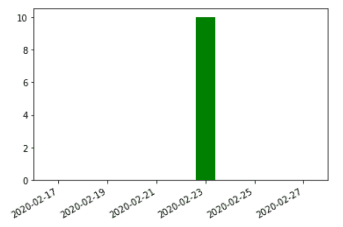

# Python 中的 matplotlib . date . autodatefformatter 类

> 原文:[https://www . geesforgeks . org/matplotlib-date-autodatefformatter-python 中的类/](https://www.geeksforgeeks.org/matplotlib-dates-autodateformatter-class-in-python/)

[**Matplotlib**](https://www.geeksforgeeks.org/python-matplotlib-an-overview/) 是 Python 中一个惊人的可视化库，用于数组的 2D 图。Matplotlib 是一个多平台数据可视化库，构建在 NumPy 数组上，旨在与更广泛的 SciPy 堆栈一起工作。

## matplot lib . date . autodateformatter

matplotlib . date . autodate formatter 类用于计算日期的最佳格式。这最好与自动日期定位器一起使用。它有一个映射刻度和格式字符串的字典。默认情况下，它如下所示:

> self . scaled = {
> DAYS _ PER _ YEAR:rcParams[' date . AutoFormat . YEAR ']，
> DAYS _ PER _ MONTH:rcParams[' date . AutoFormat . MONTH ']，
> 1.0:rcParams[' date . AutoFormat . day ']，
> 1。/HOURS _ PER _ DAY:rcParams[' date . AutoFormat . hour ']，
> 1。/(MINUTES _ PER _ DAY):rcParams[' date . AutoFormat . MINUTE ']，
> 1。/(SEC _ PER _ DAY):rcParams[' date . AutoFormat . second ']，
> 1。/(musseconds _ PER _ DAY):rcParams[' date . AutoFormat .微秒']，
> }

该字典中大于或等于当前比例的键由该算法选取，并用于格式化字符串。本词典也可以如下定制:

```
locator = AutoDateLocator()
formatter = AutoDateFormatter(locator)

# only show hour and minute
formatter.scaled[1/(24.*60.)] = '%H:%M'
```

如果 self.scaled 中的值不大于定位器返回的单位，则使用默认格式。_get_unit()。

> **语法:**class matplotlib . date . autodatefformatter(定位器，tz=None，defaultfmt='%Y-%m-%d ')
> 
> **参数:**
> 
> 1.  **定位器:**绘制日期时确定刻度位置。
> 2.  **tz:** 保存时区信息
> 3.  **defaultfmt:** 如果没有格式匹配=ches 要求，该格式将作为年-月-日格式的默认值。

**例 1:**

## 蟒蛇 3

```
import datetime
import matplotlib.pyplot as plt
from matplotlib.dates import AutoDateLocator, AutoDateFormatter, date2num

# make my own data:
date = '2020-02-23'
low = 10

# how to format dates:
date_datetime = datetime.datetime.strptime(date, '% Y-% m-% d')
int_date = date2num( date_datetime)

# create plots:
figure, axes = plt.subplots()

# plot data:
axes.bar(int_date, low, label ="", color ="green")

# format date
locator = AutoDateLocator()
axes.xaxis.set_major_locator(locator)
axes.xaxis.set_major_formatter( AutoDateFormatter(locator) )

# apply autoformatter for displaying of dates
min_date = date2num( datetime.datetime.strptime('2020-02-16', '% Y-% m-% d') )
max_date = date2num( datetime.datetime.strptime('2020-02-28', '% Y-% m-% d') )
axes.set_xlim([min_date, max_date])
figure.autofmt_xdate()

# show plot:
plt.show()
```

**输出:**



**例 2:**

## 蟒蛇 3

```
import random
import matplotlib.pyplot as plt
import matplotlib.dates as mdates

# generate some random data for
# approx 5 yrs
random_data = [float(random.randint(1487517521,
                                    14213254713))
               for _ in range(1000)]

# convert the epoch format to
# matplotlib date format
mpl_data = mdates.epoch2num(random_data)

# plotting the graph
fig, axes = plt.subplots(1, 1)
axes.hist(mpl_data, bins = 51, color ='green')

locator = mdates.AutoDateLocator()

axes.xaxis.set_major_locator(locator)
axes.xaxis.set_major_formatter(mdates.AutoDateFormatter(locator))

plt.show()
```

**输出:**

