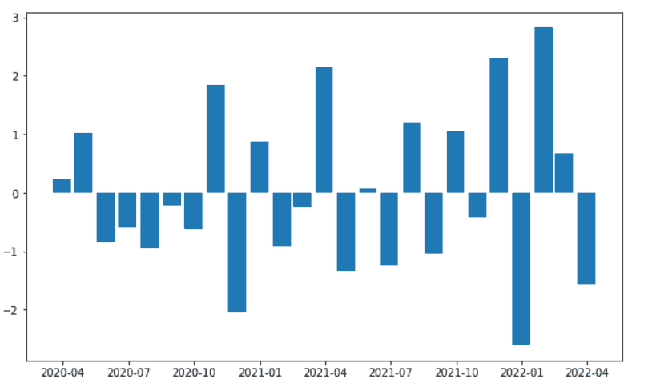
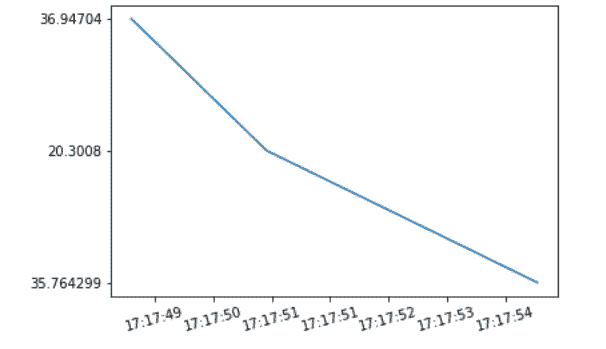

# Python 中的 matplotlib . date . date formatter 类

> 原文:[https://www . geesforgeks . org/matplotlib-date-date formatter-python 中的类/](https://www.geeksforgeeks.org/matplotlib-dates-dateformatter-class-in-python/)

**[Matplotlib](https://www.geeksforgeeks.org/python-matplotlib-an-overview/)** 是 Python 中一个惊人的可视化库，用于数组的 2D 图。Matplotlib 是一个多平台数据可视化库，构建在 NumPy 数组上，旨在与更广泛的 SciPy 堆栈一起工作。

## matplotlib . date . date formatter-matplotlib .日期格式化程式

`matplotlib.dates.DateFormatter`类用于用 strftime 格式的字符串格式化一个刻度(从纪元开始以秒为单位)。它的基类是`matplotlib.ticker.Formatter`。

> **语法:**类 matplotlib . date . datefformatter(fmt，tz=None)
> 
> **参数:**
> 
> 1.  **fmt:** 接受 strftime 格式字符串进行格式化，是必选项。
> 2.  **tz:** 它保存关于时区的信息。如果设置为无，它将在格式化日期字符串时忽略时区信息。

**例 1:**

```
import numpy
import matplotlib.pyplot as plt
import matplotlib.dates as mdates
import pandas

total_bars = 25
numpy.random.seed(total_bars)

dates = pandas.date_range('3/4/2020', 
                          periods=total_bars,
                          freq='m')

diff = pandas.DataFrame(
    data=numpy.random.randn(total_bars), 
    index=dates,
    columns=['A']
)

figure, axes = plt.subplots(figsize=(10, 6))

axes.xaxis.set_major_formatter(mdates.DateFormatter('%Y-%m'))

axes.bar(diff.index,
         diff['A'], 
         width=25, 
         align='center')
```

**输出:**


**例 2:**

```
import matplotlib
import matplotlib.pyplot as plt
from datetime import datetime

origin = ['2020-02-05 17:17:55',
          '2020-02-05 17:17:51', 
          '2020-02-05 17:17:49']

a = [datetime.strptime(d, '%Y-%m-%d %H:%M:%S') for d in origin]

b = ['35.764299', '20.3008', '36.94704']

x = matplotlib.dates.date2num(a)
formatter = matplotlib.dates.DateFormatter('%H:%M:%S')

figure = plt.figure()
axes = figure.add_subplot(1, 1, 1)

axes.xaxis.set_major_formatter(formatter)
plt.setp(axes.get_xticklabels(), rotation = 15)

axes.plot(x, b)
plt.show()
```

**输出:**
