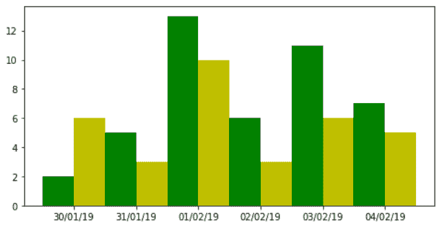
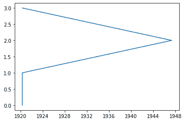

# matplotlib . datestr 2 num()用 Python

表示

> 哎哎哎:# t0]https://www . geeksforgeeks . org/matplotlib-datestr 2 num-in-python/上的日期

**[Matplotlib](https://www.geeksforgeeks.org/python-matplotlib-an-overview/)** 是 Python 中一个惊人的可视化库，用于数组的 2D 图。Matplotlib 绘图库是一个基于 NumPy 阵列的多平台数据可视化库，旨在与更广泛的 SciPy 堆栈协同工作。

## matplotlib . dates . datestr 2 num()

`matplotlib.dates.datestr2num()`功能用于通过使用`dateutil.parser.parser()`将日期字符串转换为日期。

> **语法:**matplotlib . datestr 2 num(d，default=None)
> 
> **参数:**
> 
> 1.  **d:** 是表示日期的字符串或字符串序列。
> 2.  **默认值:**这是一个可选参数，是一个日期时间实例。默认情况下，当 d 中不存在字段时使用此选项。

**例 1:**

```py
from datetime import datetime
import matplotlib.pyplot as plt
from matplotlib.dates import (
    DateFormatter, AutoDateLocator, AutoDateFormatter, datestr2num
)

days = [
    '30/01/2019',
    '31/01/2019', 
    '01/02/2019',
    '02/02/2019', 
    '03/02/2019', 
    '04/02/2019'
]
data1 = [2, 5, 13, 6, 11, 7]
data2 = [6, 3, 10, 3, 6, 5]

z = datestr2num([
    datetime.strptime(day, '%d/%m/%Y').strftime('%m/%d/%Y')
    for day in days
])

r = 0.25

figure = plt.figure(figsize =(8, 4))
axes = figure.add_subplot(111)

axes.bar(z - r, data1, width = 2 * r,
         color ='g', align ='center',
         tick_label = day)

axes.bar(z + r, data2, width = 2 * r,
         color ='y', align ='center', 
         tick_label = day)

axes.xaxis_date()
axes.xaxis.set_major_locator(
    AutoDateLocator(minticks = 3, interval_multiples = False))

axes.xaxis.set_major_formatter(DateFormatter("%d/%m/%y"))

plt.show()
```

**输出:**



**例 2:**

```py
import matplotlib
import matplotlib.pyplot as plt
import matplotlib.dates

dates =  ['1920-05-06', 
          '1920-05-07', 
          '1947-05-08', 
          '1920-05-09']

converted_dates = matplotlib.dates.datestr2num(dates)

x_axis = (converted_dates)
y_axis = range(0, 4)

plt.plot_date( x_axis, y_axis, '-' )

plt.show()
```

**输出:**
