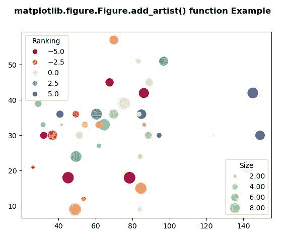
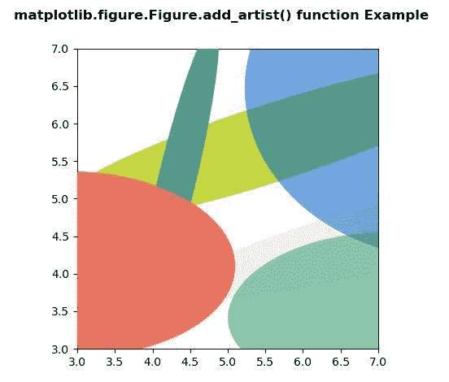

# Python 中的 matplotlib . figure . figure . add _ artist()

> 原文:[https://www . geesforgeks . org/matplotlib-figure-figure-add _ artist-in-python/](https://www.geeksforgeeks.org/matplotlib-figure-figure-add_artist-in-python/)

**[Matplotlib](https://www.geeksforgeeks.org/python-introduction-matplotlib/)** 是 Python 中的一个库，是 NumPy 库的数值-数学扩展。**人物模块**提供了顶级的艺术家，人物，包含了所有的剧情元素。该模块用于控制所有情节元素的子情节和顶层容器的默认间距。

## matplotlib . figure . figure . add _ artist()函数

**matplotlib 库的 add_artist()方法**人物模块用于向人物添加任意 artist。

> **语法:** add_artist(自我、艺术家、剪辑=False)
> 
> **参数:**这接受下面描述的以下参数:
> 
> *   **艺术家:**此参数是要添加到图中的艺术家。
> *   **剪辑:**此参数用于确定添加的艺术家是否应该被人物补丁剪辑。
> 
> **返回:**此方法返回添加的艺术家

下面的例子说明了 matplotlib.figure . figure . add _ artist()函数在 matplotlib . figure 中的作用:

**例 1:**

```py
# Implementation of matplotlib function
import numpy as np
np.random.seed(19680801)
import matplotlib.pyplot as plt

fig, ax = plt.subplots()

volume = np.random.rayleigh(27, size = 40)
amount = np.random.poisson(10, size = 40)
ranking = np.random.normal(size = 40)
price = np.random.uniform(1, 10, size = 40)

scatter = ax.scatter(volume * 2,
                     amount * 3, 
                     c = ranking * 3,
                     s = 0.3*(price * 3)**2,
                     vmin =-4,
                     vmax = 4,
                     cmap ="Spectral")

legend1 = ax.legend(*scatter.legend_elements(num = 5),
                    loc ="upper left", title ="Ranking")

fig.add_artist(legend1)

kw = dict(prop ="sizes",
          num = 5,
          color = scatter.cmap(0.7),
          fmt =" {x:.2f}",
          func = lambda s: np.sqrt(s/.3)/3)

legend2 = ax.legend(*scatter.legend_elements(**kw),
                    loc ="lower right", title ="Size")

fig.suptitle('matplotlib.figure.Figure.add_artist() \
function Example\n\n', fontweight ="bold")

plt.show()
```

**输出:**


**例 2:**

```py
# Implementation of matplotlib function
import matplotlib.pyplot as plt
import numpy as np
from matplotlib.patches import Ellipse

NUM = 200

ells = [Ellipse(xy = np.random.rand(2) * 10,
                width = np.random.rand(), height = np.random.rand(),
                angle = np.random.rand() * 360)
        for i in range(NUM)]

fig, ax = plt.subplots(subplot_kw ={'aspect': 'equal'})
for e in ells:
    fig.add_artist(e)
    e.set_clip_box(ax.bbox)
    e.set_alpha(np.random.rand())
    e.set_facecolor(np.random.rand(4))

ax.set_xlim(3, 7)
ax.set_ylim(3, 7)

fig.suptitle('matplotlib.figure.Figure.add_artist()\
 function Example\n\n', fontweight ="bold")

plt.show()
```

**输出:**
