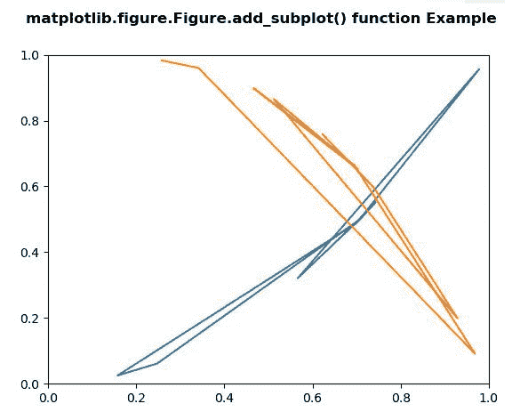

# Python 中的 matplotlib . figure . figure . add _ subplot()

> 原文:[https://www . geesforgeks . org/matplotlib-figure-figure-add _ subplot-in-python/](https://www.geeksforgeeks.org/matplotlib-figure-figure-add_subplot-in-python/)

**[Matplotlib](https://www.geeksforgeeks.org/python-introduction-matplotlib/)** 是 Python 中的一个库，是 NumPy 库的数值-数学扩展。**人物模块**提供了顶级的艺术家，人物，包含了所有的剧情元素。该模块用于控制所有情节元素的子情节和顶层容器的默认间距。

## matplotlib . figure . figure . add _ subplot()函数

**matplotlib 库的 add_subplot()方法**图形模块用于给图形添加一个 Axes 作为子图排列的一部分。

> **语法:** add_subplot(self，*args，**kwargs)
> 
> **参数:**这接受下面描述的以下参数:
> 
> *   **投影:**该参数是轴的投影类型。
> *   **sharex，sharey :** 这些参数与 sharex 和/或 sharey 共享 x 轴或 y 轴。
> *   **标签:**该参数是返回轴的标签。
> 
> **返回:**此方法返回子剧情的轴。

下面的例子说明了 matplotlib.figure . figure . add _ subplot()函数在 matplotlib . figure:

**例 1:**

```py
# Implementation of matplotlib function
import matplotlib.pyplot as plt
from mpl_toolkits.axisartist.axislines import Subplot

fig = plt.figure(figsize =(4, 4))

ax = Subplot(fig, 111)
fig.add_subplot(ax)

ax.axis["left"].set_visible(False)
ax.axis["bottom"].set_visible(False)

fig.suptitle('matplotlib.figure.Figure.add_subplot() \
function Example\n\n', fontweight ="bold")

plt.show()
```

**输出:**


**例 2:**

```py
# Implementation of matplotlib function
import matplotlib.pyplot as plt
import numpy as np

np.random.seed(19680801)

xdata = np.random.random([2, 10])

xdata1 = xdata[0, :]
xdata2 = xdata[1, :]

ydata1 = xdata1 ** 2
ydata2 = 1 - xdata2 ** 3

fig = plt.figure()
ax = fig.add_subplot(1, 1, 1)
ax.plot(xdata1, ydata1, color ='tab:blue')
ax.plot(xdata2, ydata2, color ='tab:orange')

ax.set_xlim([0, 1])
ax.set_ylim([0, 1])
fig.suptitle('matplotlib.figure.Figure.add_subplot() \
function Example\n\n', fontweight ="bold")

plt.show()
```

**输出:**
