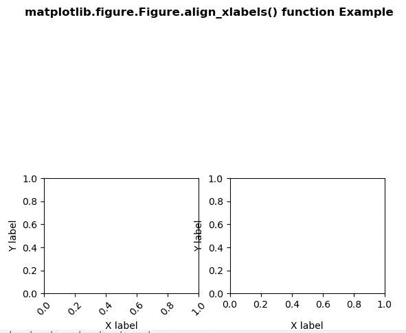
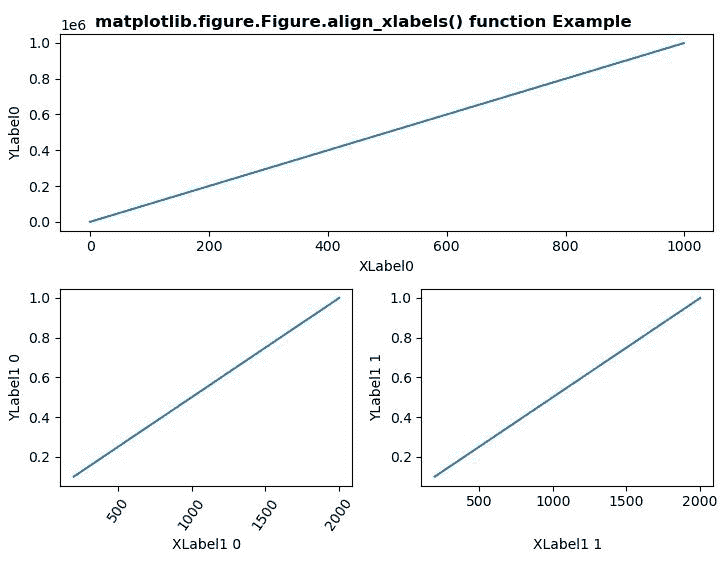

# matplotlib . figure . figure . align _ xlabels()中的 Python

> 原文:[https://www . geesforgeks . org/matplotlib-figure-figure-align _ xlabels-in-python/](https://www.geeksforgeeks.org/matplotlib-figure-figure-align_xlabels-in-python/)

**[Matplotlib](https://www.geeksforgeeks.org/python-introduction-matplotlib/)** 是 Python 中的一个库，是 NumPy 库的数值-数学扩展。**人物模块**提供了顶级的艺术家，人物，包含了所有的剧情元素。该模块用于控制所有情节元素的子情节和顶层容器的默认间距。

## matplotlib . figure . figure . align _ xlabels()函数

**matplotlib 库的 align_xlabels()方法**图形模块用于在自动进行标签对齐的情况下，将子图的 xlabels 与相同的子图行或列对齐。

> **语法:** align_xlabels(self，axs=None)
> 
> **参数:**这接受下面描述的以下参数:
> 
> *   **轴:**该参数是对齐轴标签的轴列表。
> 
> **返回:**该方法不返回值。

下面的例子说明了 matplotlib.figure . figure . align _ xlabels()函数在 matplotlib . figure 中的作用:

**例 1:**

```py
# Implementation of matplotlib function
import matplotlib.pyplot as plt
import numpy as np
import matplotlib.gridspec as gridspec

fig = plt.figure()
gs = gridspec.GridSpec(2, 2)

for i in range(2):
    ax = fig.add_subplot(gs[1, i])
    ax.set_ylabel('Y label')
    ax.set_xlabel('X label')
    if i == 0:
        for tick in ax.get_xticklabels():
            tick.set_rotation(45)

fig.align_xlabels()

fig.suptitle('matplotlib.figure.Figure.align_xlabels() \
function Example\n\n', fontweight ="bold")

plt.show()
```

**输出:**


**例 2:**

```py
# Implementation of matplotlib function
import matplotlib.pyplot as plt
import numpy as np
import matplotlib.gridspec as gridspec

fig = plt.figure(tight_layout = True)
gs = gridspec.GridSpec(2, 2)

ax = fig.add_subplot(gs[0, :])
ax.plot(np.arange(0, 1e6, 1000))

ax.set_ylabel('YLabel0')
ax.set_xlabel('XLabel0')

for i in range(2):
    ax = fig.add_subplot(gs[1, i])
    ax.plot(np.arange(1., 0., -0.1) * 2000., 
            np.arange(1., 0., -0.1))

    ax.set_ylabel('YLabel1 % d' % i)
    ax.set_xlabel('XLabel1 % d' % i)

    if i == 0:
        for tick in ax.get_xticklabels():
            tick.set_rotation(55)

fig.align_xlabels()  

fig.suptitle('matplotlib.figure.Figure.align_xlabels() \
function Example\n\n', fontweight ="bold")

plt.show()
```

**输出:**
