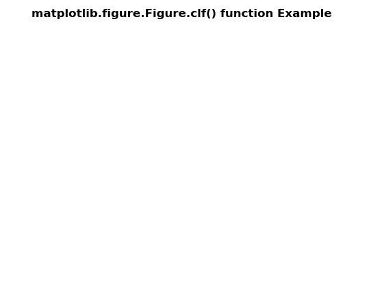

# matplotlib . figure . figure . clf()中的 Python

> 哎哎哎:# t0]https://www . geeksforgeeks . org/matplotlib-figure-clf-in-python/中

**[Matplotlib](https://www.geeksforgeeks.org/python-introduction-matplotlib/)** 是 Python 中的一个库，是 NumPy 库的数值-数学扩展。**人物模块**提供了顶级的艺术家，人物，包含了所有的剧情元素。该模块用于控制所有情节元素的子情节和顶层容器的默认间距。

## matplotlib.figure.Figure.clf()函数

**matplotlib 库图形模块的 clf()方法**用于清除图形。

> **语法:** clf(self，keep _ observers = False)
> 
> **参数:**这接受下面描述的以下参数:
> 
> *   **keep _ observer:**该参数为布尔值。
> 
> **返回:**该方法不返回值。

下面的例子说明了 matplotlib.figure.Figure.clf()函数在 matplotlib.figure 中的作用:

**例 1:**

```py
# Implementation of matplotlib function
import numpy as np
import matplotlib.pyplot as plt

fig, ax = plt.subplots()

ax.set_xlabel('x-axis')
ax.set_ylabel('y-axis')

ax.plot([1, 2, 3])
ax.grid(True)

fig.clf(True)

fig.suptitle('matplotlib.figure.Figure.clf() \
function Example\n\n', fontweight ="bold")

plt.show()
```

**输出:**


**例 2:**

```py
# Implementation of matplotlib function
import numpy as np
import matplotlib.pyplot as plt

t = np.linspace(0.0, 2.0, 201)
s = np.sin(2 * np.pi * t)

fig, [ax, ax1] = plt.subplots(2, 1, sharex = True)

ax.set_ylabel('y-axis')
ax.plot(t, s)
ax.grid(True)
ax.set_title('Sample Example',
             fontsize = 12,
             fontweight ='bold')

ax1.set_ylabel('y-axis')
ax1.plot(t, s)
ax1.grid(True)

fig.clf(False)

fig.suptitle('matplotlib.figure.Figure.clf() \
function Example\n\n', fontweight ="bold")

plt.show()
```

**输出:**
