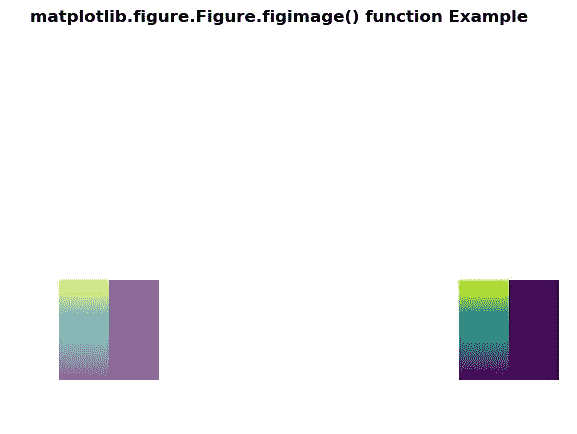

# matplot lib . figure . figure . figimage()中的 Python

> 哎哎哎:# t0]https://www . geeksforgeeks . org/matplotlib-figure-figimage-in-python/

**[Matplotlib](https://www.geeksforgeeks.org/python-introduction-matplotlib/)** 是 Python 中的一个库，是 NumPy 库的数值-数学扩展。**人物模块**提供了顶级的艺术家，人物，包含了所有的剧情元素。该模块用于控制所有情节元素的子情节和顶层容器的默认间距。

## matplotlib . figure . figure . figimage()函数

**matplotlib 库的图形模块的 figimage()方法**用于给图形添加一个未重采样的图像。

> **语法:** figimage(self，X，xo=0，yo=0，alpha =无，norm =无，cmap =无，vmin =无，vmax =无，origin =无，resize=False，**kwargs)
> 
> **参数:**这接受下面描述的以下参数:
> 
> *   **X:** 该参数为图像数据。
> *   **xo，yo:** 这些参数是以像素为单位的 x/y 图像偏移量。
> *   **alpha :** 该参数为 alpha 混合值。
> *   **范数:**该参数是将亮度映射到区间[0，1]的归一化实例。
> *   **cmap :** 此参数是要使用的颜色图。
> *   **vmin，vmax:** 这些参数是色图的数据限制。
> *   **原点:**此参数指示数组的[0，0]索引位于轴的左上角或左下角。
> *   **调整大小:**此参数用于调整图形大小，以匹配给定的图像大小。
> 
> **返回:**该方法返回*matplotlib . image . figure image*。

下面的例子说明了 matplotlib.figure . fig image()函数在 matplotlib . fig:

**例 1:**

```
# Implementation of matplotlib function 
import matplotlib.pyplot as plt
import numpy as np

fig = plt.figure()
nx = int(fig.get_figwidth() * fig.dpi)
ny = int(fig.get_figheight() * fig.dpi)
data = np.random.random((ny, nx))
fig.figimage(data)

fig.suptitle('matplotlib.figure.Figure.figimage()\
function Example', fontweight ="bold") 

plt.show()
```

**输出:**


**例 2:**

```
# Implementation of matplotlib function 
import numpy as np
import matplotlib
import matplotlib.pyplot as plt

fig = plt.figure()
Z = np.arange(10000).reshape((100, 100))
Z[:, 50:] = 1

im1 = fig.figimage(Z, xo = 500, yo = 100,
                   origin ='lower')

im2 = fig.figimage(Z, xo = 100, yo = 100,
                   alpha =.6,
                   origin ='lower')

fig.suptitle('matplotlib.figure.Figure.figimage() \
function Example', fontweight ="bold") 

plt.show()
```

**输出:**
