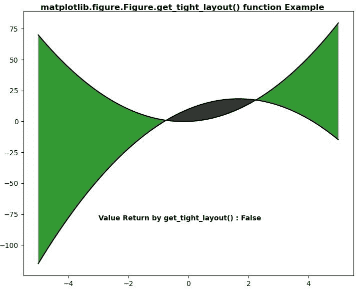
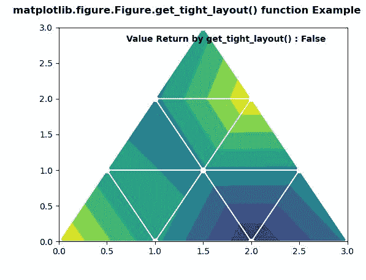

# Python 中的 matplotlib . figure . figure . get _ 紧绷 _layout()

> 原文:[https://www . geesforgeks . org/matplotlib-figure-figure-get _ 紧绷 _ python 中的布局/](https://www.geeksforgeeks.org/matplotlib-figure-figure-get_tight_layout-in-python/)

**[Matplotlib](https://www.geeksforgeeks.org/python-introduction-matplotlib/)** 是 Python 中的一个库，是 NumPy 库的数值-数学扩展。**人物模块**提供了顶级的艺术家，人物，包含了所有的剧情元素。该模块用于控制所有情节元素的子情节和顶层容器的默认间距。

## matplotlib . figure . figure . get _ 紧绷 _layout()方法

**matplotlib 库的 get _ 紧绷 _layout()方法**图形模块用于检查绘图时是否调用紧绷 _layout。

> **语法:** get_size_inches(self)
> 
> **参数:**此方法不接受任何参数。
> 
> **返回:**该方法返回是否调用了紧密 _layout。

下面的例子说明了 matplotlib.figure . figure . get _ 紧绷 _layout()函数在 matplotlib . figure 中的作用:

**例 1:**

```
# Implementation of matplotlib function 
import numpy as np
import matplotlib.pyplot as plt

x = np.arange(-5, 5, 0.01)
y1 = -3 * x*x + 10 * x + 10
y2 = 3 * x*x + x

fig, ax = plt.subplots()
fig.tight_layout()
ax.plot(x, y1, x, y2, color ='black')

ax.fill_between(x, y1, y2, where = y2 >y1,
                facecolor ='green',
                alpha = 0.8)
ax.fill_between(x, y1, y2, where = y2 <= y1,
                facecolor ='black',
                alpha = 0.8)

w = fig.get_tight_layout()

ax.text(-3, -80,
        "Value Return by get_tight_layout() : " 
        + str(w),
        fontweight ="bold")

fig.canvas.draw()
fig.suptitle('matplotlib.figure.Figure.get_tight_layout()\
 function Example', fontweight ="bold") 

plt.show()
```

**输出:**


**例 2:**

```
# Implementation of matplotlib function
import matplotlib.pyplot as plt
import matplotlib.tri as mtri
import numpy as np

# Create triangulation.
x = np.asarray([0, 1, 2, 3, 0.5,
                1.5, 2.5, 1, 2,
                1.5])
y = np.asarray([0, 0, 0, 0, 1.0,
                1.0, 1.0, 2, 2, 
                3.0])
triangles = [[0, 1, 4], [1, 5, 4], 
             [2, 6, 5], [4, 5, 7],
             [5, 6, 8], [5, 8, 7], 
             [7, 8, 9], [1, 2, 5], 
             [2, 3, 6]]

triang = mtri.Triangulation(x, y, triangles)
z = np.cos(1.5 * x) * np.cos(1.5 * y)

fig, axs = plt.subplots()
axs.tricontourf(triang, z)
axs.triplot(triang, 'go-', color ='white')
fig.tight_layout(rect =(0.1, 0.1, 0.95, 0.95))

w = fig.get_tight_layout()
axs.text(.7, 2.8, 
         "Value Return by get_tight_layout() : " 
         + str(w),
         fontweight ="bold")

fig.canvas.draw()

fig.suptitle('matplotlib.figure.Figure.get_tight_layout() \
function Example', fontweight ="bold") 

plt.show()
```

**输出:**
