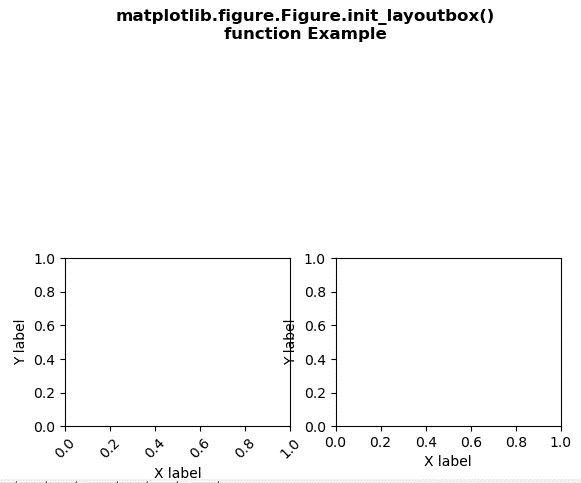
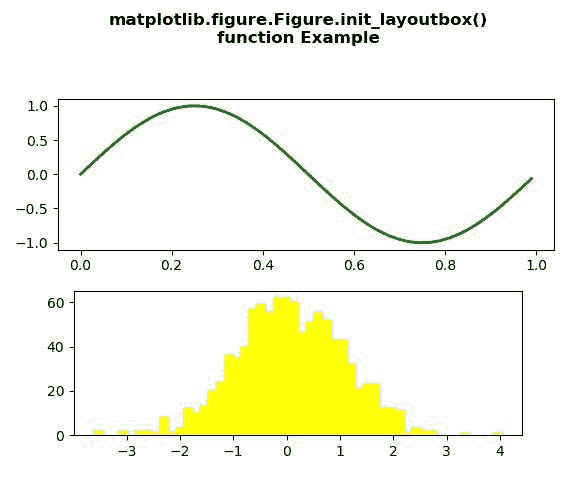

# Python 中的 matplotlib . figure . figure . init _ lay 发件箱()

> 原文:[https://www . geesforgeks . org/matplotlib-figure-figure-init _ lay 发件箱-in-python/](https://www.geeksforgeeks.org/matplotlib-figure-figure-init_layoutbox-in-python/)

[**Matplotlib**](https://www.geeksforgeeks.org/python-introduction-matplotlib/) 是 Python 中的一个库，是 NumPy 库的数值-数学扩展。**人物模块**提供了顶级的艺术家，人物，包含了所有的剧情元素。该模块用于控制所有情节元素的子情节和顶层容器的默认间距。

## matplotlib . figure . figure . init _ layoutbox()方法

matplotlib 库的**init _ lay 发件箱()方法**图形模块用于初始化 lay 发件箱，以便在 constrained_layout 中使用。

> **语法:**init _ lay 发件箱(自身)
> 
> **参数:**此方法不接受任何参数。
> 
> **返回:**此方法不返回任何值。

下面的例子说明了 matplotlib.figure . figure . init _ layoutbox()函数在 matplotlib . figure 中的作用:

**例 1:**

```
# Implementation of matplotlib function 
import matplotlib.pyplot as plt 
import numpy as np 
import matplotlib.gridspec as gridspec 

fig = plt.figure() 
gs = gridspec.GridSpec(2, 2) 

for i in range(2): 
    ax = fig.add_subplot(gs[1, i]) 
    ax.set_ylabel('Y label') 
    ax.set_xlabel('X label') 
    if i == 0: 
        for tick in ax.get_xticklabels(): 
            tick.set_rotation(45) 

fig.init_layoutbox() 

fig.suptitle("""matplotlib.figure.Figure.init_layoutbox()
function Example\n\n""", fontweight ="bold") 

plt.show() 
```

**输出:**


**例 2:**

```
# Implementation of matplotlib function 
import numpy as np 
import matplotlib.pyplot as plt 

fig = plt.figure() 
fig.subplots_adjust(top = 0.8) 
ax1 = fig.add_subplot(211) 

t = np.arange(0.0, 1.0, 0.01) 
s = np.sin(2 * np.pi * t) 
line, = ax1.plot(t, s, color ='green', lw = 2) 

np.random.seed(19680801) 

ax2 = fig.add_axes([0.15, 0.1, 0.7, 0.3]) 
n, bins, patches = ax2.hist(np.random.randn(1000), 50, 
                            facecolor ='yellow', 
                            edgecolor ='yellow') 

fig.init_layoutbox() 

fig.suptitle("""matplotlib.figure.Figure.init_layoutbox()
function Example\n\n""", fontweight ="bold") 

plt.show() 
```

**输出:**
