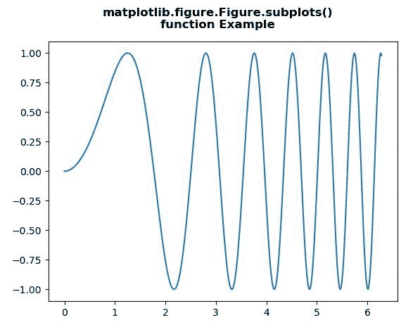
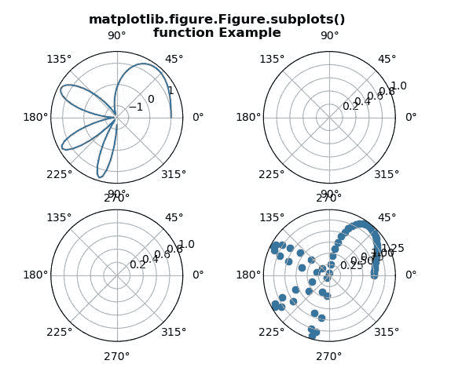

# Python 中的 matplotlib . figure . figure . subplots()

> 原文:[https://www . geesforgeks . org/matplotlib-figure-figure-subplotes-in-python/](https://www.geeksforgeeks.org/matplotlib-figure-figure-subplots-in-python/)

[**Matplotlib**](https://www.geeksforgeeks.org/python-introduction-matplotlib/) 是 Python 中的一个库，是 NumPy 库的数值-数学扩展。**人物模块**提供了顶级的艺术家，人物，包含了所有的剧情元素。该模块用于控制所有情节元素的子情节和顶层容器的默认间距。

## matplotlib . figure . figure . subplots()方法

matplotlib 库的**子图()方法**图形模块用于显示图形窗口。

> **语法:**子剧情(self，nrows=1，ncols=1，sharex=False，sharey=False，挤压=True，子剧情 _ kw =无，gridspec _ kw =无)
> 
> **参数:**该方法接受以下描述的参数:
> 
> *   **nrow，ncol:**这些参数是子图网格的行数/列数。
> *   **sharex，sharey :** 这些参数控制 x (sharex)或 y (sharey)轴之间的属性共享。
> *   **挤压:**该参数为可选参数，包含布尔值，默认值为真。
> *   **num:** 此参数是 pyplot.figure 关键字，用于设置图形编号或标签。
> *   **子剧情 _kwd:** 此参数是带有传递给 add _ 子剧情调用的关键字的 dict，用于创建每个子剧情。
> *   **gridspec_kw:** 此参数是带有传递给 gridspec 构造函数的关键字的 dict，该构造函数用于创建放置子情节的网格。
> 
> **返回:**该方法返回以下值。
> 
> *   斧头:这个方法返回斧头。轴对象或轴对象数组。

下面的例子说明了 matplotlib.figure . figure . subplots()函数在 matplotlib . figure 中的作用:

**例 1:**

```
# Implementation of matplotlib function
import numpy as np
import matplotlib.pyplot as plt

x = np.linspace(0, 2 * np.pi, 400)
y = np.sin(x**2)

fig = plt.figure()
ax = fig.subplots()

ax.plot(x, y)

fig.suptitle("""matplotlib.figure.Figure.subplots()
function Example\n\n""", fontweight ="bold") 

fig.show() 
```

**输出:**


**例 2:**

```
# Implementation of matplotlib function
import numpy as np
import matplotlib.pyplot as plt

x = np.linspace(0, 1.5 * np.pi, 100)
y = np.sin(x**2)+np.cos(x**2)

fig = plt.figure()
axs = fig.subplots(2, 2, subplot_kw = dict(polar = True))

axs[0, 0].plot(x, y)
axs[1, 1].scatter(x, y)

fig.suptitle("""matplotlib.figure.Figure.subplots()
function Example\n\n""", fontweight ="bold") 

fig.show() 
```

**输出:**
