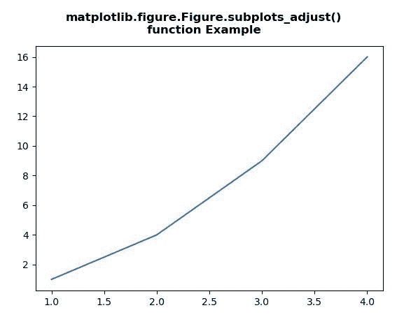
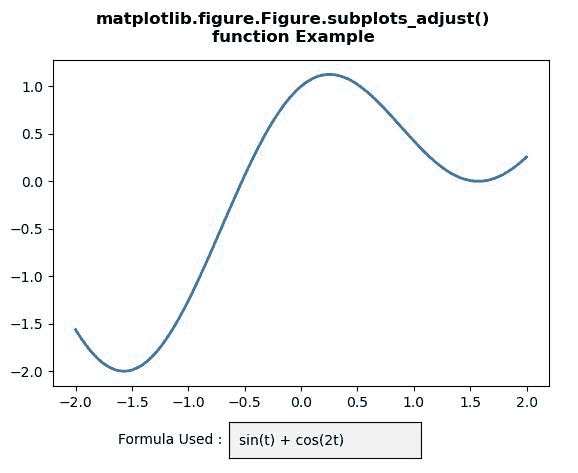

# Python 中的 matplotlib . figure . figure . subplots _ adjust()

> 原文:[https://www . geeksforgeeks . org/matplotlib-figure-figure-subplotes _ adjust-in-python/](https://www.geeksforgeeks.org/matplotlib-figure-figure-subplots_adjust-in-python/)

[**Matplotlib**](https://www.geeksforgeeks.org/python-introduction-matplotlib/) 是 Python 中的一个库，是 NumPy 库的数值-数学扩展。**人物模块**提供了顶级的艺术家，人物，包含了所有的剧情元素。该模块用于控制所有情节元素的子情节和顶层容器的默认间距。

## matplotlib . figure . figure . subplots _ adjust()方法

matplotlib 库的**子图 _ 调整()方法**图形模块用于用 kwargs 更新子图参数。

> **语法:**子剧情 _ 调整(自，左=无，下=无，右=无，上=无，wspace =无，hspace =无)
> 
> **参数:**该方法接受下面讨论的以下参数:
> 
> *   **左:**此参数为图中支线剧情的左侧。
> *   **右侧:**该参数为图中支线剧情的右侧。
> *   **底部:**这个参数是图中支线剧情的底部。
> *   **顶部:**该参数为图中支线剧情的顶部。
> *   **wspace :** 此参数是为子情节之间的空间保留的宽度量，表示为平均轴宽度的一部分。
> *   **hs space:**此参数是为支线剧情之间的空间保留的高度量，表示为平均轴高度的分数。
> 
> **返回:**此方法不返回任何值。

下面的例子说明了 matplotlib.figure . figure . subtracts _ adjust()函数在 matplotlib . figure 中的作用:

**例 1:**

```py
# Implementation of matplotlib function
import numpy as np
import matplotlib.pyplot as plt

x = [1, 2, 3, 4]
y = [1, 4, 9, 16]

fig = plt.figure()
axs = fig.subplots()

axs.plot(x, y)

fig.subplots_adjust(bottom = 0.15)

fig.suptitle("""matplotlib.figure.Figure.subplots_adjust()
function Example\n\n""", fontweight ="bold") 

fig.show() 
```

**输出:**


**例 2:**

```py
# Implementation of matplotlib function
import numpy as np
import matplotlib.pyplot as plt
from matplotlib.widgets import TextBox

fig, ax = plt.subplots()
fig.subplots_adjust(bottom = 0.2)

t = np.arange(-2.0, 2.0, 0.001)
s = np.sin(t)+np.cos(2 * t)

initial_text = "sin(t) + cos(2t)"
l, = ax.plot(t, s, lw = 2)

def submit(text):
    ydata = eval(text)
    l.set_ydata(ydata)
    ax.set_ylim(np.min(ydata), np.max(ydata))
    plt.draw()

axbox = plt.axes([0.4, 0.05, 0.3, 0.075])

text_box = TextBox(axbox, 'Formula Used : ',
                   initial = initial_text)
text_box.on_submit(submit)

fig.suptitle("""matplotlib.figure.Figure.subplots_adjust()
function Example\n\n""", fontweight ="bold") 

fig.show() 
```

**输出:**
