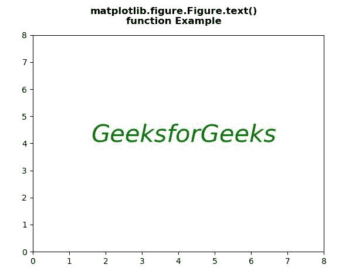

# Python 中的 Matplotlib.figure.Figure.text()

> 原文:[https://www . geesforgeks . org/matplotlib-figure-figure-text-in-python/](https://www.geeksforgeeks.org/matplotlib-figure-figure-text-in-python/)

[**Matplotlib**](https://www.geeksforgeeks.org/python-introduction-matplotlib/) 是 Python 中的一个库，是 NumPy 库的数值-数学扩展。**人物模块**提供了顶级的艺术家，人物，包含了所有的剧情元素。该模块用于控制所有情节元素的子情节和顶层容器的默认间距。

**matplotlib.figure.Figure.text() method**

matplotlib 库的 **text()方法**图形模块用于给图形添加文本。

> **语法:**文本(self，x，y，s，fontdict=None，withdash =，**kwargs)
> 
> **参数:**该方法接受下面讨论的以下参数:
> 
> *   **x:** 此参数是放置文本的 x 位置。
> *   **y:** 此参数是放置文本的 y 位置。
> *   **s:** 此参数为文本字符串。
> *   **fontdict :** 该参数是覆盖默认文本属性的字典。
> *   **带标记:**此参数用于创建一个**文本带标记**实例，而不是一个**文本**实例。
> 
> **返回:**该方法返回**文本**。

下面的例子说明了 matplotlib.figure.Figure.text()函数在 matplotlib.figure 中的作用:

**例 1:**

```
#Implementation of matplotlib function
import matplotlib.pyplot as plt

fig, ax = plt.subplots()

fig.text(0.28, 0.5, 
         'GeeksforGeeks', 
         style = 'italic',
         fontsize = 30,
         color = "green")

ax.set(xlim = (0, 8),
       ylim = (0, 8))

fig.suptitle("""matplotlib.figure.Figure.text()
function Example\n\n""",fontweight="bold")

fig.show()
```

**输出:**


**例 2:**

```
# Implementation of matplotlib function
import matplotlib.pyplot as plt

fig, ax = plt.subplots()
ax.set_xlabel('xlabel')
ax.set_ylabel('ylabel')

fig.text(0.3, 0.7,
         'GeeksforGeeks',
         style = 'italic',
         fontsize = 30,
         bbox ={'facecolor':'green',
                'alpha':0.6,
                'pad':10})

fig.text(0.35, 0.6, 
         'Python matplotlib Module',
         fontsize = 15)

fig.text(0.35, 0.3,
         'Figure Class - Text Function')

fig.text(0, 0, 'by-Shubham Singh',
        verticalalignment ='bottom', 
        horizontalalignment ='left',
        transform = ax.transAxes,
        color ='green',
        fontsize = 5)

ax.set(xlim =(0, 10), ylim =(0, 10))

fig.suptitle("""matplotlib.figure.Figure.text()
function Example\n\n""", fontweight ="bold")

fig.show()
```

**输出:**
