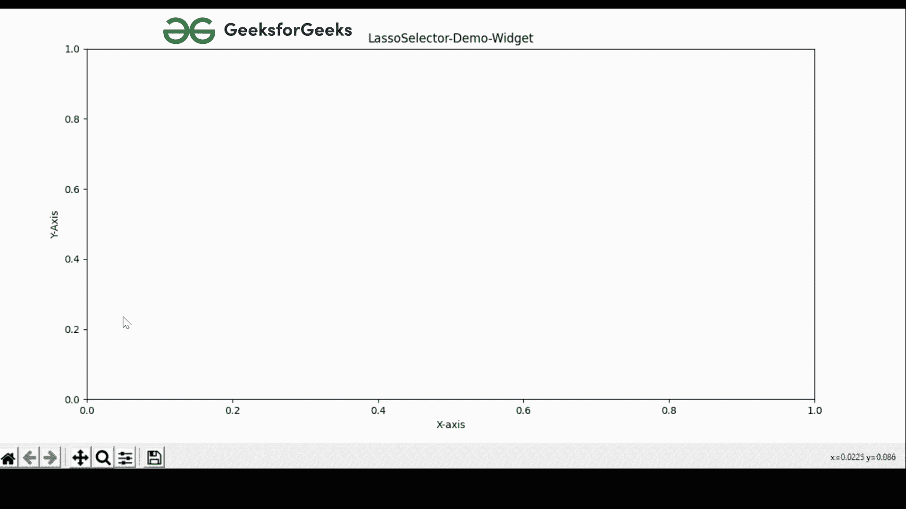
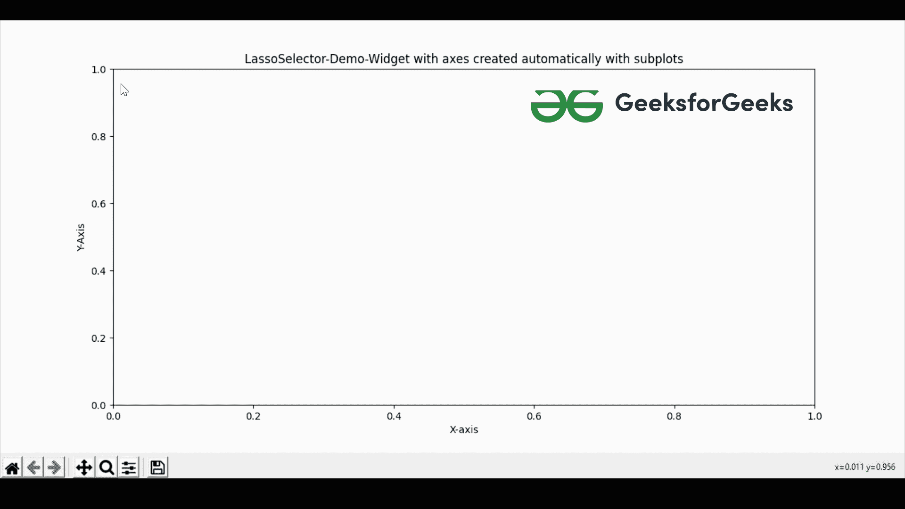

# matplotlib–套索选择器小部件

> 哎哎哎:# t0]https://www . geeksforgeeks . org/matplot lib-lasso 选择器小部件/

Matplotlib 为我们提供了各种各样的小部件。在本文中，我们将学习**套索选择器小部件演示**。套索选择器小部件是一个工具，帮助我们做出任意空间的选择曲线。

### **接近#1**

我们将手动添加轴到我们的绘图，然后使用套索选择器小部件工具。

**实施:**

## 蟒蛇 3

```
# importing matplotlib package
import matplotlib.pyplot as plt

# importing LassoSelector from
# Matplotlib.widgets
from matplotlib.widgets import LassoSelector

# Creating a figure of the plot
fig = plt.figure()

# Add set of axes to figure(Manually)
# left, bottom, width, height (ranging in between 0 and 1)
axes = fig.add_axes([0.1, 0.1, 0.8, 0.8])

# Set the label of X-Axis
axes.set_xlabel('X-axis')

# Set the label of Y-Axis
axes.set_ylabel('Y-Axis')

# Set the title of the plot
axes.set_title('LassoSelector-Demo-Widget')

# OnSelect function:Gets triggered
# as soon as the mouse is pressed
# in the plot
def onSelect(geeksforgeeks):
    print(geeksforgeeks)

# line defines the color, width and opacity
# of the line to be drawn
line = {'color': 'green', 
        'linewidth': 8, 'alpha': 1}

# Three parameters are passed inside the lasso
# Selector class defining the axis, line
# property and on select function
lsso = LassoSelector(ax=axes, onselect=onSelect, 
                     lineprops=line, button=2)

# Show the above plot
plt.show()
```

**输出:**



**说明:**

在上面的代码中，我们从***matplotlib . widgets***模块中导入 **matplotlib** 包和 **LassoSelector** 工具到我们的 python 项目中。导入包后，我们创建一个图形(即一个空画布)并手动添加轴。然后，我们定义了一个函数 **onSelect()** ，只要在图中按下鼠标就会被触发。然后，我们正在创建定义线条属性的**线条**，然后出现***lasso selector***，帮助我们在地块内部进行绘制。现在在**类选择器**里面有四个参数，第一个定义了我们已经创建的轴，第二个定义了 **onSelect()** 函数，第三个参数定义了线(线)的属性，最后一个参数定义了鼠标的哪一次点击将用于绘制**图(左，右，中)**。

### **接近#2**

这里不用手动添加轴，我们也可以使用 **plt .子图**自动创建轴来完成。

## 蟒蛇 3

```
# importing matplotlib package
import matplotlib.pyplot as plt

# importing LassoSelector from
# Matplotlib.widgets
from matplotlib.widgets import LassoSelector

# Creating a Subplot in matplotlib
fig, axes = plt.subplots()

# Set the label of X-Axis
axes.set_xlabel('X-axis')

# Set the label of Y-Axis
axes.set_ylabel('Y-Axis')

# Set the title of the plot
axes.set_title(
    'LassoSelector-Demo-Widget with axes created automatically with subplots')

# onSelect function gets triggered
# as soon as the mouse is pressed
# in the plot
def onSelect(geeksforgeeks):
    print(geeksforgeeks)

# line defines the color, width and opacity
# of the line to be drawn
line = {'color': 'green',
        'linewidth': 8, 'alpha': 1}

# Three parameters are passed inside the lasso
# Selector class defining the axis, line
# property and on select function
lsso = LassoSelector(ax=axes, onselect=onSelect, 
                     lineprops=line, button=2)

# If you want to print x and y while pressing
# and releasing mouse, then use mpl_connect
# and replace pressed and released with event

# Shows the above plot
plt.show()
```

**输出:**



**说明:**

同样的一系列事件正在发生，就像我们之前的方法一样。唯一不同的是，这里我们是在 **plt .支线剧情()** *的帮助下自动创建轴。*如果你穿过终端，你可以看到大量的坐标，这些坐标是我们在图形中绘制的点。