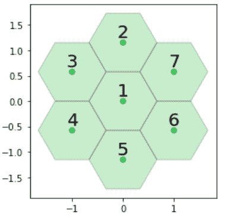
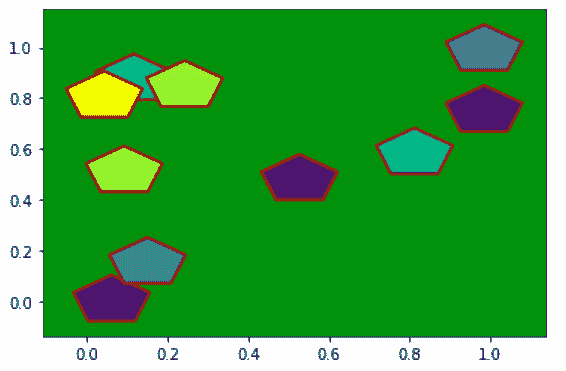

# Python 中的 matplotlib . patches . regular polygon 类

> 原文:[https://www . geesforgeks . org/matplotlib-patches-regular polygon-in-class-python/](https://www.geeksforgeeks.org/matplotlib-patches-regularpolygon-class-in-python/)

[**Matplotlib**](https://www.geeksforgeeks.org/python-matplotlib-an-overview/) 是 Python 中一个惊人的可视化库，用于数组的 2D 图。Matplotlib 是一个多平台数据可视化库，构建在 NumPy 数组上，旨在与更广泛的 SciPy 堆栈一起工作。

## matplot lib . patches . regular polygon

matplotlib . patches . regular polygon 类用于添加正多边形面片。

> **语法:**class matplotlib . patches . regular polygon(xy，numVertices，半径=5，方向=0，**kwargs)
> **参数:**
> 
> *   **xy:** 一个长度为 2 的元组(x，y)的中心。
>     
> *   **numVertices:** 表示顶点数。
>     
> *   **半径:**从中心到每个顶点的距离。
>     
> *   **方位:**用于旋转多边形(以弧度为单位)。

下表列出了有效的 kwargs

<figure class="table">

| 财产 | 描述 |
| --- | --- |
| agg _ 筛选器 | 接受(m，n，3)浮点数组和返回(m，n，3)数组的 dpi 值的筛选函数 |
| 希腊字母的第一个字母 | 浮动或无 |
| 愉快的 | 弯曲件 |
| 抗锯齿或 aa | 未知的 |
| 帽式 | { '对接'，'圆形'，'突出' } |
| 剪辑盒 | Bbox |
| 剪辑 _on | 弯曲件 |
| 剪辑路径 | [(路径，转换)&#124;补丁&#124;无] |
| 颜色 | rgba 元组的颜色或序列 |
| 包含 | 请求即付的 |
| edgecolor 或 ec 或 edgecolors | 颜色或无或“自动” |
| facecolor 或 fc 或 facecolors | 颜色或无 |
| 数字 | 数字 |
| 充满 | 弯曲件 |
| 眩倒病 | 潜艇用热中子反应堆（submarine thermal reactor 的缩写） |
| 舱口 | {'/'，' \ '，' &#124; '，'-'，'+'，' x '，' O '，' O '，' ', '*'} |
| in _ 布局 | 弯曲件 |
| 连接样式 | { '斜接'，'圆形'，'斜角' } |
| 生活方式 | {'-', '–', '-.'，':'，"，(偏移量，开-关-序列)，…} |
| 线宽 | 浮动或无 |
| 路径效果 | 抽象路径效应 |
| 采摘者 | 无、布尔、浮点或可调用 |
| 路径效果 | 抽象路径效应 |
| 采摘者 | 浮动或可调用[[艺术家，事件]，元组[布尔，字典]] |
| 光栅化 | 布尔或无 |
| 草图 _ 参数 | (比例:浮动，长度:浮动，随机性:浮动) |
| 突然的 | 布尔或无 |
| 改变 | matplotlib . transforms . transform |
| 全球资源定位器(Uniform Resource Locator) | 潜艇用热中子反应堆（submarine thermal reactor 的缩写） |
| 看得见的 | 弯曲件 |
| 更糟 | 漂浮物 |

</figure>

**例 1:**

## 蟒蛇 3

```
import matplotlib.pyplot as plt
from matplotlib.patches import RegularPolygon
import numpy as np

coord = [[0, 0, 0],
         [0, 1, -1],
         [-1, 1, 0],
         [-1, 0, 1],
         [0, -1, 1],
         [1, -1, 0],
         [1, 0, -1]]

colors = [["Green"],
          ["Green"],
          ["Green"],
          ["Green"],
          ["Green"],
          ["Green"],
          ["Green"]]

labels = [['1'], ['2'],
          ['3'], ['4'],
          ['5'], ['6'],
          ['7']]

# Horizontal cartesian coords
hcoord = for c in coord]

# Vertical cartersian coords
vcoord = [2\. * np.sin(np.radians(60)) * (c[1] - c[2]) /3.
          for c in coord]

fig, ax = plt.subplots(1)
ax.set_aspect('equal')

# Add some coloured hexagons
for x, y, c, l in zip(hcoord, vcoord, colors, labels):

    # matplotlib understands lower
    # case words for colours
    color = c[0].lower()
    hex = RegularPolygon((x, y),
                         numVertices = 6,
                         radius = 2\. / 3.,
                         orientation = np.radians(30),
                         facecolor = color,
                         alpha = 0.2,
                         edgecolor ='k')

    ax.add_patch(hex)

    # Also add a text label
    ax.text(x, y + 0.2, l[0], ha ='center',
            va ='center', size = 20)

# add scatter points in hexagon centers
ax.scatter(hcoord, vcoord, c =.lower()
                               for c in colors],
           alpha = 0.5)

plt.show()
```

**输出:**



**例 2:**

## 蟒蛇 3

```
import matplotlib.pyplot as plt
from matplotlib.patches import RegularPolygon
from matplotlib.collections import PatchCollection
import numpy as np

xy = np.random.random((10, 2))
z = np.random.random(10)

patches = [RegularPolygon((x, y),
                          5, 0.1)
           for x, y in xy]

collection = PatchCollection(patches,
                             array = z,
                             edgecolors ='brown',
                             lw = 2)

fig, ax = plt.subplots()

ax.patch.set(facecolor ='green')
ax.add_collection(collection)
ax.autoscale()

plt.show()
```

**输出:**

