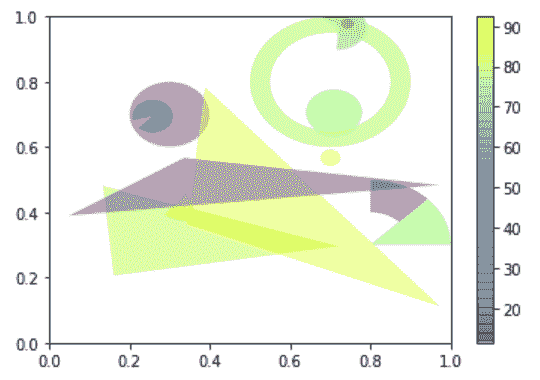

# Python 中的 Matplotlib.patches.Wedge 类

> 原文:[https://www . geeksforgeeks . org/matplotlib-patches-wedge-in-class-python/](https://www.geeksforgeeks.org/matplotlib-patches-wedge-class-in-python/)

[**Matplotlib**](https://www.geeksforgeeks.org/python-matplotlib-an-overview/) 是 Python 中一个惊人的可视化库，用于数组的 2D 图。Matplotlib 是一个多平台数据可视化库，构建在 NumPy 数组上，旨在与更广泛的 SciPy 堆栈一起工作。

## matplotlib.patches.Wedge

matplotlib.patches .楔形类用于在绘图中添加楔形面片。楔子以 xy = (x，y)为中心，半径为 r，它扫过θ1 到θ2(以度为单位)。如果给定宽度，部分楔形从内半径 r–宽度画到外半径 r。

> **语法:**class matplotlib . patches . wedge(中心，r，theta1，theta2，宽度=None，**kwargs)
> **参数:**
> 
> 1.  **中心:**楔子的中心点。
>     
> 2.  **r:** 楔块的半径。
>     
> 3.  **θ1:**第一扫掠角度。
>     
> 4.  **θ2:**第二扫掠角。
>     
> 5.  **宽度:**扫掠的宽度

kwargs 属性如下表所示:

<figure class="table">

| 财产 | 描述 |
| --- | --- |
| agg _ 筛选器 | 接受(m，n，3)浮点数组和返回(m，n，3)数组的 dpi 值的筛选函数 |
| 希腊字母的第一个字母 | 浮动或无 |
| 愉快的 | 弯曲件 |
| 抗锯齿或 aa | 未知的 |
| 帽式 | { '对接'，'圆形'，'突出' } |
| 剪辑盒 | Bbox |
| 剪辑 _on | 弯曲件 |
| 剪辑路径 | [(路径，转换)&#124;补丁&#124;无] |
| 颜色 | rgba 元组的颜色或序列 |
| 包含 | 请求即付的 |
| edgecolor 或 ec 或 edgecolors | 颜色或无或“自动” |
| facecolor 或 fc 或 facecolors | 颜色或无 |
| 数字 | 数字 |
| 充满 | 弯曲件 |
| 眩倒病 | 潜艇用热中子反应堆（submarine thermal reactor 的缩写） |
| 舱口 | {'/'，' \ '，' &#124; '，'-'，'+'，' x '，' O '，' O '，' ', '*'} |
| in _ 布局 | 弯曲件 |
| 连接样式 | { '斜接'，'圆形'，'斜角' } |
| 生活方式 | {'-', '–', '-.'，':'，"，(偏移量，开-关-序列)，…} |
| 线宽 | 浮动或无 |
| 路径效果 | 抽象路径效应 |
| 采摘者 | 无、布尔、浮点或可调用 |
| 路径效果 | 抽象路径效应 |
| 采摘者 | 浮动或可调用[[艺术家，事件]，元组[布尔，字典]] |
| 光栅化 | 布尔或无 |
| 草图 _ 参数 | (比例:浮动，长度:浮动，随机性:浮动) |
| 突然的 | 布尔或无 |
| 改变 | matplotlib . transforms . transform |
| 全球资源定位器(Uniform Resource Locator) | 潜艇用热中子反应堆（submarine thermal reactor 的缩写） |
| 看得见的 | 弯曲件 |
| 更糟 | 漂浮物 |

</figure>

**例 1:**

## 蟒蛇 3

```
import numpy as np
from matplotlib.patches import Circle, Wedge, Polygon
from matplotlib.collections import PatchCollection
import matplotlib.pyplot as plt

# Fixing random state for reproducibility
np.random.seed(19680801)

fig, ax = plt.subplots()

resolution = 50  # the number of vertices
N = 3
x = np.random.rand(N)
y = np.random.rand(N)
radii = 0.1 * np.random.rand(N)
patches = []

for x1, y1, r in zip(x, y, radii):
    circle = Circle((x1, y1), r)
    patches.append(circle)

x = np.random.rand(N)
y = np.random.rand(N)
radii = 0.1 * np.random.rand(N)
theta1 = 360.0 * np.random.rand(N)
theta2 = 360.0 * np.random.rand(N)

for x1, y1, r, t1, t2 in zip(x, y, radii,
                             theta1, theta2):
    wedge = Wedge((x1, y1), r, t1, t2)
    patches.append(wedge)

# Some limiting conditions on Wedge
patches += [
    Wedge((.3, .7), .1, 0, 360),             # Full circle
    Wedge((.7, .8), .2, 0, 360, width = 0.05),  # Full ring
    Wedge((.8, .3), .2, 0, 45),              # Full sector
    Wedge((.8, .3), .2, 45, 90, width = 0.10),  # Ring sector
]

for i in range(N):
    polygon = Polygon(np.random.rand(N, 2), True)
    patches.append(polygon)

colors = 100 * np.random.rand(len(patches))
p = PatchCollection(patches, alpha = 0.4)
p.set_array(np.array(colors))
ax.add_collection(p)
fig.colorbar(p, ax = ax)

plt.show()
```

**输出:**



**例 2:**

## 蟒蛇 3

```
import numpy as np
import matplotlib.pyplot as plt

fig, ax = plt.subplots(figsize =(6, 3),
                       subplot_kw = dict(aspect ="equal"))

recipe = ["375 g flour",
          "75 g sugar",
          "250 g butter",
          "300 g berries"]

data = [float(x.split()[0]) for x in recipe]
ingredients = [x.split()[-1] for x in recipe]

def func(pct, allvals):
    absolute = int(pct / 100.*np.sum(allvals))

    return "{:.1f}%\n({:d} g)".format(pct, absolute)

wedges, texts, autotexts = ax.pie(data,
                                  autopct = lambda pct: func(pct, data),
                                  textprops = dict(color ="w"))

ax.legend(wedges, ingredients,
          title ="Ingredients",
          loc ="center left",
          bbox_to_anchor =(1, 0, 0.5, 1))

plt.setp(autotexts, size = 8, weight ="bold")

ax.set_title("Recipe for a pie")

plt.show()
```

**输出:**

