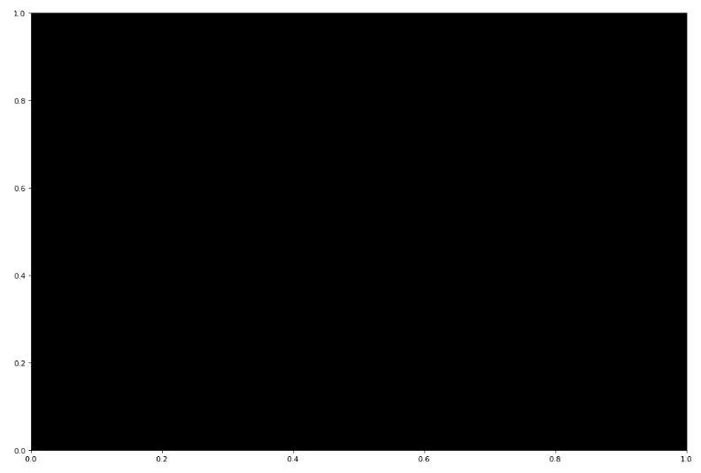

# Matplotlib.pyplot.axes()用 Python

表示

> 哎哎哎:# t0]https://www . geeksforgeeks . org/matplot lib-pyplot-axes-in-python/

[**【Pyplot】**](https://www.geeksforgeeks.org/pyplot-in-matplotlib/)是[**【matplotlib】**](https://www.geeksforgeeks.org/python-introduction-matplotlib/)的另一个模块，使用户能够在 Python 环境中集成 MATLAB，从而提供类似 MATLAB 的界面，使 Python 在视觉上具有交互性。

## Matplotlib.pyplot.axes()文件

`pyplot.axes`是 matplotlib 库的一个函数，它将轴添加到当前图形中，并使其成为当前轴。它的输出取决于使用的参数。

> **语法:**matplotlib . pyplot . axes(* args，**kwargs)
> 
> **参数:**
> ***参数:**可能包括无(无)或 4 个浮点型元组
> 
> *   **无:**给出新的全窗轴
> *   **4 元组:**以 4 元组为列表即【左下宽高】，给出这些维度的一个窗口为轴。
> 
> ****kwargs:** 有几个关键字参数(kwargs)用作 pyplot.axes()的参数，最常见的包括 facecolor、gid、in_layout、label、position、xlim、ylim 等。

**例 1:**

```py
# importing matplot library along 
# with necessary modules
import matplotlib.pyplot as plt

# providing values to x and y 
x = [8, 5, 11, 13, 16, 23]
y = [14, 8, 21, 7, 12, 15]

# to plot x and y
plt.plot(x, y)

# to generate the full window axes
plt.axes()
```

**输出:**


**例 2:**

```py
# importing matplot library along 
# with necessary modules
import matplotlib.pyplot as plt

# providing values to x and y 
x = [8, 5, 11, 13, 16, 23]
y = [14, 8, 21, 7, 12, 15]

# to plot x and y
#plt.plot(x, y)
# to generate window of custom 
# dimensions [left, bottom, width,
# height] along with the facecolor 
plt.axes([0, 2.0, 2.0, 2.0], facecolor = 'black') 
```

**输出:**

