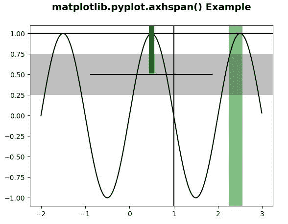

# Matplotlib.pyplot.axhspan()在 Python

中

> 原文:[https://www . geeksforgeeks . org/matplotlib-pyplot-axhspan-in-python/](https://www.geeksforgeeks.org/matplotlib-pyplot-axhspan-in-python/)

**[Matplotlib](https://www.geeksforgeeks.org/python-introduction-matplotlib/)** 是 Python 中的一个库，是 NumPy 库的数值-数学扩展。 **[Pyplot](https://www.geeksforgeeks.org/pyplot-in-matplotlib/)** 是一个基于状态的接口到 **Matplotlib** 模块，它提供了一个类似于 MATLAB 的接口。

## matplotlib.pyplot.axhspan()函数

matplotlib 库 pyplot 模块中的 **axhspan()函数**用于添加一个跨轴的水平跨度(矩形)。

> **语法:**matplotlib . pyplot . axhspan(ymin，ymax，xmin=0，xmax=1，**kwargs)
> 
> **参数:**该方法接受以下描述的参数:
> 
> *   **ymin:** 该参数是以数据单位表示的水平跨度的下限。
> *   **ymax:** 此参数是以数据单位表示的水平跨度上限。
> *   **xmin:** 此参数是以数据单位表示的垂直跨度的下限。
> *   **xmax:** 此参数是以数据单位表示的垂直跨度上限。
> 
> **返回:**返回多边形。

下面的例子说明了 matplotlib.pyplot.axhspan()函数在 matplotlib.pyplot 中的作用:

**例 1:**

```
import matplotlib.pyplot as plt

# xmin = 0 and xmax = 1 is the
# default value
plt.axhspan(0.25, 0.75, facecolor ='r', alpha = 0.7)
```

**输出:**


**例 2:**

```
#Implementation of matplotlib function
import numpy as np 
import matplotlib.pyplot as plt 

t = np.arange(-2, 3, .01) 
s = np.sin(np.pi * t) 

plt.plot(t, s, color ='black') 
plt.axhline(y = 1, color ='black') 

plt.axvline(x = 1, color ='black') 
plt.axvline(x = 0.5, ymin = 0.75, linewidth = 8,
            color ='green') 

plt.axhline(y =.5, xmin = 0.25, xmax = 0.75,
            color ='black') 

plt.axhspan(0.25, 0.75, facecolor ='0.5', alpha = 0.5) 
plt.axvspan(2.25, 2.55, facecolor ='green', alpha = 0.5) 

plt.title('matplotlib.pyplot.axhspan() Example\n',
          fontsize=14, fontweight='bold')

plt.show()
```

**输出:**
