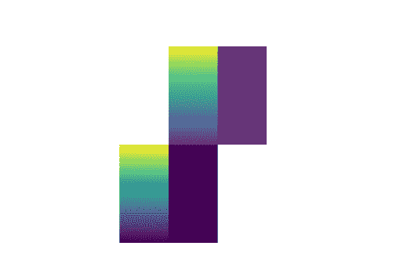
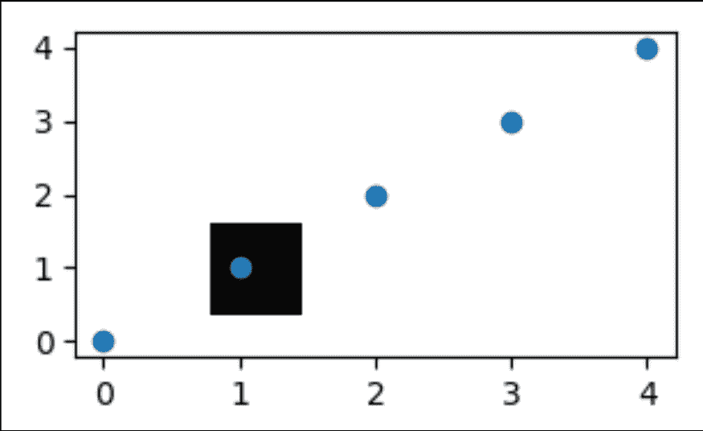

# matplotlib . pyplot . figimage()python 中的函数

> 哎哎哎:# t0]https://www . geeksforgeeks . org/matplot lib-pyplot-figimage-function-in-python/

**[Matplotlib](https://www.geeksforgeeks.org/python-introduction-matplotlib/)** 是 Python 中广泛使用的绘制各种图形的库，因为它也为复杂的图形提供了非常高效的方法和易于理解的方法。pyplot 是命令风格函数的集合，使 matplotlib 的工作方式与 MATLAB 类似。

## figimage()函数

**matplotlib . pyplot . fig image()**是一种将未重采样的图像添加到图形中的方法。通常，它会根据原点将图像附加到左下角或左上角。

> **语法:**matplotlib . pyplot . figimage(* args，**kwargs)
> 
> **参数:**
> 
> **alpha** 是一个浮点值参数，用于给出图像的混合值。这是一个可选参数。未指定时，它采用默认值“无”。
> 
> **Xo，Yo** 是表示图像数据形状的另一个重要参数。通常可以是“both”、“x”或“y”。它以像素为单位计算 x/y 图像偏移量。
> 
> ****kwargs** 是一个附加参数，一般称为 kwargs。他们是传递给数字图像的艺术家。

现在让我们举一个简单的例子来说明 matplotlib.pyplot.figimage()的工作原理。

**例 1:**

```py
import numpy as np
import matplotlib
import matplotlib.pyplot as plt

fig = plt.figure()
Z = np.arange(10000).reshape((100, 100))
Z[:, 50:] = 1

im1 = fig.figimage(Z, xo = 50, yo = 0,
                   origin ='lower')
im2 = fig.figimage(Z, xo = 100, yo = 100,
                   alpha =.8, origin ='lower')

plt.show()
```

**输出:**



**例 2:**

```py
import numpy as np
import matplotlib.pyplot as plt

im = np.zeros((40, 40, 3), dtype = np.float)

fig, ax = plt.subplots()
im = fig.figimage(im, 100, 60)

ax.scatter([0, 1, 2, 3, 4], [0, 1, 2, 3, 4])

ax.set_zorder(1)
im.set_zorder(0)
ax.patch.set_visible(False)

plt.show()
```

**输出:**
